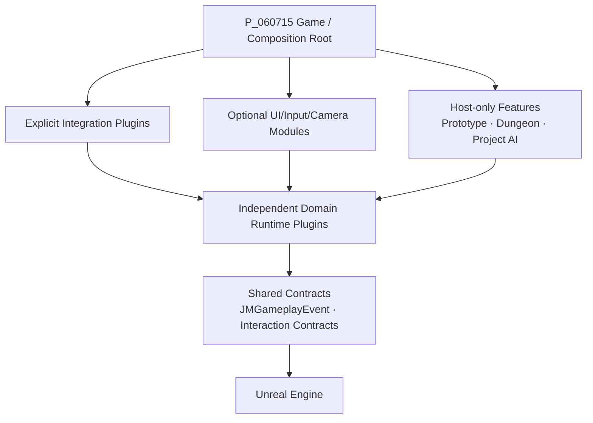
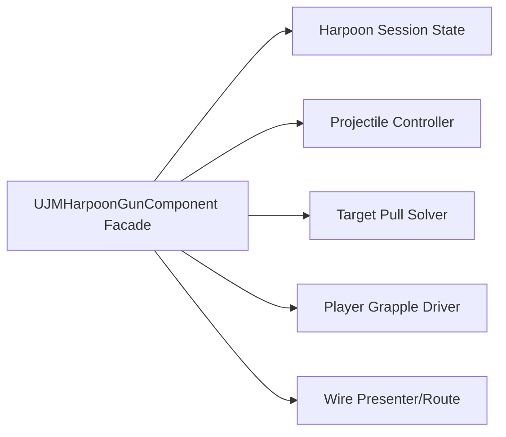
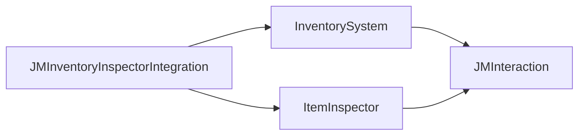
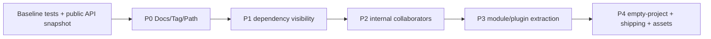

# Architecture Improvement Plan

> 이 문서는 감사 결과에 따른 향후 개선 계획이다. 이번 감사에서는 아래 코드 변경을 수행하지 않았다.

## 1. 목표

1. 각 Runtime Plugin을 명확한 최소 설치 단위로 만든다.
2. Domain, Presentation, Integration, Host 조립의 방향을 고정한다.
3. 코드·매니페스트·문서·GameplayTag registry가 같은 사실을 말하게 한다.
4. 대형 클래스의 변경 이유를 분리하되 공개 API와 저장/에셋 호환성을 보존한다.
5. 새 기능이 기존 Feature의 역참조나 호스트 의존 없이 추가되게 한다.

## 2. 목표 아키텍처



금지 방향:

- Domain → Host
- Domain A → Domain B의 구체 구현
- Contract → Feature
- Runtime → Editor
- 기반 Plugin → Integration

## 3. 우선순위 요약

| 단계 | 목적 | 대표 작업 | 위험 |
|---|---|---|---|
| P0 | 사실과 이식성 복구 | 문서 registry, `/Game` 기본 참조, Tag 소유권 | 낮음~중간 |
| P1 | 의존성 표면 축소 | Public/Private Build.cs, Runtime Commandlet 분리, opt-in 자동 조립 | 중간 |
| P2 | 대형 책임 분해 | Harpoon/Door/Recon/Inspection/Host Progression | 높음 |
| P3 | 기능 최소 설치 단위 | Inventory-Inspector Integration 추출, Host 모듈 분리 | 높음 |
| P4 | 운영/확장 품질 | 네트워크 범위, Asset Registry 감사, 성능/계약 테스트 | 중간 |

## 4. P0 — 즉시 정리할 항목

### 4.1 전체 Plugin registry를 단일 사실 원천으로 갱신

대상 문서:

- `Plugins/AGENTS.md`
- `Plugins/JM_FUTURE_SYSTEM_DESIGN_CONTEXT_KO.md`
- `Plugins/JM_PLUGINS_STRUCTURE.md`
- `Plugins/PORTABLE_BUNDLE.md`

작업:

1. 실제 21개 Plugin과 41개 Plugin Module을 반영한다.
2. Inventory 0.7.0, Footstep 1.1.1 등 실제 버전을 맞춘다.
3. `JMObjective`, `JMMonsterFramework`, `JMThrowable`, `JMThrowableGameplayIntegration` 누락을 보완한다.
4. Host Runtime의 실제 Plugin 의존성을 기록한다.
5. “선택 Integration”을 “폴더/Plugin 활성화가 선택이며, 활성화 시 양쪽은 필수 링크”로 정의한다.

완료 기준:

- 자동 스크립트가 `.uplugin` 목록과 registry 표의 이름/버전을 비교해 차이 0을 보고한다.
- 각 Plugin의 최소 설치 closure가 dependency graph와 일치한다.

### 4.2 잘못된 아키텍처 문구 수정

확정된 드리프트:

- JMDoor는 `JMGameplayEvent`를 직접 의존한다.
- ItemInspector는 `JMInteraction`, `JMGameplayEvent`를 직접 의존한다.
- Host `P_060715`은 다수 Plugin을 직접 의존한다.
- Hide Event Tag는 현재 bus에 발행되지 않는다.

완료 기준:

- `.uplugin`/`Build.cs`와 모든 “dependency/의존성” 표를 정적 비교해 모순이 없다.

### 4.3 JMJumpScare의 `/Game` 기본 참조 제거 계획

현재 근거: `JMJumpScareDefinition.h`의 기본 PostProcess Material이 `/Game/Jumpscare/M_Glitch`다.

선택지:

1. 플러그인 Content로 옮겨 `/JMJumpScare/...` Soft Reference를 사용한다.
2. 기본값을 null로 두고 누락 시 안전하게 연출을 생략한다.
3. 호스트 `DefaultGame.ini`에서만 `/Game` 에셋을 지정한다.

권장: Plugin이 소유해야 하는 기본 연출이면 1, 게임별 연출이면 2+3.

완료 기준:

- Plugin Runtime 코드/Config에서 `/Game/` 검색 결과 0.
- 빈 C++ 프로젝트에 Plugin closure만 복사해 로드/재생 실패가 crash 없이 처리된다.

### 4.4 GameplayTag 소유권 정리

작업:

- `JMObjectiveTags.ini`의 자동화 전용 `JMObjectiveTest.*`를 Test/Editor 범위로 이동한다.
- `Item.Key.Office`, `Door.Office.Main`, `Dialogue.Teacher.Intro`는 Example Content 전용 registry 또는 Host Config로 이동한다.
- 프로젝트 `DefaultGameplayTags.ini`와 Plugin Config의 중복 태그를 정리한다.
- `Event.Hide.*`를 실제 발행할지, 미사용 선언을 제거할지 결정한다.
- `IJMJumpScareActorInterface`를 Runtime 단계 callback에 실제 연결할지, 사용하지 않는 공개 API로 폐기할지 결정한다.

완료 기준:

- 모든 Tag에 Owner, 의미, Payload, Runtime/Example/Test 범위가 있다.
- 동일 Tag가 여러 config에 중복 선언되지 않는다.

## 5. P1 — 의존성 및 Plugin 경계 정밀화

### 5.1 Build.cs Public/Private 최소화

검증 후보:

| Module | 후보 작업 |
|---|---|
| `JMDoorRuntime` | 사용되지 않는 `InputCore` 제거 검증 |
| `JMReconRuntime` | `AudioMixer` 제거 검증 |
| `JMJumpScare` | `Slate`, `SlateCore` 제거 또는 Private 전환 검증 |
| `JMThrowable` | `AIModule`을 Private로 이동 |
| Integration 모듈 | Public 헤더가 노출하지 않는 UMG/Slate/Input 모듈을 Private로 이동 |

절차:

1. Public 헤더 include/type 기준으로 Public dependency 목록을 만든다.
2. Private cpp에서만 쓰는 모듈은 Private로 옮긴다.
3. 한 번에 한 모듈씩 변경하고 Editor + Shipping 빌드한다.

완료 기준:

- Runtime Public dependency마다 대응하는 Public 헤더 타입/include 근거가 있다.
- 전체 Editor/Shipping 빌드와 Plugin별 테스트가 통과한다.

### 5.2 JMDoorGameplayIntegration Commandlet를 Editor 모듈로 분리

현재 `UJMDoorConfigureIntegrationSamplesCommandlet`는 Runtime 모듈에서 Plugin 에셋을 Load/수정/Save한다.

목표:

```text
JMDoorGameplayIntegration       # Runtime Adapter만
JMDoorGameplayIntegrationEditor # 샘플 저작 Commandlet
```

완료 기준:

- Shipping binary에 샘플 저작 코드가 들어가지 않는다.
- Runtime Plugin은 에셋 저장 API를 참조하지 않는다.

### 5.3 Integration 기본 활성화 정책 수정

현재 여러 Integration이 `EnabledByDefault=true`다. 활성화만으로 WorldSubsystem이 Actor를 순회하고 Component를 자동 부착한다.

정책:

- 기반 Domain Plugin은 기본 활성화 가능하다.
- 전역 정책을 만드는 Integration은 프로젝트 `.uproject`에서 명시 opt-in을 권장한다.
- 자동 부착은 Settings로 끌 수 있어야 하며 기본값을 보수적으로 결정한다.
- 자동 부착 대상에는 명시 Marker Interface/Tag/Component 조건을 우선한다.

완료 기준:

- Plugin 활성화만으로 예상하지 못한 Pawn/Actor가 수정되지 않는다.
- 자동 부착/수동 부착 양쪽 자동화 테스트가 있다.

### 5.4 빈 Content 선언 정리

`JMDoorGameplayIntegration`은 `CanContainContent=true`지만 현재 Content asset 수가 0이다.

- 향후 샘플 Content를 소유할 계획이 없다면 false로 바꾼다.
- 소유한다면 Runtime 필수와 Demo를 분리한다.

## 6. P2 — 대형 타입 책임 분해

공개 API를 깨지 않도록 기존 Facade 타입을 유지하고 내부 collaborator를 먼저 추출한다.

### 6.1 `UJMHarpoonGunComponent`

현재 책임:

- 발사/Projectile 수명
- 박힘/Target Interface
- 물리 Pull/Recall
- Cable/Spline Wire 표시와 경로
- Player Grapple
- 상태 전이/입력 호환/Event

목표 분해:



완료 기준:

- Facade의 기존 Blueprint API와 저장된 Component class path가 유지된다.
- 각 collaborator는 단일 상태 소유자와 독립 테스트를 가진다.

### 6.2 `UJMDoorComponent`

분리 후보:

- State/Command coordinator
- Access policy evaluator
- Durability/break model
- Obstruction/character push policy
- Noise/event publisher
- Save serializer

`UJMDoorMovementComponent` 전략 분리는 이미 좋은 기반이므로 유지한다.

완료 기준:

- Door 상태 전이의 단일 소유자는 유지한다.
- Access, obstruction, durability를 독립 테스트할 수 있다.
- Version 1/2 Save migration 결과가 동일하다.

### 6.3 `UJMReconPlayerBridgeComponent`

현재 Interaction Focus, 입력, 카메라, 플레이어 정렬/잠금, 조명, Prompt Widget, 상태 복구를 함께 소유한다.

목표:

- Recon Focus Adapter
- Local Input Router
- Camera Presenter
- Illuminate Presenter
- Player State Guard
- Prompt Presenter

Facade Component는 위 객체를 조립하고 기존 Blueprint API를 보존한다.

### 6.4 `UJMItemInspectionSubsystem`

목표:

- LocalPlayer session coordinator
- Preview scene/actor controller
- Widget presenter
- Input/cursor state guard
- Asset loader

모든 종료 경로가 하나의 idempotent restore 함수로 모이게 한다.

### 6.5 Inventory UI 계층

`UInventoryDuckovWidgetBase`와 `UInventoryWidgetBase`의 drag/drop, context menu, tooltip, transition, selection, layout 책임을 작은 presenter/controller로 분리한다. Inventory domain mutation은 계속 `UInventoryComponent` API만 통과해야 한다.

## 7. P3 — 최소 설치 단위와 Host 분리

### 7.1 Inventory-Inspector Integration 추출

현재:

```text
InventorySystem -> ItemInspectorRuntime
```

목표:



이동 후보:

- `UReuseInventoryInspectorBridge`
- `AReuseInspectableInventoryPickup`
- Inspector 전용 설정/사용 흐름

호환 전략:

- 기존 `/Script/InventorySystem.*` class path를 깨지 않도록 Core Redirect 또는 Deprecated forwarding class를 한 버전 유지한다.
- Inventory의 기본 WorldItemClass가 Integration class를 강제하지 않게 한다.

완료 기준:

- Inventory + Interaction + GameplayEvent만으로 Inspector 없이 빌드/사용 가능하다.
- Integration을 추가하면 기존 조사 흐름이 동일하게 동작한다.

### 7.2 Host Runtime 모듈 분해

현재 `P_060715`은 프로젝트 조립 역할 외에 도메인을 직접 구현한다.

권장 모듈:

```text
P_060715Core                 # 최소 Game module / composition root
P_060715Prototype            # 진행, 포탈, Quest giver, HUD
P_060715Dungeon              # RoomGrid 소비, spawn point, dungeon director
P_060715MonsterPrototype     # 기존 BehaviorTree 몬스터
P_060715Tests                # Editor tests/authoring
```

이 분리는 Plugin으로 만들 필요가 없다. 먼저 Host 내부 Module 경계로 컴파일 의존성을 분리하는 것이 안전하다.

완료 기준:

- Core Host가 모든 기능 Plugin을 Public dependency로 노출하지 않는다.
- Dungeon/Prototype/AI 변경이 서로의 재컴파일 범위를 최소화한다.
- Test authoring code는 Runtime에 들어가지 않는다.

### 7.3 두 AI 구조의 정책 결정

현재:

- Host `JMDungeonMonster`: 프로젝트 전용 BehaviorTree/Hide/Noise/던전 규칙
- `JMMonsterFramework`: 재사용 StateTree 기반 Enemy 조립

결정지:

1. Host AI를 유지하고 Plugin AI는 별도 실험/향후 시스템으로 명시한다.
2. 새 적부터 MonsterFramework를 사용하고 기존 적은 단계적으로 Adapter를 둔다.
3. 공통 Perception/Noise 계약만 공유하고 실행기는 병존시킨다.

선택 전에는 양쪽을 무리하게 상속/참조하지 않는다.

완료 기준:

- 새 몬스터가 어느 프레임워크를 따라야 하는지 문서 한 곳에서 결정 가능하다.
- 중복 State enum, Memory, Noise 모델의 소유권이 명확하다.

## 8. P4 — 런타임 품질과 확장 범위

### 8.1 Tick 활성 구간 감사

대상:

- Interaction trace
- Door movement
- Footstep distance
- Hide participant/mechanism
- Recon Player Bridge
- Throwable preview/movement
- Harpoon/Grabber
- Monster Action/Debug/SurfaceCrawler

정책:

- Idle에서는 `SetComponentTickEnabled(false)`를 기본으로 한다.
- Session/Movement 시작 시 활성화하고 모든 종료 경로에서 비활성화한다.
- Debug Component는 non-shipping 및 명시 opt-in이어야 한다.

완료 기준:

- 100/500 Actor 배치 성능 테스트에서 Idle tick 수가 문서화된 예산 안에 있다.

### 8.2 네트워크 범위 명시

현재 대부분 비복제 로컬 시스템이다.

각 Plugin 문서에 다음 중 하나를 명시한다.

- Local single-player only
- Server-authoritative domain + local presentation
- Cosmetic client-only
- Replicated 지원

멀티플레이가 필요할 때 Gameplay Event bus 자체를 복제하지 말고 서버 명령/RPC와 Replicated state에서 로컬 Event를 파생한다.

### 8.3 Asset Registry portability 감사

별도 Unreal Editor 검증에서 각 Plugin Content의 dependency를 검사한다.

완료 기준:

- Runtime Content의 `/Game` hard dependency 0.
- Engine Content 의존은 문서화.
- Demo/Reference/Test Content가 Runtime 필수 Content와 분리.
- Redirector, missing package, invalid soft path 0.

### 8.4 계약 테스트 추가

필수 공통 테스트:

- Plugin dependency DAG 검사
- `.uplugin` ↔ `Build.cs` 일치 검사
- Runtime → Editor module 금지
- Runtime Plugin 코드/Config의 `/Game` 참조 금지
- GameplayTag 중복/소유권 검사
- Event Payload 타입/필수 필드 검사
- Modal Open/Close, 입력/커서/카메라 restore 대칭성
- Auto-injection opt-in/opt-out
- 빈 프로젝트 최소 closure 빌드

## 9. 마이그레이션 순서



1. 공개 클래스/구조체/Enum/Tag/Config/Asset path snapshot을 만든다.
2. 현재 자동화 테스트와 Editor/Shipping build를 baseline으로 기록한다.
3. 문서와 이식성 위반부터 고친다.
4. Build dependency는 하나씩 최소화한다.
5. 대형 타입은 Facade 유지 + 내부 위임 방식으로 분해한다.
6. Plugin/Module 이동은 마지막에 Core Redirect와 에셋 리세이브를 포함해 수행한다.
7. 빈 프로젝트 최소 closure 검증 후에만 이전 경로를 deprecate한다.

## 10. 새 시스템 추가 표준

### 설계 전

- 책임/비책임
- 데이터 소유자
- Runtime 수명
- 명령/이벤트 구분
- 필수/선택 dependency
- 취소/파괴/레벨 전환 복구
- 네트워크/저장 범위

### 기본 폴더

```text
Plugins/JMFeature/
├─ JMFeature.uplugin
├─ Source/
│  ├─ JMFeatureRuntime/{Public,Private}
│  ├─ JMFeatureEditor/{Public,Private}       # 필요할 때만
│  └─ JMFeatureTests/Private
├─ Config/
├─ Content/
│  ├─ Runtime
│  └─ Demo                                  # 선택
└─ Docs/
```

### Integration이 필요한 경우

```text
Plugins/JMFeatureAFeatureBIntegration/
├─ Source/...Runtime
├─ Source/...Tests
└─ Docs/README + ARCHITECTURE + CHANGELOG
```

Integration은 양쪽의 Public API만 사용하고 기반 Plugin은 Integration을 알지 않는다.

## 11. 완료 판정표

| 목표 | 측정 방법 | 완료 조건 |
|---|---|---|
| 순환 없음 | Plugin/Module graph SCC 검사 | SCC 크기 1 |
| Runtime 이식성 | `/Game`/Host type 정적 검색 + Asset Registry | 위반 0 |
| 최소 dependency | Public header ↔ Public Build dependency | 근거 없는 Public dependency 0 |
| 문서 정확성 | manifest 자동 비교 | 이름/버전/의존성 drift 0 |
| 상태 복구 | 취소/파괴/전환 테스트 | 입력/UI/카메라/이동 원상복구 |
| 최소 설치 | 빈 프로젝트 closure build | 각 배포 단위 Editor + Shipping 성공 |
| 성능 | Idle tick/Actor scan 측정 | 사전 정의 예산 충족 |
| API 호환 | reflection/API snapshot | 승인 없는 breaking change 0 |

## 12. 권장 실행 단위

각 개선 PR/작업은 하나의 목적만 가져야 한다.

1. 문서 registry와 dependency drift 수정
2. JumpScare `/Game` 기본 참조 수정
3. Tag 소유권/중복 정리
4. Build.cs dependency visibility 정리
5. Door Integration Editor 모듈 분리
6. Integration opt-in 정책
7. Harpoon 내부 collaborator 추출
8. Door 내부 policy 추출
9. Recon Presentation 분리
10. Inventory-Inspector Integration 추출
11. Host Module 분리
12. AI 프레임워크 정책 결정

각 단위는 변경 전/후 dependency graph, 공개 API 영향, 자동화 테스트, Editor/Shipping build, 남은 제한을 기록한다.
