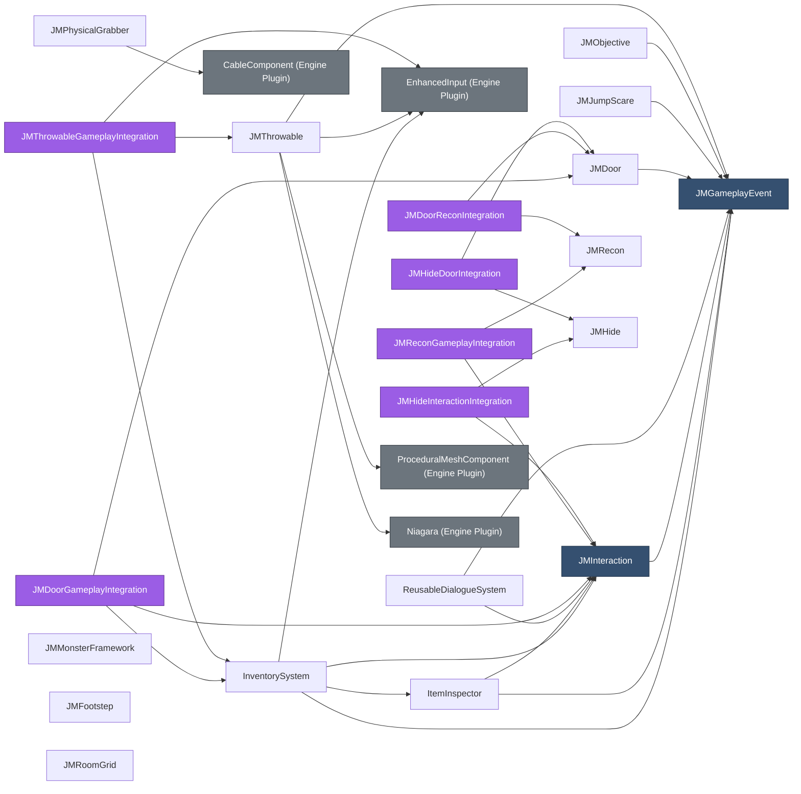
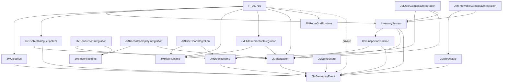
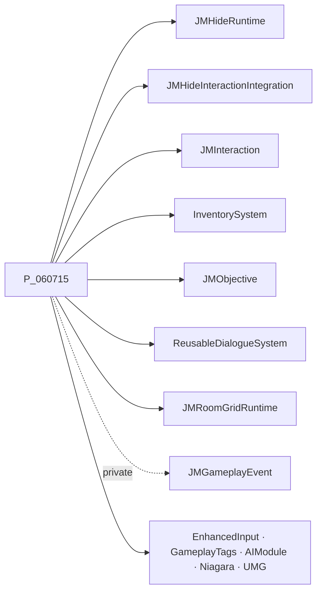
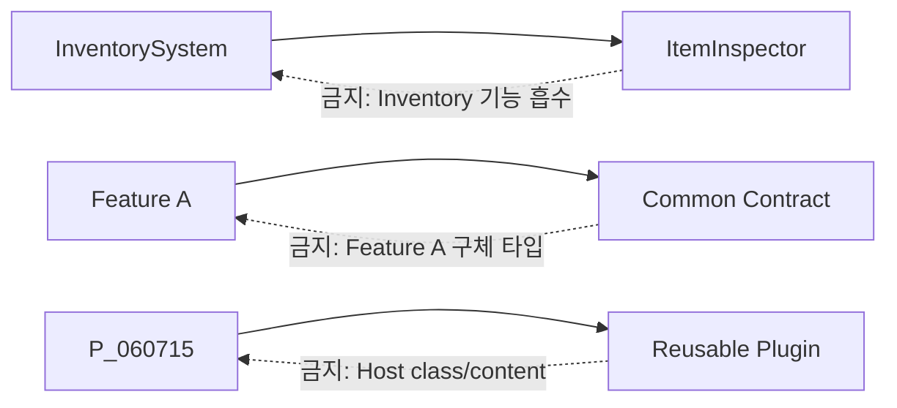
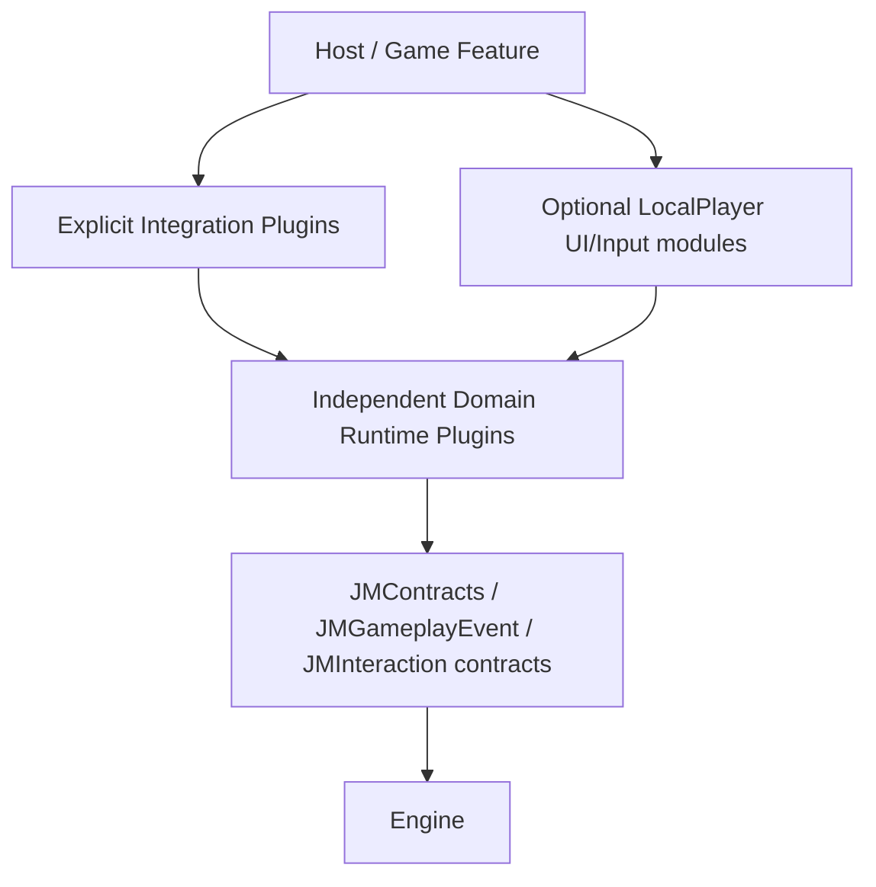

# Plugin / Module Dependency Graph

> 기준: 2026-08-25의 실제 `.uplugin`과 `Build.cs`
> 화살표 `A --> B`는 **A가 B를 의존**한다는 뜻이다.

## 1. 전체 Plugin 그래프

### 해석

- 로컬 Plugin 그래프는 DAG이며 실제 순환이 없다.
- 가장 많이 소비되는 기반은 `JMGameplayEvent`, 다음은 `JMInteraction`이다.
- 가장 큰 설치 closure는 `JMDoorGameplayIntegration`과 `JMThrowableGameplayIntegration`이다.
- `JMFootstep`, `JMRecon`, `JMHide`, `JMRoomGrid`, `JMMonsterFramework`는 다른 JM Plugin 없이 빌드되는 독립 기능이다.
- `JMPhysicalGrabber`는 JM 독립이지만 Engine Plugin `CableComponent`가 필수다.

## 2. 로컬 직접/전이 의존성

| Plugin | 직접 JM 의존성 | 전이 JM 의존성 포함 |
|---|---|---|
| `JMGameplayEvent` | 없음 | 없음 |
| `JMInteraction` | GameplayEvent | GameplayEvent |
| `ItemInspector` | Interaction, GameplayEvent | 동일 |
| `InventorySystem` | GameplayEvent, Interaction, ItemInspector | 동일 |
| `ReusableDialogueSystem` | GameplayEvent, Interaction | 동일 |
| `JMDoor` | GameplayEvent | GameplayEvent |
| `JMDoorGameplayIntegration` | Door, Interaction, Inventory | Door, Interaction, Inventory, ItemInspector, GameplayEvent |
| `JMJumpScare` | GameplayEvent | GameplayEvent |
| `JMObjective` | GameplayEvent | GameplayEvent |
| `JMRecon` | 없음 | 없음 |
| `JMReconGameplayIntegration` | Recon, Interaction | Recon, Interaction, GameplayEvent |
| `JMDoorReconIntegration` | Door, Recon | Door, Recon, GameplayEvent |
| `JMFootstep` | 없음 | 없음 |
| `JMHide` | 없음 | 없음 |
| `JMHideInteractionIntegration` | Hide, Interaction | Hide, Interaction, GameplayEvent |
| `JMHideDoorIntegration` | Hide, Door | Hide, Door, GameplayEvent |
| `JMRoomGrid` | 없음 | 없음 |
| `JMPhysicalGrabber` | 없음 | 없음 |
| `JMThrowable` | GameplayEvent | GameplayEvent |
| `JMThrowableGameplayIntegration` | Throwable, Inventory | Throwable, Inventory, ItemInspector, Interaction, GameplayEvent |
| `JMMonsterFramework` | 없음 | 없음 |

## 3. Runtime Module 그래프

그래프에서 생략한 독립 Runtime 모듈은 `JMFootstepRuntime`, `JMRoomGridRuntime`, `JMPhysicalGrabber`, `JMHideRuntime`, `JMReconRuntime`, `JMMonsterFrameworkRuntime`이다. 이들은 Engine 모듈만 의존한다.

## 4. 전체 Module 인벤토리

### Plugin Runtime 21개 + Host Runtime 1개

| Plugin/Host | Runtime Module | 로컬 Module 의존성 |
|---|---|---|
| InventorySystem | `InventorySystem` | `ItemInspectorRuntime`, `JMInteraction`, `JMGameplayEvent` |
| ItemInspector | `ItemInspectorRuntime` | `JMInteraction`, `JMGameplayEvent` |
| JMDoor | `JMDoorRuntime` | `JMGameplayEvent` |
| JMDoorGameplayIntegration | `JMDoorGameplayIntegration` | `JMDoorRuntime`, `JMInteraction`, `InventorySystem` |
| JMDoorReconIntegration | `JMDoorReconIntegration` | `JMDoorRuntime`, `JMReconRuntime` |
| JMFootstep | `JMFootstepRuntime` | 없음 |
| JMGameplayEvent | `JMGameplayEvent` | 없음 |
| JMHide | `JMHideRuntime` | 없음 |
| JMHideDoorIntegration | `JMHideDoorIntegration` | `JMHideRuntime`, `JMDoorRuntime` |
| JMHideInteractionIntegration | `JMHideInteractionIntegration` | `JMHideRuntime`, `JMInteraction` |
| JMInteraction | `JMInteraction` | `JMGameplayEvent` |
| JMJumpScare | `JMJumpScare` | `JMGameplayEvent` |
| JMMonsterFramework | `JMMonsterFrameworkRuntime` | 없음 |
| JMObjective | `JMObjective` | `JMGameplayEvent` |
| JMPhysicalGrabber | `JMPhysicalGrabber` | 없음 |
| JMRecon | `JMReconRuntime` | 없음 |
| JMReconGameplayIntegration | `JMReconGameplayIntegration` | `JMInteraction`, `JMReconRuntime` |
| JMRoomGrid | `JMRoomGridRuntime` | 없음 |
| JMThrowable | `JMThrowable` | `JMGameplayEvent` |
| JMThrowableGameplayIntegration | `JMThrowableGameplayIntegration` | `JMThrowable`, `InventorySystem` |
| ReusableDialogueSystem | `ReusableDialogueSystem` | `JMInteraction`, `JMGameplayEvent` |
| Host | `P_060715` | HideRuntime, HideInteractionIntegration, Interaction, Inventory, Objective, Dialogue, RoomGridRuntime, GameplayEvent |

### Plugin Editor 3개

| Plugin | Editor Module | Runtime 의존성 |
|---|---|---|
| JMRecon | `JMReconEditor` | `JMReconRuntime` |
| JMRoomGrid | `JMRoomGridEditor` | `JMRoomGridRuntime` |
| JMThrowable | `JMThrowableEditor` | `JMThrowable` |

Host에는 별도 Editor 모듈이 없고 Editor Target가 Host Runtime과 Host Test 모듈을 로드한다.

### Plugin Test 17개 + Host Test 1개

`ItemInspectorTests`, `JMDoorTests`, `JMDoorReconIntegrationTests`, `JMFootstepTests`, `JMGameplayEventTests`, `JMHideTests`, `JMHideDoorIntegrationTests`, `JMInteractionTests`, `JMJumpScareTests`, `JMMonsterFrameworkTests`, `JMObjectiveTests`, `JMPhysicalGrabberTests`, `JMReconTests`, `JMReconGameplayIntegrationTests`, `JMRoomGridTests`, `JMThrowableTests`, `JMThrowableGameplayIntegrationTests`, 그리고 `P_060715Tests`가 있다. `JMDoorGameplayIntegration`, `JMHideInteractionIntegration`, `ReusableDialogueSystem`은 별도 Test 모듈이 없다.

## 5. Host 모듈의 직접 결합

`Source/P_060715/P_060715.Build.cs`의 실제 의존은 다음과 같다.

`JM_PLUGINS_STRUCTURE.md`의 “게임 모듈은 위 플러그인 모듈을 의존하지 않는다”는 설명은 현재 코드와 정반대다.

## 6. 선언 일치성

### `.uplugin`과 Runtime `Build.cs`

로컬 Plugin 의존성은 전반적으로 일치한다.

- `.uplugin`은 Plugin 이름(`JMDoor`, `JMRecon`)을 사용한다.
- `Build.cs`는 Module 이름(`JMDoorRuntime`, `JMReconRuntime`)을 사용한다.
- Engine Plugin은 `.uplugin`, 그 Plugin의 Runtime Module은 `Build.cs`에 각각 선언되어 있다.

확인된 의미상 주의점:

- `ItemInspector.uplugin`은 `JMInteraction`과 `JMGameplayEvent`를 모두 직접 선언한다. 문서 일부의 “JM 의존성 없음”은 틀리다.
- `JMDoor.uplugin`과 `JMDoorRuntime.Build.cs`는 `JMGameplayEvent`를 직접 선언한다. JMDoor 문서의 “JM 직접 의존 0”은 틀리다.
- `JMDoorGameplayIntegration`은 `InventorySystem`을 통해 `ItemInspector`를 전이 의존한다. 직접 의존은 아니다.

## 7. Public/Private dependency 감사

| 모듈 | 현재 | 실제 사용 근거 | 권고 |
|---|---|---|---|
| `JMDoorRuntime` | `InputCore` Private | 관련 심볼/include 검색 결과 없음 | 제거 가능 여부 빌드 검증 |
| `JMReconRuntime` | `AudioMixer` Public | `USoundMix`, `UGameplayStatics::PushSoundMixModifier`는 Engine API | 제거 가능 여부 빌드 검증 |
| `JMJumpScare` | Slate/SlateCore Public | 공개/비공개 코드에서 직접 Slate 심볼 미검출 | 제거 또는 필요한 최소 모듈로 축소 |
| `JMThrowable` | AIModule Public | `UAISense_Hearing`은 Private cpp에서만 사용 | Private로 이동 |
| 다수 Runtime | 모든 기능 모듈 Public | Public 헤더에서 노출하지 않는 구현 모듈 포함 | Public 헤더 include/type 기준으로 재분류 |

위 항목은 정적 검색으로 찾은 **후보**다. 실제 제거는 전체 Editor/Shipping 빌드로만 확정한다.

## 8. 순환 검사 결과

### 현재

- Plugin 그래프: 순환 없음
- Runtime Module 그래프: 순환 없음
- Editor/Test → Runtime 방향: 역참조 없음
- 기반 Feature → Integration 역참조: 없음

### 잠재 순환 경로

## 9. 권장 목표 계층

핵심 규칙은 Domain Runtime이 Presentation과 형제 Feature를 역참조하지 않는 것이다.
