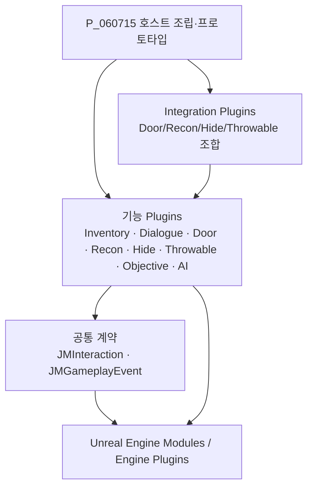
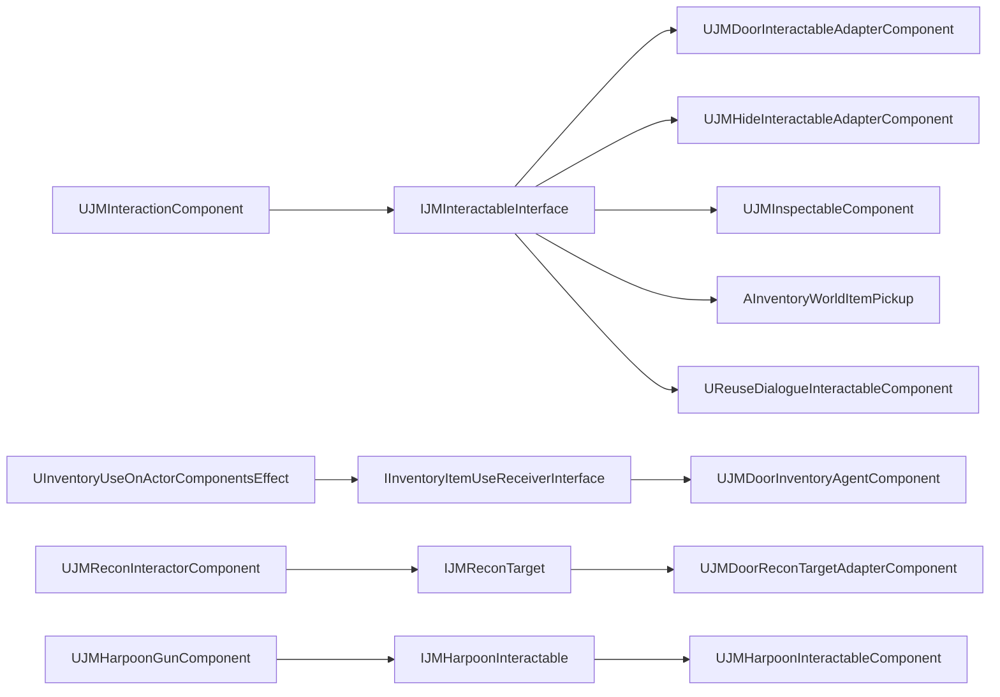
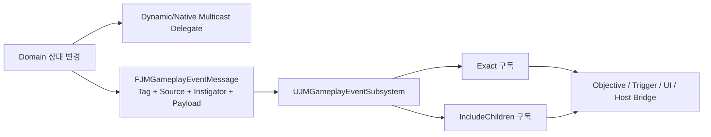
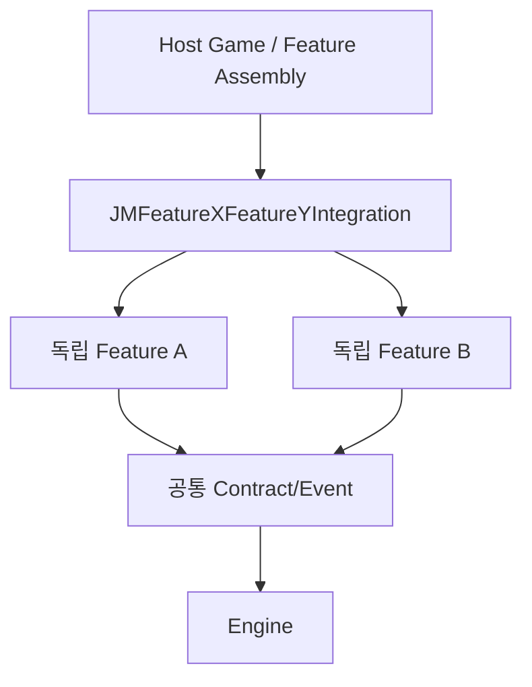

# P_260729 Unreal Engine 프로젝트 아키텍처 감사

> 감사 기준일: 2026-08-19  
> 대상 엔진: Unreal Engine 5.7 (`P_060715.uproject`)  
> 대상: `Plugins`, `Source`, `Config`, 모든 `.uplugin`, 모든 `Build.cs`, 현재 Markdown 문서 122개  
> 성격: 코드·설정·문서의 정적 역분석. 런타임 코드는 변경하지 않았다.

## 1. 감사 방법과 사실의 우선순위

이 문서는 다음 순서로 사실을 판정했다.

1. `.uplugin`의 플러그인/모듈 선언
2. `Build.cs`의 컴파일 의존성
3. Public 헤더가 노출하는 타입과 상속
4. Private 구현의 include, 호출, Cast, Delegate 바인딩, Subsystem 접근
5. `Config`의 실제 경로·태그·설정 오버라이드
6. 기존 문서의 설명

문서와 코드가 다르면 1~4를 현재 사실로 취급했다. `.uasset`/`.umap`은 바이너리이므로 이 감사에서는 파일 존재와 경로만 확인했다. 바이너리 내부 참조의 완전한 Asset Registry 감사는 Unreal Editor 명령let을 통한 별도 검증 항목이다.

### 규모

| 항목 | 확인 수 |
|---|---:|
| 로컬 플러그인 | 21 |
| 플러그인 모듈 | 41 |
| 호스트 모듈 | 2 |
| `Build.cs` | 43 |
| C++ 헤더 / 구현 | 276 / 292 |
| Markdown 문서 | 122 |
| 프로젝트 루트 Config | 5 |

## 2. 결론 요약

현재 구조는 **공통 계약 → 독립 기능 → Integration → 호스트 조립**이라는 방향을 대체로 지킨다. 실제 Plugin/Module 그래프에는 순환 의존성이 없다. `JMGameplayEvent`, `JMInteraction`, Interface, ActorComponent, 수명별 Subsystem, 별도 Integration 플러그인은 재사용에 유리한 기반이다.

가장 큰 위험은 그래프 자체보다 각 노드 내부의 책임 집중과 문서 드리프트다.

- `P_060715` 호스트 Runtime 모듈은 15개 Public 모듈과 4개 Private 모듈을 직접 의존하며 프로토타입 진행, 포탈, 던전 생성, 인벤토리 저장, UI, AI까지 포함한다.
- `UJMHarpoonGunComponent`(구현 약 1,965행), `UJMDoorComponent`(약 1,198행), `UInventoryDuckovWidgetBase`(약 1,083행), `UJMReconPlayerBridgeComponent`(약 990행), `UJMItemInspectionSubsystem`(약 970행)은 여러 변경 이유를 한 타입에 모은다.
- `Plugins/AGENTS.md`의 레지스트리는 실제 21개 중 `JMObjective`, `JMMonsterFramework`, `JMThrowable`, `JMThrowableGameplayIntegration`을 누락한다.
- `Plugins/JM_PLUGINS_STRUCTURE.md`는 호스트 모듈이 플러그인을 의존하지 않는다고 적지만 실제 `Source/P_060715/P_060715.Build.cs`는 다수 플러그인을 의존한다.
- `JMDoor/Docs/ARCHITECTURE.md`는 JM 직접 의존성이 0이라고 적지만 실제로 `JMGameplayEvent`를 직접 의존한다.
- `JMJumpScare` Runtime 공개 데이터의 기본 Soft Reference가 `/Game/Jumpscare/M_Glitch`를 가리켜 플러그인 단독 이식 원칙을 위반한다.
- 선택형 Integration 대부분이 `EnabledByDefault=true`이고 컴파일 시 양쪽 기능을 필수 링크한다. 여기서 “선택”은 런타임의 약한 의존성이 아니라 배포 시 플러그인 폴더를 포함할지의 선택이다.

## 3. 전체 Plugin 목록과 책임

| Plugin | 버전 | 모듈 | 실제 책임 | 직접 로컬 Plugin 의존성 |
|---|---:|---|---|---|
| `JMGameplayEvent` | 1.1.0 | Runtime, Tests | Gameplay Tag 기반 동기식 GameInstance 이벤트 버스, BP Listener/Publisher | 없음 |
| `JMInteraction` | 1.1.1 | Runtime, Tests | Trace/커서 탐지, Focus, Prompt, 상호작용 상태와 계약 | `JMGameplayEvent` |
| `ItemInspector` | 0.5.0 | Runtime, Tests | LocalPlayer 단위 3D 아이템 조사, Preview Actor, UMG 전환 | `JMInteraction`, `JMGameplayEvent` |
| `InventorySystem` | 0.7.0 | Runtime | 스택/슬롯 인벤토리, Pickup, Container, 사용/드롭, UI, Inspector Bridge | `JMGameplayEvent`, `JMInteraction`, `ItemInspector`, `EnhancedInput` |
| `ReusableDialogueSystem` | 0.2.1 | Runtime | Data Asset 대사 재생 상태 머신, 타이핑/음성/UI, Interaction 진입 | `JMGameplayEvent`, `JMInteraction` |
| `JMDoor` | 1.6.0 | Runtime, Tests | 문 상태/이동/접근/내구도/방해/소음/저장 계약 | `JMGameplayEvent` |
| `JMDoorGameplayIntegration` | 1.1.0 | Runtime | Door ↔ Interaction ↔ Inventory 잠금 해제 흐름 | `JMDoor`, `JMInteraction`, `InventorySystem` |
| `JMJumpScare` | 2.0.0 | Runtime, Tests | World 단위 2D 점프스케어 재생, Trigger, 상태 복구, 이벤트 | `JMGameplayEvent` |
| `JMObjective` | 1.1.1 | Runtime, Tests | 이벤트 기반 Objective, 선형 Flow, LocalPlayer UI, 저장용 상태 | `JMGameplayEvent` |
| `JMRecon` | 1.1.0 | Runtime, Editor, Tests | Listen/Peek/Illuminate 세션, Target 예약, 카메라/소음 요청 | 없음 |
| `JMReconGameplayIntegration` | 1.1.0 | Runtime, Tests | Interaction Focus ↔ Recon, 입력/카메라/조명/Prompt/플레이어 상태 관리 | `JMRecon`, `JMInteraction` |
| `JMDoorReconIntegration` | 1.0.0 | Runtime, Tests | Recon 세션 중 Door의 임시 Peek Pose 적용·검증·복원 | `JMDoor`, `JMRecon` |
| `JMFootstep` | 1.1.1 | Runtime, Tests | 이동 거리/Physical Surface/보행 Variant 기반 3D 발소리 | 없음 |
| `JMHide` | 1.0.0 | Runtime, Tests | Session 기반 은신, Spot 예약/점유, Participant/Mechanism 계약 | 없음 |
| `JMHideInteractionIntegration` | 1.0.0 | Runtime | Interaction 명령을 Hide 진입/이탈로 번역, 입력 Router | `JMHide`, `JMInteraction` |
| `JMHideDoorIntegration` | 1.0.0 | Runtime, Tests | JMDoor를 Hide Mechanism으로 번역 | `JMHide`, `JMDoor` |
| `JMRoomGrid` | 1.5.0 | Runtime, Editor, Tests | 모듈 방, Port 연결, 결정적 Grid 생성, 에셋 생성/검증 도구 | 없음 |
| `JMPhysicalGrabber` | 1.8.0 | Runtime, Tests | 물리 Grab, Harpoon, Wire Route, Target 반응, 선택적 Player Grapple | `CableComponent` |
| `JMThrowable` | 1.4.1 | Runtime, Editor, Tests | 투척 세션/탄도/Projectile/Preview/Niagara/소음 이벤트 | `EnhancedInput`, `ProceduralMeshComponent`, `Niagara`, `JMGameplayEvent` |
| `JMThrowableGameplayIntegration` | 1.0.0 | Runtime, Tests | Inventory Item Use ↔ Throwable Commit, 입력/UI/이동 제한 | `JMThrowable`, `InventorySystem`, `EnhancedInput` |
| `JMMonsterFramework` | 1.1.0 | Runtime, Tests | 데이터 기반 Enemy 조립, State/Memory/Perception/Movement/Action/StateTree | `StateTree`, `GameplayStateTree` |

## 4. 계층과 의존 방향

예외적으로 `InventorySystem`은 기능 플러그인이면서 `ItemInspector`를 직접 소비한다. Inspector 연동 클래스가 Inventory Runtime 모듈의 Public API에 들어 있어 Inspector 없이 Inventory만 빌드할 수 없다. 현재 그래프에서 순환은 없지만 기능 계층 간 직접 결합이다.

## 5. Module 목록과 의존성

### Runtime 모듈

| Module | Public 의존성 중 핵심 | Private 의존성 | 판정 |
|---|---|---|---|
| `JMGameplayEvent` | Engine, GameplayTags, DeveloperSettings | 없음 | 공통 기반 |
| `JMInteraction` | UMG, Slate/SlateCore, GameplayTags, `JMGameplayEvent` | 없음 | UI까지 포함한 Interaction 기반 |
| `ItemInspectorRuntime` | UMG, GameplayTags, `JMInteraction`, `JMGameplayEvent` | Slate | 조사 기능 |
| `InventorySystem` | EnhancedInput, UMG, GameplayTags, `ItemInspectorRuntime`, `JMInteraction`, `JMGameplayEvent` | Slate/SlateCore | 기능 간 직접 결합 존재 |
| `ReusableDialogueSystem` | UMG, Slate/SlateCore, GameplayTags, `JMInteraction`, `JMGameplayEvent` | 없음 | 대사 기능 |
| `JMDoorRuntime` | DeveloperSettings, GameplayTags, `JMGameplayEvent` | InputCore | InputCore 실제 사용 미검출 |
| `JMDoorGameplayIntegration` | `JMDoorRuntime`, `JMInteraction`, `InventorySystem` | 없음 | 3자 Bridge |
| `JMJumpScare` | GameplayTags, DeveloperSettings, `JMGameplayEvent`, UMG, Slate/SlateCore | 없음 | Slate 직접 사용 미검출 |
| `JMObjective` | GameplayTags, `JMGameplayEvent`, UMG, DeveloperSettings | 없음 | Objective/Flow/UI 묶음 |
| `JMReconRuntime` | DeveloperSettings, AudioMixer | 없음 | SoundMix는 사용하나 AudioMixer 직접 심볼 미검출 |
| `JMReconGameplayIntegration` | InputCore, UMG, Slate/SlateCore, `JMInteraction`, `JMReconRuntime` | 없음 | 플레이어 Presentation Bridge |
| `JMDoorReconIntegration` | DeveloperSettings, `JMDoorRuntime`, `JMReconRuntime` | 없음 | Door Pose Adapter |
| `JMFootstepRuntime` | DeveloperSettings, PhysicsCore | 없음 | 독립 기능 |
| `JMHideRuntime` | DeveloperSettings, GameplayTags | 없음 | 독립 Domain |
| `JMHideInteractionIntegration` | GameplayTags, `JMHideRuntime`, `JMInteraction` | 없음 | Interaction Adapter |
| `JMHideDoorIntegration` | `JMHideRuntime`, `JMDoorRuntime` | 없음 | Mechanism Adapter |
| `JMRoomGridRuntime` | DeveloperSettings, GameplayTags | 없음 | 독립 기능 |
| `JMPhysicalGrabber` | InputCore, CableComponent | 없음 | 독립 기능, 엔진 Plugin 의존 |
| `JMThrowable` | EnhancedInput, InputCore, ProceduralMeshComponent, Niagara, AIModule, GameplayTags, `JMGameplayEvent` | 없음 | AIModule는 구현 전용인데 Public |
| `JMThrowableGameplayIntegration` | GameplayTags, EnhancedInput, UMG/Slate, `JMThrowable`, `InventorySystem` | 없음 | Inventory/Presentation Bridge |
| `JMMonsterFrameworkRuntime` | GameplayTags, AIModule, StateTreeModule, GameplayStateTreeModule | NavigationSystem | 독립 AI 프레임워크 |
| `P_060715` | EnhancedInput, GameplayTags, Hide/Interaction/Inventory/Objective/Dialogue/RoomGrid, AIModule, Niagara, UMG | `JMGameplayEvent`, NavigationSystem, Slate/SlateCore, MoviePlayer | 호스트 조립이지만 과도하게 넓음 |

### Editor/Test 모듈

| 모듈군 | 직접 대상 Runtime | Editor 전용 의존성 |
|---|---|---|
| `ItemInspectorTests` | `ItemInspectorRuntime` | UnrealEd |
| `JMDoorTests` | `JMDoorRuntime` | FunctionalTesting, UnrealEd, Kismet, AssetRegistry, PropertyEditor, Slate |
| `JMGameplayEventTests` | `JMGameplayEvent` | 없음 |
| `JMInteractionTests` | `JMInteraction` | UMG/SlateCore |
| `JMJumpScareTests` | `JMJumpScare`, `JMGameplayEvent` | UnrealEd |
| `JMObjectiveTests` | `JMObjective`, `JMGameplayEvent` | 없음 |
| `JMReconEditor` | `JMReconRuntime` | UnrealEd, ComponentVisualizers |
| `JMReconTests` | `JMReconRuntime` | UnrealEd |
| `JMReconGameplayIntegrationTests` | Integration + 양쪽 Runtime | UnrealEd |
| `JMDoorReconIntegrationTests` | Integration + 양쪽 Runtime | UnrealEd |
| `JMFootstepTests` | `JMFootstepRuntime` | 없음 |
| `JMHideTests` | `JMHideRuntime` | UnrealEd |
| `JMHideDoorIntegrationTests` | Integration + 양쪽 Runtime | UnrealEd |
| `JMRoomGridEditor` | `JMRoomGridRuntime` | UnrealEd, AssetTools, AssetRegistry, BlueprintGraph, KismetCompiler, ToolMenus, PropertyEditor |
| `JMRoomGridTests` | `JMRoomGridRuntime` | UnrealEd |
| `JMPhysicalGrabberTests` | `JMPhysicalGrabber` | 없음 |
| `JMThrowableEditor` | `JMThrowable` | UnrealEd, AssetRegistry, NiagaraEditor |
| `JMThrowableTests` | `JMThrowable` | 없음 |
| `JMThrowableGameplayIntegrationTests` | Integration + 양쪽 Runtime | 없음 |
| `JMMonsterFrameworkTests` | `JMMonsterFrameworkRuntime` | UnrealEd, StateTreeEditorModule, AssetTools, KismetCompiler 등 |
| `P_060715Tests` | Host + Recon/Door/Hide/Inventory/RoomGrid Integration | UnrealEd, AIGraph, BehaviorTreeEditor, BlueprintGraph, KismetCompiler |

`JMDoorGameplayIntegration`의 샘플 구성 Commandlet은 Runtime 모듈 안에 있다. 실제 게임 런타임 책임과 에셋 저작/저장 책임을 분리하려면 별도 Editor 모듈이 맞다.

## 6. 핵심 클래스와 역할

| 영역 | 핵심 타입 | 실제 역할 |
|---|---|---|
| 이벤트 | `UJMGameplayEventSubsystem` | GameInstance 수명의 동기 Publish/Subscribe, Exact/IncludeChildren, 약한 Listener 참조, 중첩 깊이 제한 |
| 이벤트 | `UJMGameplayEventListenerComponent` | BeginPlay 구독, EndPlay 전체 해제, Blueprint multicast 변환 |
| 상호작용 | `UJMInteractionComponent` | 대상 탐지, Focus, Modal 차단, Begin/Hold/Complete/Cancel, Prompt, 이벤트 발행 |
| 상호작용 | `UJMInteractableComponent` | 기본 Interface 구현과 Focus/Interacted Delegate 노출 |
| 조사 | `UJMItemInspectionSubsystem` | LocalPlayer UI/Preview/입력 상태와 조사 세션 수명 관리 |
| 조사 | `UJMInspectableComponent` | Interaction 완료를 조사 세션 시작으로 변환 |
| 인벤토리 | `UInventoryComponent` | 슬롯/스택/무게/이동/사용/드롭 및 이벤트 발행 |
| 인벤토리 | `UInventoryUIComponent` | Input Mapping, Widget 생성, 입력 모드/커서, Modal 이벤트 |
| 대사 | `UDialogueSubsystem` | 대사 상태 머신, Timer/Audio/UI, Started/Line/Ended 이벤트 |
| 문 | `UJMDoorComponent` | 상태, 명령, 접근, 내구도, 방해, 소음, Save Record, Gameplay Event 발행 |
| 문 | `UJMDoorMovementComponent` 계층 | 회전/슬라이딩/커스텀 이동 전략 |
| 정찰 | `UJMReconInteractorComponent` | 세션 ID, Target 예약, Listen/Peek 전이, 카메라/조명/소음 요청 |
| 은신 | `UJMHideInteractorComponent` | 예약→진입→Hidden→이탈 상태, 취소/실패/복구 |
| 은신 | `UJMHideSpotComponent` | Spot 가용성, 예약·점유 상태 |
| 목표 | `UJMObjectiveSubsystem` | 정의 등록/활성화, 이벤트 필터, 진행/완료/실패, 저장 상태 |
| 목표 | `UJMObjectiveFlowSubsystem` | 선형 Step과 Objective 순차 활성화 |
| 점프스케어 | `UJMJumpScareSubsystem` | World 수명 재생, UI/카메라/입력 상태, 단계 Timer, 종료 복구 |
| 방 생성 | `AJMGridMapGenerator`, `AJMCustomGridMapGenerator` | Seed 기반 배치와 사용자 Grid 생성 |
| 물리 | `UJMHarpoonGunComponent` | 발사/박힘/회수/와이어/그래플/Target 반응을 총괄 |
| 투척 | `UJMThrowableInteractorComponent` | Ready/Aiming/Commit 세션, Preview와 발사 요청 |
| AI | `AJMEnemyBase` | Definition 기반 State/Memory/Perception/Movement/Action/Audio/StateTree 조립 |
| AI | `UJMEnemyStateComponent`, `UJMEnemyMemoryComponent`, `UJMEnemyActionComponent` | 상태, 감각 기억, 실행 가능한 Action을 분리 |
| 호스트 | `UJMPrototypeProgressionSubsystem` | 런 상태, 화폐, 업그레이드, 인벤토리 Save/Restore, 진행 규칙 |
| 호스트 | `AJMPrototypeGeneratedDungeonDirector` | RoomGrid 결과에 프로젝트 전용 Loot/Monster 배치 |

## 7. Interface 사용 관계

| Interface | 소비자 | 구현자/제공자 | 판정 |
|---|---|---|---|
| `IJMInteractableInterface` | `UJMInteractionComponent` | 기본 Component, Pickup, Inspectable, Dialogue, Door/Hide Adapter, 호스트 Prototype Actor | 가장 넓게 재사용되는 공통 계약 |
| `IJMInteractorInterface` | `UJMInteractionComponent` | 호스트/Blueprint 구현 가능, C++ 고정 구현 없음 | View/Instigator Tag 역전 지점 |
| `IJMInteractionInputInterceptorInterface` | `UJMInteractionComponent` | `UJMHideInputRouterComponent` | Modal/상태별 입력 선점 |
| `IInventoryProviderInterface` | Pickup/호스트 Resolver | Actor/Blueprint 구현 | Inventory 소유자 탐색을 구체 Pawn에서 분리 |
| `IInventoryItemUseReceiverInterface` | Inventory Use Effect | Door Inventory Agent | 아이템 사용 대상 확장 지점 |
| `IJMDoorAccessProviderInterface` | JMDoor dispatch helper | 외부 Actor/Component/Blueprint | 접근 태그·소모를 Door에서 역전 |
| `IJMDoorUsableInterface` | JMDoor dispatch helper | `AJMDoorActor` | 명령 API 추상화 |
| `IJMDoorSaveInterface` | 외부 Save Adapter | `AJMDoorActor` | 호스트 SaveGame과 분리 |
| `IJMReconTarget` | Recon Interactor | Door Recon Adapter/Blueprint | 세션 예약과 Pose 수명 계약 |
| `IJMHarpoonInteractable` | Harpoon Gun | Harpoon Interactable Component | Target가 반응 정책을 소유 |
| `IJMJumpScareActorInterface` | Runtime 소비 호출 미검출 | 테스트 Actor만 C++ 구현 | 단계 callback 계약은 선언됐지만 Runtime dispatch가 없어 현재 dead API |

## 8. ActorComponent 사용 관계

ActorComponent는 이 프로젝트의 주요 조합 단위다.

| 그룹 | Component | 결합/수명 |
|---|---|---|
| Interaction | `UJMInteractionComponent`, `UJMInteractableComponent` | 플레이어/대상 Actor에 부착; 이벤트 버스와 Prompt UI 사용 |
| Inventory | `UInventoryComponent`, `UInventoryContainerComponent`, `UInventoryUIComponent` | 데이터와 UI를 별도 Component로 나눴으나 UI Component가 입력·커서·Modal까지 소유 |
| Door | `UJMDoorComponent`, `UJMDoorMovementComponent` 계층 | 도메인 상태와 이동 전략 분리 |
| Recon | `UJMReconInteractorComponent`, `UJMReconTargetComponent` | Interactor/Target 대칭 구성 |
| Hide | Spot, Interactor, ParticipantDriver, Mechanism, Anchor | 가장 조합성이 좋은 도메인 분해 중 하나 |
| Footstep | `UJMFootstepComponent` | 이동 누적/Trace/Surface/Audio를 단일 Component가 처리 |
| Physical | Grabber, HarpoonGun, HarpoonInteractable, WireRoute | 기능 분리는 있으나 HarpoonGun이 orchestration과 물리를 과다 소유 |
| Throwable | Interactor, Movement | 세션/Preview와 Projectile 이동을 분리 |
| Monster | State, Memory, Perception, Locomotion, Action, Audio, Debug | 기능별 Component 분리가 명확함 |
| Integration | Door/Hide/Recon/Throwable Adapter와 Bridge | 양쪽 기능 타입을 아는 유일한 조립 지점 |

상시 Tick은 Interaction 탐지, 물리/Harpoon, Door 이동, Footstep 거리, Recon 카메라, Hide 이동, Throwable Preview/Movement, Monster Action/Debug/SurfaceCrawler에서 사용한다. 많은 경우 활성 세션이나 이동 중에만 Tick을 켜는지 구현별 점검이 필요하다. “컴포넌트 존재 = 항상 Tick” 패턴은 다수 Actor 배치 시 비용이 된다.

## 9. Subsystem 사용 관계와 수명

| Subsystem | 수명 | 역할 | 판정 |
|---|---|---|---|
| `UJMGameplayEventSubsystem` | GameInstance | 레벨 전환을 넘는 로컬 이벤트 버스 | 적절함; 동기/Game Thread/비복제 명시 |
| `UDialogueSubsystem` | GameInstance | 현재 대사와 UI | 레벨 전환 정책을 명시해야 함 |
| `UJMObjectiveSubsystem` | GameInstance | Objective 상태 | Save/세션 범위에 적합 |
| `UJMObjectiveFlowSubsystem` | GameInstance | Flow 상태 | Objective와 강한 내부 결합 |
| `UJMObjectiveUISubsystem` | LocalPlayer | 로컬 Widget와 Modal 반응 | 적절함 |
| `UJMItemInspectionSubsystem` | LocalPlayer | 조사 UI/입력/Preview | 적절함; 책임량은 큼 |
| `UJMJumpScareSubsystem` | World | World별 재생과 Actor 상태 | 적절함 |
| `UJMDoorInteractionWorldSubsystem` | World | Door 전체 검색/Spawn 감시 후 Adapter 자동 부착 | 편리하지만 암묵적 조립 |
| `UJMDoorReconIntegrationWorldSubsystem` | World | Door+Recon Target Actor에 Adapter 자동 부착 | 설정으로 제어되나 Actor 전수 순회 |
| `UJMReconGameplayIntegrationWorldSubsystem` | World | Interaction+Recon Pawn에 Player Bridge 자동 부착 | 암묵적 로컬 플레이어 정책 주입 |
| `UJMPrototypeProgressionSubsystem` | GameInstance | 프로젝트 진행/화폐/업그레이드/Save | 호스트 전용으로는 가능하나 SRP 위반 |
| `UJMPrototypeTravelTransitionSubsystem` | GameInstance | 레벨 포탈 비동기 전환 | 별도 분리는 양호 |

WorldSubsystem 자동 부착은 사용자가 Blueprint를 수정하지 않아도 되는 장점이 있지만, `TActorIterator` 전수 순회와 `AddOnActorSpawnedHandler`가 활성화만으로 전역 정책을 만든다. 자동 조립 여부, 대상 조건, 생성 Component의 저장/복제/정리 정책을 명시해야 한다.

## 10. Delegate와 Gameplay Event 구조

이 프로젝트에는 두 이벤트 층이 있다.

- **로컬 Delegate**: 같은 기능 또는 Integration이 타입 안전하게 즉시 반응한다.
- **Gameplay Event Bus**: 발행자가 소비자를 모르는 Plugin 간 완료 사실 전달에 사용한다.

주요 로컬 흐름은 다음과 같다.

- Door: 상태/접근 거부/소음/방해/내구도 → Integration Adapter와 Blueprint
- Recon: 세션/상태 → Camera/Illuminate/Noise 요청 → Player Bridge
- Hide: Phase/진입/이탈/실패 → Input Router와 Mechanism/Participant 완료
- Inventory: 슬롯 변경/사용/드롭/UI 표시 → Widget/Integration
- Monster: Perception → Memory → State/StateTree → Locomotion/Action → Audio/Debug

Gameplay Event의 전체 Publisher/Subscriber와 순서는 `GAMEPLAY_EVENT_FLOW.md`에 분리했다.

## 11. GameplayTag 사용 관계

| Tag 계층 | 소유 코드 | 용도 |
|---|---|---|
| `Event.UI.Modal.*` | `JMGameplayEvent` | Inventory/Inspection UI가 발행하고 Interaction 탐지/Objective UI가 구독 |
| `Event.Interaction.*` | `JMInteraction` | 성공/실패/Focus 사실 |
| `Event.Item.*`, `Event.UI.Inventory.*` | `InventorySystem` | 아이템과 UI 사실 |
| `Event.Dialogue.*` | Dialogue | 시작/완료/선택 |
| `Event.Door.*` | JMDoor | 문 상태 사실 |
| `JM.Door.Access.*`, `JM.Door.Noise.*` | JMDoor | 접근/소음 의미 계약 |
| `Event.JumpScare.*` | JMJumpScare | 재생 단계/결과 |
| `Event.Objective.*`, `Event.ObjectiveFlow.*` | JMObjective | Objective/Flow 상태 |
| `Event.Throwable.*` | JMThrowable | Projectile 수명 사건 |
| `Hide.Type.*`, `Event.Hide.*` | JMHide | Spot 종류/은신 사실 |
| `JM.Enemy.State.*`, `.Action.*`, `.Event.*` | JMMonsterFramework | AI 상태/행동/StateTree 사건 |

문제점:

- 이벤트 태그는 주로 `Event.*`, 도메인 태그는 `JM.*` 또는 `Hide.*`로 최상위 규칙이 섞여 있다.
- `JMObjective/Config/Tags/JMObjectiveTags.ini`가 `Item.Key.Office`, `Door.Office.Main`, `Dialogue.Teacher.Intro` 같은 타 도메인 예제 태그까지 소유한다.
- 프로젝트 `DefaultGameplayTags.ini`와 Plugin Tags에 Objective 예제가 중복된다.
- 태그 이름은 저장/에셋 계약이므로 소유권 표와 Redirect/마이그레이션 정책이 필요하다.

## 12. 직접 참조와 간접 참조

### 직접 참조

- Build 직접 참조: `.uplugin Plugins[]` + `Build.cs` 의존 모듈
- C++ 직접 참조: 외부 Public 헤더 include, 구체 타입 멤버, 상속, `Cast`, `FindComponentByClass`
- 설정 직접 참조: `/Script/Module.Class`, Soft Object/Class 경로

대표적인 직접 결합:

- `InventorySystem` → `ItemInspectorRuntime`: `UReuseInventoryInspectorBridge`, `AReuseInspectableInventoryPickup`
- `ReusableDialogueSystem` → `JMInteraction`: `UReuseDialogueInteractableComponent`
- `P_060715` → Inventory/Objective/Dialogue/RoomGrid/Hide: Build 의존성과 구체 타입 사용
- `JMReconGameplayIntegration` → `JMInteraction`, `JMReconRuntime`: Bridge의 구체 Component 탐색

### 간접 참조

- GameplayTag + Payload를 통한 이벤트 구독
- Unreal Interface의 `Execute_*`
- Delegate를 통한 상태 반응
- Soft Object/Class Reference와 Data Asset
- Integration Plugin을 통한 전이적 의존

예: `JMObjective`는 Inventory/Door/Dialogue를 직접 알지 않고 각 시스템이 발행한 Tag/Payload를 구독한다. 반대로 `JMDoorGameplayIntegration`은 세 시스템의 구체 타입을 모두 알며 명령을 조립한다.

## 13. Integration Plugin이 연결하는 시스템

| Integration | 입력 측 | 출력 측 | 방식 | 위험 |
|---|---|---|---|---|
| Door Gameplay | Interaction Context, Inventory item | Door command/access | Interface Adapter + Inventory Use Receiver + World 자동 부착 | 3개 기능의 구체 타입, 런타임 Commandlet |
| Door Recon | Recon session | Door temporary panel fraction | `IJMReconTarget` Adapter + Door Delegate + World 자동 부착 | Sliding movement 구체 Cast, Tick 기반 Pose |
| Hide Interaction | Interaction 완료/입력 | Hide session begin/exit | Interactable + InputInterceptor, 필요 Component 동적 생성 | 호출 시 Driver/Interactor/Router 암묵 설치 |
| Hide Door | Hide mechanism operation | Door open/close command | Mechanism subclass + Door state Delegate | 명확한 Adapter, 비교적 낮은 결합 |
| Recon Gameplay | Interaction Focus/키 입력 | Recon session/camera/light/player lock | Player Bridge + World 자동 부착 | 약 990행, 로컬 플레이어 정책 집중 |
| Throwable Gameplay | Inventory Use/Enhanced Input | Throwable session/commit | Inventory Use Effect + native Delegate + 상태 Widget | Inventory/UI/입력/이동 정책 집중 |

## 14. 구조적 문제와 심각도

### P0 — 사실 불일치와 이식성 위반

1. **점프스케어 Runtime의 호스트 `/Game` 기본 참조**  
   `JMJumpScareDefinition.h`의 `PostProcessMaterial` 기본값이 `/Game/Jumpscare/M_Glitch`다. Plugin 단독 복사 시 참조가 깨진다.
2. **아키텍처 문서의 의존성 오기**  
   `JMDoor/Docs/ARCHITECTURE.md`, `JM_PLUGINS_STRUCTURE.md`, `AGENTS.md`, `JM_FUTURE_SYSTEM_DESIGN_CONTEXT_KO.md`가 현재 매니페스트/버전/목록과 다르다.
3. **Plugin Tags의 예제/테스트/타 도메인 소유권 혼합**  
   `JMObjectiveTags.ini`가 제품 태그와 자동화 전용 태그, 타 도메인 ID를 함께 배포한다.

### P1 — 강결합과 책임 집중

1. **호스트 Runtime 모듈의 넓은 fan-out**  
   `P_060715.Build.cs`가 Hide, Interaction, Inventory, Objective, Dialogue, RoomGrid 등을 Public 의존한다.
2. **대형 God Component/Subsystem**  
   HarpoonGun, DoorComponent, ReconPlayerBridge, ItemInspectionSubsystem, Inventory UI Widget는 상태·입력·표시·복구·에셋/물리를 함께 소유한다.
3. **Inventory 코어와 Inspector의 필수 결합**  
   Inspector Bridge가 같은 Runtime 모듈/Public API에 있어 Inventory 최소 설치 집합이 커진다.
4. **자동 부착 WorldSubsystem의 암묵성**  
   Door/Recon Integration이 World 전체를 순회하고 Spawn Actor에 Component를 추가한다.
5. **호스트 AI와 Plugin AI의 이중 구조**  
   `Source/P_060715/Public/AI`의 BehaviorTree 기반 몬스터와 `JMMonsterFramework`의 StateTree 기반 프레임워크가 병존하지만 경계·마이그레이션 정책이 없다.

### P2 — 의존성 정밀도와 운영 품질

1. `JMDoorRuntime`의 `InputCore`는 실제 Runtime 코드 사용이 검색되지 않아 제거 후보이다.
2. `JMReconRuntime`의 `AudioMixer`는 `USoundMix`를 사용하지만 직접 AudioMixer 심볼/include가 없어 제거 후보이다.
3. `JMJumpScare`의 `Slate`, `SlateCore`는 직접 사용이 검색되지 않아 제거/Private 전환 후보이다.
4. `JMThrowable`의 `AIModule`은 `UAISense_Hearing`을 Private cpp에서만 사용하므로 Private dependency가 맞다.
5. 다수 Runtime 모듈이 모든 의존성을 Public으로 선언해 전이 include/link 표면을 넓힌다.
6. 네트워크 구현 표식(`DOREPLIFETIME`, RPC)은 사실상 없고 Preview Actor만 명시적으로 비복제다. 재사용 범위를 “로컬/싱글플레이”로 명시해야 한다.
7. `IJMJumpScareActorInterface`는 단계 callback을 선언하지만 Runtime에서 `Execute_*`/native dispatch가 없고 테스트 Actor만 구현한다. 공개 계약과 실제 실행이 분리돼 있다.

## 15. 순환 의존 가능성

현재 `.uplugin`/`Build.cs` 방향에는 순환이 없다. 위험은 다음 변경에서 생길 수 있다.

- `JMDoorRuntime`이 Interaction Adapter를 편의상 내장하면 `JMInteraction → JMGameplayEvent ← JMDoor`는 즉시 순환하지 않지만 Door가 Integration 상위 정책을 흡수한다.
- `ItemInspector`가 Inventory 전용 기능을 참조하면 현재 `Inventory → ItemInspector`와 실제 순환이 된다.
- `JMObjective`가 각 기능의 구체 클래스를 참조하면 Event 기반 역전이 무너지고 fan-out 허브가 된다.
- Host 전용 타입을 Plugin이 참조하면 `Host → Plugin → Host` 순환과 이식 불가가 동시에 발생한다.

방지 규칙은 “두 기능을 모두 알아야 하는 코드는 제3 Integration이 소유”이다.

## 16. SOLID 관점 평가

| 원칙 | 좋은 부분 | 문제 |
|---|---|---|
| SRP | Monster의 State/Memory/Perception/Action, Door Movement 전략, Hide 구성요소 분리 | HarpoonGun, ReconPlayerBridge, ItemInspectionSubsystem, PrototypeProgressionSubsystem의 책임 집중 |
| OCP | Interface, Data Asset, GameplayTag, BlueprintNativeEvent, Movement/Action 파생형 | 일부 Integration이 구체 Actor/Component Cast와 자동 생성 조건에 고정 |
| LSP | Door Movement/Enemy Action/Hide Mechanism 계층은 대체 가능 | 계약의 실패·취소·복구 보장이 타입 주석보다 구현 관례에 의존 |
| ISP | Door Access/Usable/Save, Recon Target, Inventory Provider/Receiver가 작게 분리 | Recon Player Bridge와 UI Component는 소비자가 필요 이상 기능을 함께 받음 |
| DIP | Objective의 이벤트 구독, Interaction/Recon/Harpoon Interface | Inventory→Inspector 직접 상속, Host의 다수 구체 타입, Integration의 구체 탐색 |

## 17. Unreal Plugin Architecture 관점 평가

좋은 부분:

- Runtime/Editor/Tests 분리가 대부분 명확하며 Runtime에 `UnrealEd`가 없다.
- 기능 조합을 독립 Integration Plugin으로 분리했다.
- Plugin Content는 대체로 자체 Mount Point를 사용한다.
- DeveloperSettings, Data Asset, Soft Reference, Core Redirect를 적극 사용한다.
- Public API 매크로와 Blueprint 확장 지점이 전반적으로 갖춰져 있다.

문제:

- 모든 Integration이 기본 활성화되어 “선택적” 의미가 설치 시점에만 존재한다.
- Runtime 모듈에 저작 Commandlet이 포함된 사례가 있다.
- `CanContainContent=true`인데 Content가 없는 `JMDoorGameplayIntegration`이 있다.
- Public dependency가 과도하게 넓은 모듈이 많다.
- Plugin 코드의 `/Game` 기본 참조 한 건이 이식성을 깬다.
- 자동 부착 Subsystem은 Plugin enable만으로 World 정책을 바꾸므로 opt-in 경계가 약하다.

## 18. 재사용성을 떨어뜨리는 부분

- 호스트 프로젝트 전용 `/Game` 경로를 기본값으로 사용하는 코드/Config
- Inventory와 Inspector의 필수 결합
- 입력 키/Mapping과 UI/커서/이동 제한을 기능 Bridge가 동시에 결정
- 싱글플레이 전제가 API 계약보다 문서에만 산재
- 예제/테스트 GameplayTag가 Runtime 배포 설정에 포함
- 대형 타입의 많은 Blueprint 노출 프로퍼티와 상태 조합
- 오래된 문서가 설치 최소 집합과 의존 방향을 잘못 안내

## 19. 확장성이 좋은 부분

- `UJMGameplayEventSubsystem`의 Tag 계층 구독과 Payload 확장
- `IJMInteractableInterface` 중심의 공통 상호작용
- Door Access/Save, Recon Target, Harpoon Target 같은 좁은 Interface
- Hide의 Spot/Participant/Mechanism/Anchor 분해
- MonsterFramework의 데이터 기반 Component 조립과 StateTree Task/Condition
- Runtime과 Editor 도구 분리(`JMRecon`, `JMRoomGrid`, `JMThrowable`)
- 안정적 ID에 GameplayTag/FGuid를 사용하고 Weak UObject 참조를 쓰는 세션 모델

## 20. Config와 현재 Docs 감사

### Config

- `DefaultEngine.ini`는 Prototype 맵, Dynamic NavMesh, DX12/SM6, Lumen/RayTracing을 프로젝트 정책으로 설정한다.
- `DefaultGame.ini`는 Inventory/RoomGrid에 `/Game` 에셋을 지정한다. 호스트 Config이므로 허용되지만 Plugin 배포 기본값과 혼동하면 안 된다.
- `DefaultGame.ini`와 각 Plugin Default ini가 Recon/ReconIntegration/Footstep 일부 값을 중복 소유한다. 우선순위와 배포 기준을 명시해야 한다.
- `JMFootstep` 에셋은 실제로 `Content/Content` 아래 있어 `/JMFootstep/Content/...` 경로가 현재는 맞지만 폴더 명명은 혼동을 만든다.

### Docs

- 문서 122개는 사용법·변경 이력·설계 근거가 풍부하다.
- 반면 `IMPLEMENTATION_PLAN`, `TODO`, 오래된 구조 문서가 현재 상태와 함께 남아 authoritative 문서가 불명확하다.
- `JM_PLUGINS_STRUCTURE.md`는 초기 6개 중심이고 현재 Host Build 의존성과 모순된다.
- `JM_FUTURE_SYSTEM_DESIGN_CONTEXT_KO.md` 레지스트리는 13개만 담고 Inventory/Footstep 버전도 현재와 다르다.
- `AGENTS.md`는 17개만 담아 4개 Plugin을 누락한다.
- `JMDoor/Docs/ARCHITECTURE.md`의 dependency 설명은 코드와 다르다.
- `ItemInspector/Docs/ARCHITECTURE.md`의 “별도 JM 플러그인 의존성 없음” 문구는 실제 `JMInteraction`, `JMGameplayEvent`와 다르다.

## 21. 앞으로 시스템을 추가할 때 지켜야 할 구조

1. Domain Runtime은 다른 형제 Feature의 구체 타입을 알지 않는다.
2. 요청은 Interface/Command Result로, 완료 사실은 Delegate 또는 Gameplay Event로 전달한다.
3. 두 Feature를 모두 알아야 하는 코드는 별도 Integration Plugin이 소유한다.
4. 자동 부착은 기본 opt-in으로 하고, 대상 판별과 생성 Component 수명을 문서화한다.
5. 입력·UI·카메라는 가능하면 LocalPlayer 계층, World 상태는 World, 영속 세션은 GameInstance에 둔다.
6. Public 헤더가 노출하는 모듈만 Public dependency로 둔다.
7. `/Game` 참조는 Host Config/조립에만 둔다. Plugin 기본값은 자체 Mount Point 또는 null-safe 기본값을 쓴다.
8. Tag는 소유 Plugin과 의미, Payload 타입, 버전 정책을 함께 등록한다.
9. Runtime/Editor/Tests를 분리하고 저작 Commandlet은 Editor 모듈에 둔다.
10. 새 Plugin 추가 시 `.uplugin`, `Build.cs`, 전체 레지스트리, dependency graph, 이벤트 표를 같은 변경에서 갱신한다.
11. 취소·대상 파괴·레벨 전환·중복 호출·에셋 누락·Dedicated Server 경로를 자동화 테스트한다.
12. “선택 연동”은 컴파일 필수인지 런타임 선택인지 정확히 구분한다.

## 22. 근거 파일 인덱스

- Plugin 선언: `Plugins/*/*.uplugin`
- Module 선언: `Plugins/*/Source/*/*.Build.cs`, `Source/*/*.Build.cs`
- 이벤트 버스: `Plugins/JMGameplayEvent/Source/JMGameplayEvent/{Public,Private}/Subsystems/JMGameplayEventSubsystem.*`
- Interaction 실행: `Plugins/JMInteraction/Source/JMInteraction/Private/Components/JMInteractionComponent.cpp`
- Door 도메인: `Plugins/JMDoor/Source/JMDoorRuntime/Private/Door/JMDoorComponent.cpp`
- Objective 구독: `Plugins/JMObjective/Source/JMObjective/Private/Subsystems/JMObjectiveSubsystem.cpp`
- 자동 조립: 각 Integration의 `Private/Subsystems/*WorldSubsystem.cpp`
- Host 결합: `Source/P_060715/P_060715.Build.cs`, `Source/P_060715/Public`, `Source/P_060715/Private`
- Tag 선언: `*EventTags.cpp`, `JMHideTags.cpp`, `JMEnemyTags.cpp`, `Config/DefaultGameplayTags.ini`, `Plugins/JMObjective/Config/Tags/JMObjectiveTags.ini`
- 문서 드리프트: `Plugins/AGENTS.md`, `Plugins/JM_PLUGINS_STRUCTURE.md`, `Plugins/JM_FUTURE_SYSTEM_DESIGN_CONTEXT_KO.md`, `Plugins/JMDoor/Docs/ARCHITECTURE.md`
