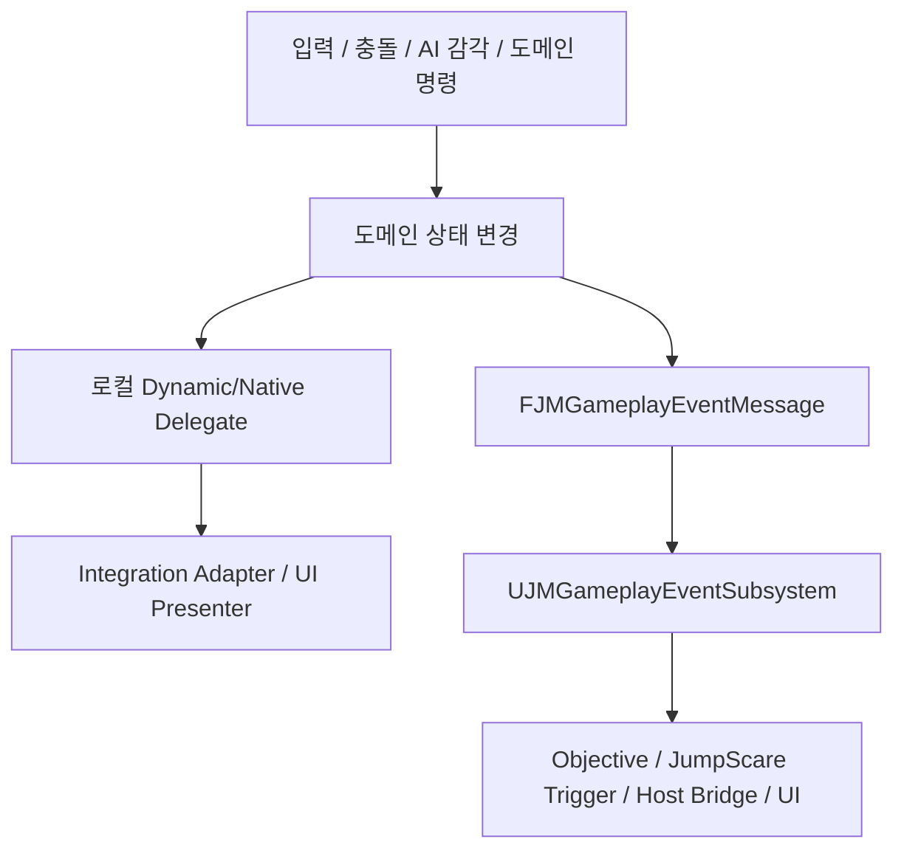
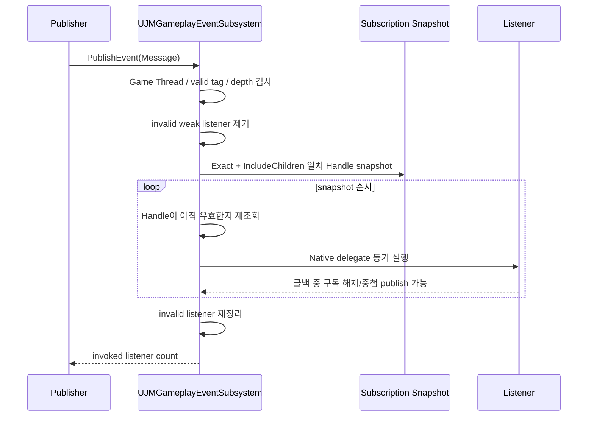
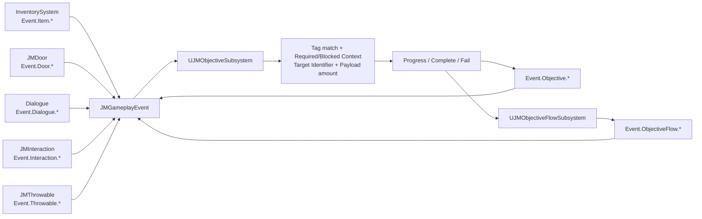
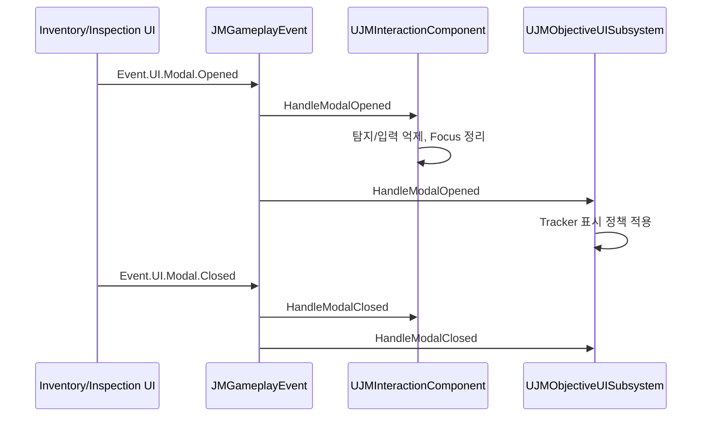
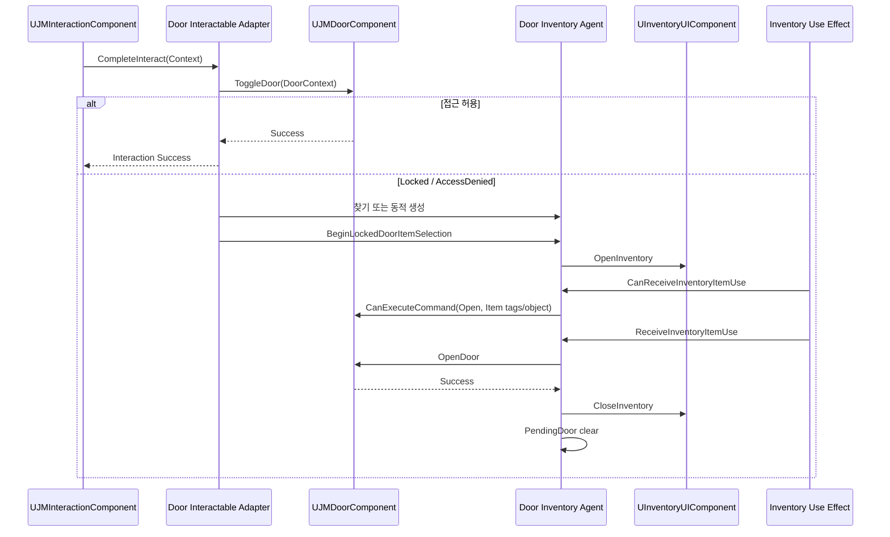
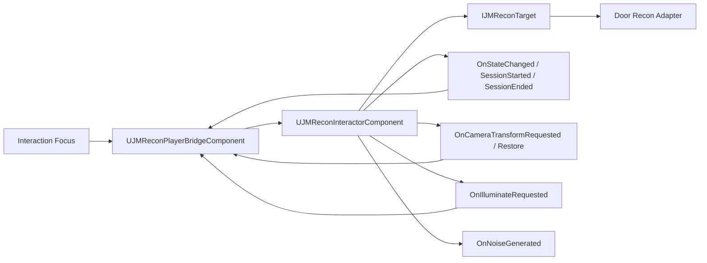
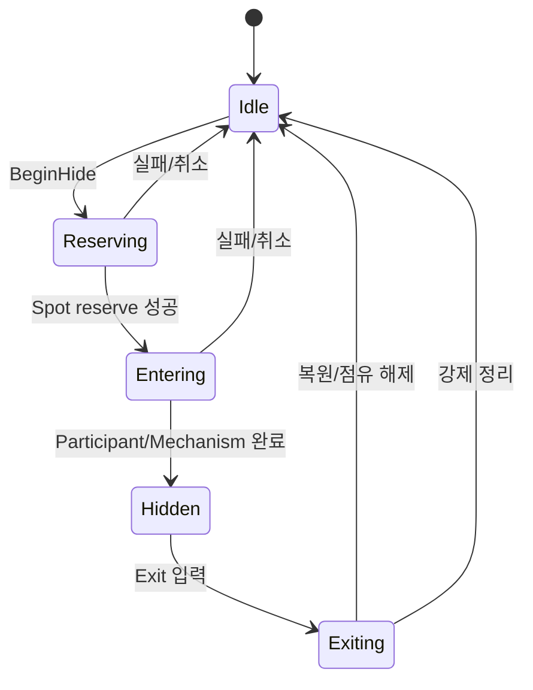
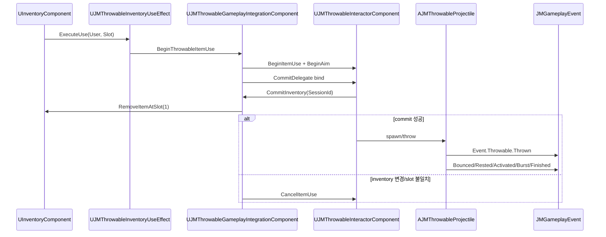
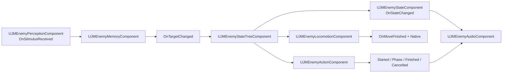

# Gameplay Event / Delegate Flow

> 기준: 실제 `PublishEvent`, `SubscribeEvent`, Delegate bind/broadcast 호출  
> 범위: Plugin 간 Gameplay Event와 주요 도메인 Delegate 흐름

## 1. 이벤트 계층

- 로컬 Delegate는 같은 도메인 또는 명시적 Integration의 즉시 반응에 사용한다.
- Gameplay Event는 발행자가 소비 Plugin을 알지 않아야 하는 완료 사실에 사용한다.
- Door를 여는 것 같은 **명령**은 Interface/직접 API로 전달하고, “문이 열렸다”는 **사실**은 Delegate/Event로 전달한다.

## 2. `UJMGameplayEventSubsystem` 실행 계약

근거: `Plugins/JMGameplayEvent/Source/JMGameplayEvent/Private/Subsystems/JMGameplayEventSubsystem.cpp`

### 보장과 제한

- Game Thread 전용이다. 위반 시 `ensureMsgf` 후 0/invalid handle을 반환한다.
- Publish는 동기식이다. Listener 작업 시간과 재진입이 Publisher 호출 스택에 포함된다.
- 네트워크 RPC/Replication이 없다. GameInstance process-local bus다.
- Listener는 `TWeakObjectPtr`로 보관한다.
- Callback 실행 전 구독 목록을 `(BucketTag, Id)` snapshot으로 만든다.
- 콜백이 자신 또는 다른 구독을 제거해도 다음 호출 전 handle을 다시 찾는다.
- 중첩 Publish는 Settings의 `MaximumNestedDispatchDepth`(기본 16)로 제한된다.
- 동일 Listener/Tag/MatchType 중복은 허용하되 경고 가능하다.
- 동일 Tag 내 호출 순서는 현재 배열 삽입 순서를 따르지만 외부 계약으로 문서화되어 있지 않다.

## 3. Gameplay Event Publisher 목록

| Publisher | Event Tag | Payload | 발행 시점 |
|---|---|---|---|
| `UJMInteractionComponent` | `Event.Interaction.Succeeded` | `UJMInteractionEventPayload` | Complete 성공 |
| `UJMInteractionComponent` | `Event.Interaction.Failed` | 동일 | Begin/Complete 실패 |
| `UJMInteractionComponent` | `Event.Interaction.FocusStarted/FocusEnded` | 동일 | Focus 교체 |
| `UInventoryComponent` | `Event.Item.Acquired` | `UInventoryItemEventPayload` | 수량 추가 성공 |
| `UInventoryComponent` | `Event.Item.Used` | 동일 | Use Effect 성공 |
| `UInventoryComponent` | `Event.Item.Dropped` | 동일 | World drop 성공 |
| `UInventoryComponent` | `Event.Item.Removed` | 동일 | 제거/이동 결과 |
| `UInventoryUIComponent` | `Event.UI.Inventory.Opened/Closed` | 없음 또는 UI context | UI 표시 변경 |
| `UDialogueSubsystem` | `Event.Dialogue.Started` | `UDialogueEventPayload` | Widget 생성/상태 Opening 후 |
| `UDialogueSubsystem` | `Event.Dialogue.Finished` | 동일 | 취소가 아닌 종료/정리 경로 |
| `UJMDoorComponent` | `Event.Door.Opened/Closed/Locked/Unlocked/Broken` | `UJMDoorStateChangedEventPayload` | Door 상태 변경 |
| `UJMJumpScareSubsystem` | `Event.JumpScare.Started/Impact/Exiting/Finished/Cancelled/Failed` | `UJMJumpScareEventPayload` | 재생 단계/종료 결과 |
| `UJMItemInspectionSubsystem` | `Event.UI.Modal.Opened/Closed` | 없음 | 조사 UI 시작/종료 |
| `UInventoryUIComponent` | `Event.UI.Modal.Opened/Closed` | 없음 | Inventory UI 시작/종료 |
| `UJMObjectiveSubsystem` | `Event.Objective.*` | `UJMObjectiveEventPayload` | 등록/활성/진행/완료/실패/리셋/제거 |
| `UJMObjectiveFlowSubsystem` | `Event.ObjectiveFlow.*` | `UJMObjectiveFlowEventPayload` | Flow 시작/Step/완료/실패/중지 |
| `AJMThrowableProjectile` | `Event.Throwable.Thrown/Bounced/Rested/Activated/Burst/Finished` | 기본 Message context | Projectile 수명 사건 |
| Blueprint library | 호출자가 지정한 유효 Tag | 선택 Payload | Blueprint 명시 발행 |

`JMHide`는 `Event.Hide.Entered`, `Event.Hide.Exited` Native Tag를 정의하지만 `JMGameplayEvent`를 의존하지 않으며 실제 Publish 호출도 없다. 현재는 외부 이벤트 계약이 아니라 미사용 Tag 정의다. Hide 상태는 로컬 Delegate로만 전달된다. Dialogue의 `Event.Dialogue.ChoiceSelected`도 정의만 있고 Runtime Publish 호출은 없다.

## 4. Subscriber 목록

| Subscriber | 구독 Tag | Match | 반응 |
|---|---|---|---|
| `UJMGameplayEventListenerComponent` | 설정된 `EventTags` | 설정값 | `OnGameplayEventReceived` Blueprint multicast |
| `UJMInteractionComponent` | `Event.UI.Modal.Opened`, `.Closed` | Exact | 탐지/입력 차단 상태 갱신 |
| `UJMObjectiveUISubsystem` | `Event.UI.Modal.Opened`, `.Closed` | Exact | Objective Widget 표시 정책 |
| `UJMObjectiveSubsystem` | 각 `UJMObjectiveDefinition.ListeningEventTag` | Definition의 Exact/IncludeChildren | Target/Context/Payload 필터 후 진행 |
| `UJMJumpScareEventTriggerComponent` | `TriggerEventTag` | 설정값 | JumpScare 재생 요청 |
| `UJMPrototypeDialogueQuestBridgeComponent` | `Event.Dialogue.Finished` | Exact | 호스트 진행/Flow 연결 |

모든 구독자는 EndPlay/Deinitialize에서 handle 또는 `UnsubscribeAll(this)`로 정리한다.

## 5. Objective 중심의 간접 통합

`JMObjective`는 Inventory/Door/Dialogue/Interaction/Throwable의 Build 의존성이 없다. `UJMObjectiveDefinition`의 `ListeningEventTag`와 Payload의 공통 Objective 필드를 사용해 간접 통합한다. 이는 DIP가 가장 잘 적용된 경로다.

### Payload 공통 의미

- `ObjectiveTargetIdentifier`: 목표 대상의 안정 ID
- `ObjectiveProgressAmount`: 진행 증가량
- `ObjectiveContextTags`: Required/Blocked 조건
- Source/Instigator/Target: 이벤트 발생 주체와 대상

Inventory는 ItemDefinition의 `ItemId`/`ItemTags`, Dialogue는 Sequence ID/Tag, Door는 Door 상태 Payload를 이 계약에 맞춰 넣는다.

## 6. Modal UI 이벤트 흐름

장점은 UI 기능들이 Interaction을 직접 참조하지 않고 공통 Tag로 차단한다는 점이다. 위험은 Open/Close 불균형이다. 중첩 Modal을 단순 bool로 처리하면 한 UI가 닫힐 때 다른 Modal의 차단까지 풀 수 있으므로 실제 구현이 참조 카운트/소유 토큰인지 계속 검증해야 한다.

`UDialogueSubsystem`은 현재 `Event.UI.Modal.*`을 발행하지 않고 자체 `ApplyInteractionMode`/정리 경로로 입력 모드를 관리한다. 따라서 대화 중 Interaction 차단이 필요하면 동일한 Modal 계약을 명시적으로 채택하거나 별도 Host 조립이 필요하다.

## 7. Door + Interaction + Inventory 흐름

Door Runtime은 Interaction/Inventory를 모른다. 세 타입을 아는 코드는 Integration에만 있다. 다만 Agent가 Pawn/Controller 그래프에서 UI Component를 구체 탐색하고, 실패 시 동적으로 Component를 추가하므로 조립이 암묵적이다.

## 8. Recon 로컬 Delegate 흐름

`UJMReconInteractorComponent`는 카메라나 입력의 구체 구현을 모른다. Integration Bridge가 요청 Delegate를 받아 PlayerController, Camera, SpotLight, 입력 Component를 관리한다. 이 경계는 좋지만 Bridge가 너무 많은 Presentation 책임을 소유한다.

## 9. Hide 로컬 Delegate 흐름

주요 Delegate:

- `OnPhaseChanged(SessionId, Old, New)`
- `OnHiddenEntered`, `OnHiddenExited`
- `OnExitPromptChanged`
- `OnHideFailed`
- Participant/Mechanism의 native `OnOperationCompleted`
- Spot의 `OnSpotStateChanged`

`JMHideDoorIntegration`은 Door의 `OnDoorStateChanged`를 구독해 Hide Mechanism 완료로 번역한다. `JMHideInteractionIntegration`은 Interaction InputInterceptor를 통해 Hidden 상태의 상호작용 키를 Exit 명령으로 라우팅한다.

## 10. Throwable + Inventory commit 흐름

아이템은 실제 Throw commit이 성공할 때만 소모된다. Slot index뿐 아니라 `InstanceId`와 ItemDefinition을 재검증해 UI 열림 후 인벤토리 변경 경쟁을 방어한다.

## 11. MonsterFramework 내부 이벤트 흐름

이 흐름은 `JMGameplayEvent`를 사용하지 않는 Plugin 내부 타입 안전 이벤트다. 독립 AI 프레임워크로서 적절한 선택이다.

## 12. GameplayTag 소유권 표

| Owner | Native/Config Tag | 소비 관계 |
|---|---|---|
| JMGameplayEvent | `Event.UI.Modal.*` | Inventory/Inspection 발행, Interaction/ObjectiveUI 구독 |
| JMInteraction | `Event.Interaction.*` | Interaction 발행, Objective 등 임의 소비자 구독 |
| InventorySystem | `Event.Item.*`, `Event.UI.Inventory.*` | Objective/Blueprint/Host 소비 |
| Dialogue | `Event.Dialogue.*` | Objective/Host Bridge 소비 |
| JMDoor | `Event.Door.*`, `JM.Door.Access.*`, `JM.Door.Noise.*` | Objective/Event Listener, Door 내부 접근/소음 |
| JMJumpScare | `Event.JumpScare.*` | 외부 Bridge/Listener 소비 |
| JMObjective | `Event.Objective.*`, `Event.ObjectiveFlow.*` | UI/Host/Blueprint 소비 |
| JMThrowable | `Event.Throwable.*` | Objective/AI/Blueprint 소비 가능 |
| JMHide | `Hide.Type.*`, `Event.Hide.*` | Type은 실제 사용, Event Tag는 현재 미발행 |
| JMMonsterFramework | `JM.Enemy.State.*`, `Action.*`, `Event.*` | State/Action/StateTree 내부 |

## 13. 이벤트 설계상 위험

1. 동기 bus이므로 Listener의 무거운 처리와 중첩 Publish가 발행자 프레임에 직접 영향을 준다.
2. Tag와 Payload 타입의 대응이 컴파일러로 강제되지 않는다. 잘못된 Payload는 런타임 필터 실패가 된다.
3. Event Tag가 여러 Plugin에 분산되어 전체 registry와 versioning 규칙이 필요하다.
4. `JMObjectiveTags.ini`에 예제/테스트/타 도메인 ID가 혼합되어 제품 태그 소유권이 흐려진다.
5. Hide는 Event Tag를 선언했지만 발행하지 않아 문서/코드 소비자가 잘못 기대할 수 있다.
6. Modal Open/Close는 중첩과 비정상 종료에서 반드시 대칭이어야 한다.
7. Gameplay Event는 복제되지 않으므로 서버 권한 이벤트로 오해하면 안 된다.

## 14. 새 이벤트 추가 체크리스트

- 소유 Plugin과 Tag namespace를 먼저 정한다.
- 명령인지 완료 사실인지 구분한다. 명령이면 Interface/API를 우선한다.
- Tag별 Payload 타입과 필수 필드를 문서화한다.
- Source/Instigator/Target 의미를 고정한다.
- Exact와 IncludeChildren 중 어느 구독이 안전한지 정한다.
- 중첩 Publish와 Listener 자체 해제를 테스트한다.
- EndPlay/Deinitialize에서 구독을 해제한다.
- 네트워크가 필요하면 bus 외부의 서버 권한/RPC 계층을 별도로 둔다.
- Tag 변경 시 에셋/Config/Save 마이그레이션을 수행한다.
