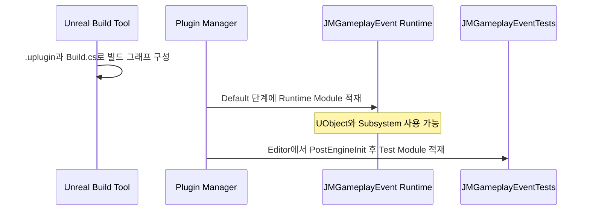

# 01. Plugin과 Module 경계

[교재 목차](README.md)

## 1. 개념

Plugin은 기능의 배포·활성화 단위이고 Module은 Unreal Build Tool이 컴파일하고 런타임에 적재하는 C++ 경계다. 하나의 Plugin이 Runtime, Editor, Tests 같은 여러 Module을 가질 수 있다. 의존성은 `.uplugin`의 Plugin 활성화 관계와 `Build.cs`의 C++ Module 링크 관계를 따로 읽어야 한다.

## 2. Unreal Engine에서 필요한 이유

Editor 전용 API인 `UnrealEd`를 게임 실행 파일에 섞지 않고, 재사용 기능을 Host 프로젝트에서 떼어 배포하며, 로딩 시점을 제어하기 위해 필요하다. 이 경계가 잘못되면 Runtime Module이 Editor에서만 빌드되거나 Shipping 빌드가 Editor 의존성 때문에 실패한다.

## 3. 이 프로젝트에서 사용된 위치

| 위치 | 대상 | 역할 |
|---|---|---|
| `Plugins/JMGameplayEvent/JMGameplayEvent.uplugin` | Plugin descriptor | Runtime과 Editor Test Module 선언 |
| `Plugins/JMGameplayEvent/Source/JMGameplayEvent/JMGameplayEvent.Build.cs` | Runtime Module | Core, GameplayTags, DeveloperSettings 의존 |
| `Plugins/JMGameplayEvent/Source/JMGameplayEvent/Private/JMGameplayEvent.cpp` | `FJMGameplayEventModule` | Module 진입점과 로그 카테고리 |
| `Source/P_060715/P_060715.cpp` | Host Module | Primary game module 등록 |

## 4. 실제 코드 분석

`JMGameplayEvent.uplugin`에는 다음 두 Module이 있다.

```json
{ "Name": "JMGameplayEvent", "Type": "Runtime", "LoadingPhase": "Default" }
{ "Name": "JMGameplayEventTests", "Type": "Editor",
  "LoadingPhase": "PostEngineInit", "TargetAllowList": [ "Editor" ] }
```

Runtime `Build.cs`의 공개 의존성은 `Core`, `CoreUObject`, `Engine`, `GameplayTags`, `DeveloperSettings`다. 반면 `JMGameplayEvent.cpp`의 `StartupModule`과 `ShutdownModule`에는 등록 작업이 없다. 즉 이 Module은 적재 훅보다 UObject/Subsystem 코드 제공 자체가 핵심이다.

Host는 다음 매크로로 실행 Module을 등록한다.

```cpp
IMPLEMENT_PRIMARY_GAME_MODULE(
    FDefaultGameModuleImpl, P_060715, "P_060715");
```

## 5. 실행 흐름



## 6. 왜 이런 구조를 선택했는지

**코드상 확인 가능한 사실:** Runtime 기능과 Editor 전용 자동화 테스트가 서로 다른 Module이고, Test Module에는 `TargetAllowList: Editor`가 지정되어 있다.

**설계 의도 추론:** 배포 Runtime의 의존성과 용량을 테스트 코드로 오염시키지 않으면서 Plugin 단위 테스트를 함께 배송하려는 선택으로 해석할 수 있다. 원 저자의 문서화된 확정 의도는 코드에서 확인되지 않는다.

## 7. 다른 구현 방법

- 모든 코드를 Host `P_060715` Module에 두는 단일 Module 방식
- Runtime과 Tests를 한 Module에 두고 `WITH_EDITOR`로 분기하는 방식
- Plugin은 하나로 두되 Runtime, Developer, Editor, Tests 네 계층으로 더 세분화하는 방식

첫 방식은 시작은 단순하지만 재사용이 어렵고, 두 번째는 전처리기 분기가 늘어난다. 세 번째는 규모가 클 때 유리하지만 Module 간 API 관리 비용이 증가한다.

## 8. 현재 구현의 장단점

장점은 Plugin별 소유권과 Runtime/Test 경계가 명확하다는 점이다. `JMRoomGrid`처럼 Runtime, Editor, Tests를 따로 둔 Plugin도 있어 패턴이 반복된다. 단점은 Plugin 수와 Module 수가 많아 `.uplugin`과 `Build.cs` 두 그래프를 함께 보지 않으면 실제 결합을 놓치기 쉽다는 점이다.

## 9. 개선 가능한 부분

- 모든 Plugin의 Module Type, LoadingPhase, Public/Private dependency를 CI에서 표로 생성한다.
- Runtime `Build.cs`의 공개 의존성을 실제 Public header 노출 기준으로 재검토한다.
- Module에 등록 작업이 없다면 빈 `StartupModule`/`ShutdownModule` 유지 여부를 코딩 규칙으로 정한다.
- Integration Plugin을 추가할 때 base Plugin이 Integration을 역참조하지 않는지 검사한다.

## 10. 면접에서 설명한다면 어떻게 설명할지

“이 프로젝트에서는 Plugin을 기능 배포 단위, Module을 빌드·로딩 단위로 사용했습니다. 예를 들어 `JMGameplayEvent`는 Runtime Module을 `Default`에, 테스트 Module을 Editor의 `PostEngineInit`에 로드합니다. `Build.cs` 의존성과 `.uplugin` 활성화 의존성을 별개로 검토했고, 테스트와 Editor API가 Shipping Runtime에 들어오지 않도록 경계를 유지했습니다.”

