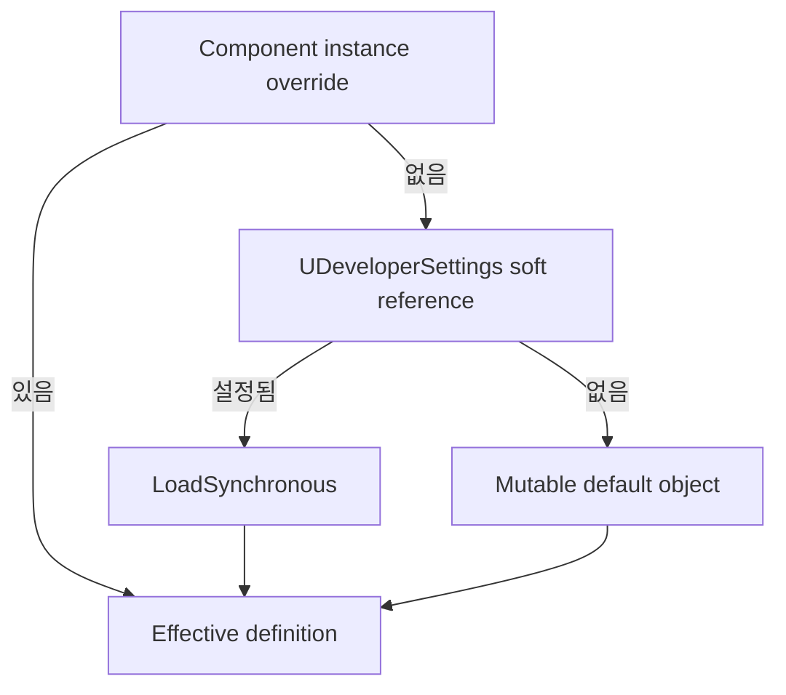

# 03. Data Asset, Developer Settings, Soft Reference

[교재 목차](README.md)

## 1. 개념

Data Asset은 코드와 콘텐츠 값을 분리하는 UObject Asset이다. `UDeveloperSettings`는 Project Settings와 config 파일을 연결한다. `TSoftObjectPtr`와 `TSoftClassPtr`는 대상 Asset을 즉시 hard-load하지 않고 경로로 보관하는 참조다.

## 2. Unreal Engine에서 필요한 이유

UI, Sound, Mesh 같은 콘텐츠를 C++ hard reference로 고정하면 로딩과 패키징 결합이 커진다. 반대로 모든 값을 호출부에 흩뿌리면 프로젝트 기본값을 일관되게 바꾸기 어렵다. 이 세 장치는 “규칙 코드, 프로젝트 기본값, 콘텐츠 Asset”을 서로 다른 변경 주기로 관리하게 한다.

## 3. 이 프로젝트에서 사용된 위치

| 파일 | 클래스/함수 | 사용 |
|---|---|---|
| `Plugins/InventorySystem/Source/InventorySystem/Public/Items/InventoryItemDefinition.h` | `UInventoryItemDefinition` | 아이템별 Primary Data Asset |
| `Plugins/InventorySystem/Source/InventorySystem/Public/Settings/InventorySystemSettings.h` | `UInventorySystemSettings` | `Config=Game` 기본값 |
| `Plugins/JMRecon/Source/JMReconRuntime/Private/Components/JMReconTargetComponent.cpp` | `GetEffectiveDefinition` | instance → settings → mutable default fallback |
| `Plugins/JMHide/Source/JMHideRuntime/Private/Components/JMHideSpotComponent.cpp` | `ResolveConfig` | 계층형 override 합성 |

## 4. 실제 코드 분석

인벤토리 설정은 프로젝트 단위 soft reference를 가진다.

```cpp
UCLASS(Config = Game, DefaultConfig)
class INVENTORYSYSTEM_API UInventorySystemSettings
    : public UDeveloperSettings
{
    GENERATED_BODY()

    UPROPERTY(EditAnywhere, Config, Category = "UI")
    TSoftClassPtr<UInventoryWidgetBase> DefaultInventoryWidgetClass;

    UPROPERTY(EditAnywhere, Config, Category = "Inventory",
        meta = (ClampMin = "1"))
    int32 DefaultMaxInventorySlots = 20;
};
```

`UInventoryItemDefinition`의 `Icon`, `InspectMesh`, `WorldItemClass`, `InspectorData`도 soft reference다. 반면 `UseEffect`는 `Instanced TObjectPtr`여서 Definition 내부에 실제 subobject로 소유된다. 두 참조는 교환 가능한 문법이 아니라 로딩·소유 의미가 다르다.

`UJMReconTargetComponent::GetEffectiveDefinition`은 instance Definition이 없으면 settings의 soft reference를 `LoadSynchronous()`로 로드하고, 그래도 없으면 mutable default Definition을 사용한다.

## 5. 실행 흐름



`JMHideSpotComponent::ResolveConfig`는 settings 기본값, Definition override, instance override, request override를 순서대로 합성한다. 뒤 단계가 앞 단계보다 더 구체적인 값이다.

## 6. 왜 이런 구조를 선택했는지

**코드상 확인 가능한 사실:** 아이템 콘텐츠 참조는 soft pointer이고, Recon/Hide는 여러 단계의 기본값과 override를 계산한다. 일부 경로는 soft reference를 동기 로드한다.

**설계 의도 추론:** Plugin을 다른 프로젝트로 옮겨도 Host가 Project Settings나 Data Asset만 바꿔 사용할 수 있게 하려는 구조로 해석된다. 동기 로드는 API를 단순하게 유지하려는 선택일 수 있으나 명시된 이유는 없다.

## 7. 다른 구현 방법

- ConstructorHelpers로 Asset 경로를 hard-code
- 모든 값을 Actor/Component instance property로만 저작
- Asset Manager로 비동기 preload 후 사용
- Data Registry나 Data Table을 중앙 데이터 원본으로 사용

초기 규모에는 동기 soft-load가 단순하다. 대형 Asset이나 플레이 중 첫 호출에는 Asset Manager 비동기 로딩이 hitch를 줄일 수 있다.

## 8. 현재 구현의 장단점

장점은 Plugin 코드가 특정 콘텐츠 Asset과 느슨하게 결합되고, 프로젝트·Definition·instance별 재정의가 가능하다는 점이다. 단점은 fallback 우선순위를 모르면 실제 적용 값을 추적하기 어렵고, `LoadSynchronous`가 게임 중 호출되면 프레임 정지를 만들 수 있다는 점이다.

## 9. 개선 가능한 부분

- 각 시스템의 override 우선순위를 공통 문서와 API 주석으로 고정한다.
- 플레이 중 사용되는 큰 Asset은 명시적 preload 단계로 옮긴다.
- 필수 soft reference가 비어 있거나 cook 대상에서 누락됐는지 Asset Validation으로 검사한다.
- fallback으로 생성되는 mutable default가 공유 상태를 갖지 않는지 테스트한다.

## 10. 면접에서 설명한다면 어떻게 설명할지

“정적 아이템 정보는 `UPrimaryDataAsset`, 프로젝트 기본값은 `UDeveloperSettings(Config=Game)`에 두었습니다. UI·Mesh·Sound는 soft reference로 보관해 Plugin Runtime이 특정 콘텐츠를 hard-load하지 않게 했습니다. Recon에서는 instance, settings, default 순으로 정의를 해석합니다. 다만 현재 일부 `LoadSynchronous` 경로는 런타임 hitch 가능성이 있어 preload로 개선할 수 있습니다.”
