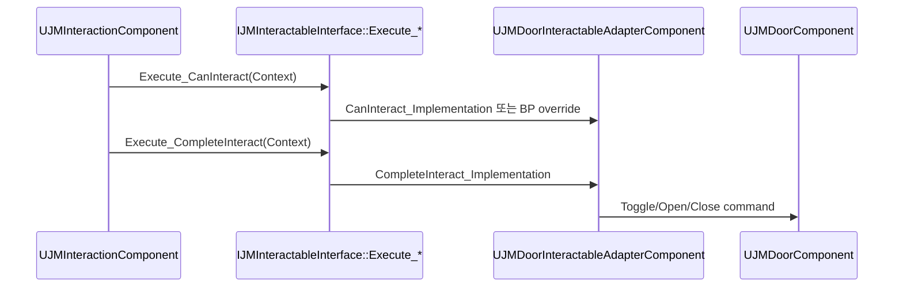

# 04. Unreal Interface

[교재 목차](README.md)

## 1. 개념

Unreal Interface는 `UINTERFACE`로 Reflection에 등록되는 UObject 측 표식과 `I...` C++ 계약의 쌍이다. `BlueprintNativeEvent` 함수는 C++ 기본 구현과 Blueprint override를 모두 허용하며 호출자는 생성된 `Execute_함수명`을 사용한다.

## 2. Unreal Engine에서 필요한 이유

상호작용 대상이 Door Actor일 수도, Item Actor일 수도, ActorComponent일 수도 있다. 공통 base Actor 상속을 강제하지 않고 Blueprint 구현까지 동일 호출 경로에 포함하려면 Unreal Interface가 필요하다.

## 3. 이 프로젝트에서 사용된 위치

| 파일 | Interface/구현 | 역할 |
|---|---|---|
| `Plugins/JMInteraction/Source/JMInteraction/Public/Interfaces/JMInteractableInterface.h` | `IJMInteractableInterface` | 상호작용 수명 계약 |
| `Plugins/JMInteraction/Source/JMInteraction/Private/Components/JMInteractionComponent.cpp` | `UJMInteractionComponent` | `Execute_*` 호출자 |
| `Plugins/JMDoorGameplayIntegration/Source/JMDoorGameplayIntegration/Public/Components/JMDoorInteractableAdapterComponent.h` | `UJMDoorInteractableAdapterComponent` | Door를 Interactable로 변환 |
| `Plugins/JMDoor/Source/JMDoorRuntime/Public/Interfaces/JMDoorSaveInterface.h` | `IJMDoorSaveInterface` | 저장 capture/restore 계약 |

## 4. 실제 코드 분석

상호작용 계약에는 판정, 시작, 완료, 취소, 표시, focus가 모두 들어 있다.

```cpp
UFUNCTION(BlueprintNativeEvent, BlueprintCallable, Category = "JM Interaction")
bool CanInteract(const FJMInteractionContext& Context) const;

UFUNCTION(BlueprintNativeEvent, BlueprintCallable, Category = "JM Interaction")
FJMInteractionResult BeginInteract(const FJMInteractionContext& Context);

UFUNCTION(BlueprintNativeEvent, BlueprintCallable, Category = "JM Interaction")
void OnFocusEnd(const FJMInteractionContext& Context);
```

`UJMInteractionComponent`는 대상이 Interface를 구현하는지 확인한 뒤 `IJMInteractableInterface::Execute_CanInteract(Target, Context)` 같은 생성 wrapper를 호출한다. 이 방식이어야 Blueprint override도 실행된다. `UJMDoorInteractableAdapterComponent`는 `CanInteract_Implementation`, `BeginInteract_Implementation`처럼 C++ 기본 구현 지점을 override한다.

## 5. 실행 흐름



## 6. 왜 이런 구조를 선택했는지

**코드상 확인 가능한 사실:** `JMInteraction`은 Door 타입을 include하지 않고 `IJMInteractableInterface`만 호출한다. Door 연결은 별도 Integration Plugin의 adapter가 구현한다.

**설계 의도 추론:** 상호작용 core를 구체 gameplay system에서 분리하고, 새 대상이 계약만 구현하면 참여하게 하려는 의존성 역전으로 해석된다. 이 표현은 구조에 대한 해석이며 원 저자의 확정 진술은 아니다.

## 7. 다른 구현 방법

- 공통 `AInteractableActor` base class 상속
- Actor tag와 class cast 분기
- `UActorComponent` 하나를 직접 찾아 concrete API 호출
- Gameplay Ability나 event-only 요청으로 상호작용 모델링

단일 상속은 단순하지만 이미 다른 Actor 계층을 가진 대상에 제약을 준다. tag/cast 분기는 대상 종류가 늘수록 호출자가 비대해진다.

## 8. 현재 구현의 장단점

장점은 Actor와 Component 구현을 모두 수용하고 Blueprint 확장도 가능하다는 점이다. Context와 Result 구조체로 호출 계약도 명시된다. 단점은 구현 누락이 컴파일 오류보다 기본 event 동작으로 숨어들 수 있고, 매 호출마다 Interface 지원 여부와 올바른 `Execute_*` 사용을 지켜야 한다는 점이다.

## 9. 개선 가능한 부분

- 필수 함수의 기본 구현이 조용히 성공하지 않도록 실패 Result와 로그 정책을 통일한다.
- Interface가 너무 많은 책임을 갖게 되면 focus/prompt와 execution 계약 분리를 검토한다.
- Blueprint 구현 대상에 대한 functional contract test를 추가한다.
- Adapter 자동 부착 시 Interface 중복 구현이 생기는 경우의 우선순위를 명시한다.

## 10. 면접에서 설명한다면 어떻게 설명할지

“`JMInteraction`은 `IJMInteractableInterface`만 알고 Door를 직접 참조하지 않습니다. 호출은 Blueprint override까지 처리하는 `Execute_CanInteract`와 `Execute_CompleteInteract`를 사용합니다. Door 쪽은 Integration Plugin의 adapter가 `_Implementation`을 구현합니다. 그래서 상호작용 core의 변경 없이 새 Actor나 Component를 연결할 수 있습니다.”
