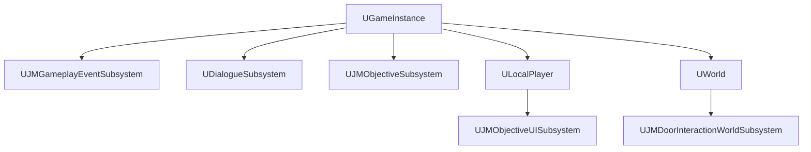

# 06. Subsystem 수명 선택

[교재 목차](README.md)

## 1. 개념

Unreal Subsystem은 Engine, Editor, GameInstance, World, LocalPlayer 같은 소유자의 수명에 맞춰 자동 생성되는 서비스 객체다. 핵심은 “전역 접근” 자체가 아니라 데이터와 작업이 살아 있어야 할 정확한 범위를 고르는 것이다.

## 2. Unreal Engine에서 필요한 이유

이벤트 버스는 같은 GameInstance 안에서 map 전환 후에도 접근할 수 있어야 하고, 월드 Actor 자동 검색은 현재 World를 벗어나면 사라져야 한다. 로컬 플레이어별 UI는 split-screen에서 다른 플레이어와 상태를 공유하면 안 된다. 이 차이를 수동 singleton 하나로 처리하기 어렵다.

## 3. 이 프로젝트에서 사용된 위치

| 수명 | 클래스 | 파일 | 실제 책임 |
|---|---|---|---|
| GameInstance | `UJMGameplayEventSubsystem` | `Plugins/JMGameplayEvent/.../JMGameplayEventSubsystem.h` | 동기 event bus |
| GameInstance | `UDialogueSubsystem` | `Plugins/ReusableDialogueSystem/.../DialogueSubsystem.h` | 현재 대화와 UI 수명 |
| GameInstance | `UJMObjectiveSubsystem` | `Plugins/JMObjective/.../JMObjectiveSubsystem.h` | objective runtime state |
| LocalPlayer | `UJMObjectiveUISubsystem` | `Plugins/JMObjective/.../JMObjectiveUISubsystem.h` | 플레이어별 objective UI |
| World | `UJMDoorInteractionWorldSubsystem` | `Plugins/JMDoorGameplayIntegration/...` | 현재 World의 Door adapter 부착 |

## 4. 실제 코드 분석

Event subsystem의 선언과 종료는 작다.

```cpp
UCLASS()
class JMGAMEPLAYEVENT_API UJMGameplayEventSubsystem
    : public UGameInstanceSubsystem
{
    GENERATED_BODY()
};

void UJMGameplayEventSubsystem::Deinitialize()
{
    bDeinitializing = true;
    SubscriptionsByTag.Reset();
    Super::Deinitialize();
}
```

`UJMObjectiveUISubsystem`은 `ULocalPlayerSubsystem`에서 GameInstance의 Objective/Event subsystem을 찾아 UI 상태만 플레이어 범위로 유지한다. Door Integration의 World subsystem은 초기 Actor scan과 actor-spawn handler로 현재 World의 Door를 처리한다. 서로 같은 Subsystem이어도 소유 범위가 다르다.

## 5. 실행 흐름



GameInstance subsystem은 GameInstance 종료 때 `Deinitialize`되고, World subsystem은 map World와 함께 교체되며, LocalPlayer subsystem은 해당 플레이어가 제거될 때 종료된다.

## 6. 왜 이런 구조를 선택했는지

**코드상 확인 가능한 사실:** event/objective/dialogue는 GameInstance, Door actor 감시는 World, objective UI는 LocalPlayer 범위다.

**설계 의도 추론:** 상태의 소비자와 자연 수명에 맞춘 선택으로 해석된다. 특히 Door 자동 부착이 다른 World의 Actor를 보존하지 않게 하고 UI를 플레이어별로 분리하려는 것으로 보이지만, 확정된 설계 기록은 확인되지 않았다.

## 7. 다른 구현 방법

- GameMode나 GameState에 모든 service 배치
- static singleton
- persistent manager Actor를 level에 배치
- dependency injection container를 직접 구현

GameMode는 client에 없고 level 전환 수명이 다르다. static singleton은 World context와 PIE 다중 World에서 문제가 된다. manager Actor는 level 저작 누락 가능성이 있다.

## 8. 현재 구현의 장단점

장점은 엔진이 생성·접근·종료를 관리하고 PIE/World context에 맞는 service를 얻는다는 점이다. 단점은 호출부가 어디서 어떤 subsystem을 찾는지 분산될 수 있고, GameInstance subsystem이 많은 mutable state를 가지면 사실상의 전역 상태가 된다는 점이다.

## 9. 개선 가능한 부분

- 새 subsystem을 만들기 전에 상태 소유자가 GameInstance, World, LocalPlayer 중 어디인지 결정표로 기록한다.
- `Deinitialize`에서 delegate, timer, weak reference map 정리를 테스트한다.
- World context가 없는 UObject에서 subsystem lookup을 숨기지 말고 명시적 주입을 고려한다.
- multiplayer가 추가되면 authoritative state가 GameInstance에 있어도 되는지 다시 검토한다.

## 10. 면접에서 설명한다면 어떻게 설명할지

“Subsystem은 편한 singleton으로 고르지 않고 수명으로 선택했습니다. 전역 gameplay event와 objective 상태는 `UGameInstanceSubsystem`, 현재 map의 Door actor 감시는 `UWorldSubsystem`, 플레이어별 objective UI는 `ULocalPlayerSubsystem`입니다. 각 소유자 종료 시 구독과 상태를 정리해 PIE 다중 World와 map 전환의 수명 오류를 줄였습니다.”

