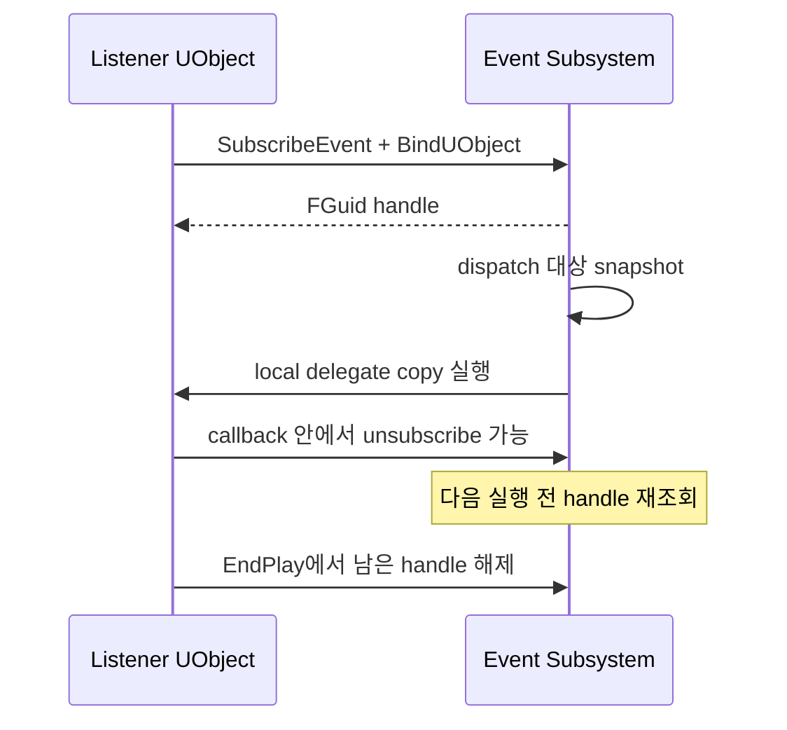

# 07. Delegate와 객체 수명

[교재 목차](README.md)

## 1. 개념

Delegate는 발행자와 수신자를 함수 호출 규약으로 연결한다. native single-cast, native multicast, dynamic multicast 등 종류마다 성능, Blueprint 노출, 직렬화 특성이 다르다. 바인딩보다 중요한 것은 해제 시점과 callback 중 목록이 변경되는 경우의 안전성이다.

## 2. Unreal Engine에서 필요한 이유

Inventory UI가 Inventory 내부 구현을 polling하지 않고 변경 시점에 갱신하고, gameplay system이 서로를 직접 호출하지 않게 하려면 event notification이 필요하다. 그러나 UObject가 파괴된 뒤 callback이 남거나 callback이 자기 자신을 해제하면 수명 오류가 생길 수 있다.

## 3. 이 프로젝트에서 사용된 위치

| 파일 | Delegate 사용 |
|---|---|
| `Plugins/InventorySystem/.../InventoryComponent.h` | `DECLARE_DYNAMIC_MULTICAST_DELEGATE*`와 `BlueprintAssignable` |
| `Plugins/InventorySystem/.../InventoryUIComponent.cpp` | `AddUniqueDynamic` / `RemoveDynamic` |
| `Plugins/JMGameplayEvent/.../JMGameplayEventTypes.h` | native callback + Blueprint-facing dynamic multicast |
| `Plugins/JMGameplayEvent/.../JMGameplayEventListenerComponent.cpp` | `BindUObject`, handle 저장, `EndPlay` 해제 |
| `Plugins/JMGameplayEvent/.../JMGameplayEventSubsystem.cpp` | weak listener와 dispatch snapshot |

## 4. 실제 코드 분석

Event bus의 native callback은 반환값 없는 single-cast delegate다.

```cpp
DECLARE_DELEGATE_OneParam(
    FJMGameplayEventNativeDelegate,
    const FJMGameplayEventMessage&);

DECLARE_DYNAMIC_MULTICAST_DELEGATE_OneParam(
    FJMGameplayEventDynamicDelegate,
    const FJMGameplayEventMessage&, Message);
```

`UJMGameplayEventListenerComponent::BeginPlay` 계열은 `BindUObject`로 native callback을 만들고 구독 handle을 보관한다. `EndPlay`에서 모든 handle을 해제한 뒤 배열을 비운다. 수신한 native event는 `OnGameplayEventReceived.Broadcast(Message)`로 Blueprint에 중계한다.

`PublishEvent`는 호출할 `BucketTag + Id` snapshot을 먼저 만든다. 실행 직전 구독을 다시 찾고, delegate를 local copy한 다음 호출한다. callback이 자기 구독을 제거해 원 배열 element가 사라져도 현재 stack의 delegate가 파괴되지 않는다.

## 5. 실행 흐름



## 6. 왜 이런 구조를 선택했는지

**코드상 확인 가능한 사실:** native event bus와 Blueprint dynamic delegate를 분리하고, listener는 weak reference와 handle로 추적된다. dispatch는 mutation-safe snapshot을 사용한다.

**설계 의도 추론:** core dispatch 비용과 수명 제어는 native로 유지하면서 Blueprint 소비 편의는 adapter component가 제공하도록 나눈 것으로 해석된다. 주석은 self-unsubscribe 안전성의 직접 이유를 명시한다.

## 7. 다른 구현 방법

- `TMulticastDelegate`를 각 system이 직접 공개
- `FDelegateHandle`을 사용하는 engine-style multicast
- Blueprint Event Dispatcher만 사용
- polling 또는 직접 함수 호출

직접 multicast는 간단하지만 tag routing과 payload 공통 계약이 없다. Blueprint-only dispatcher는 C++ 대규모 dispatch에 비용과 타입 제약이 있다. polling은 불필요한 tick과 지연을 만든다.

## 8. 현재 구현의 장단점

장점은 UObject 수명에 맞는 `BindUObject`, explicit handle, weak listener cleanup, callback 중 구독 변경 안전성이다. 단점은 모든 호출이 game thread로 제한되고, duplicate subscription은 경고만 하며 허용되어 의도치 않은 중복 callback이 생길 수 있다.

## 9. 개선 가능한 부분

- RAII 구독 wrapper로 handle 해제를 구조화한다.
- 중복 구독 허용/거부 정책을 API 인자로 명시하거나 keyed subscription을 제공한다.
- `AddUniqueDynamic`와 `RemoveDynamic` 쌍을 component별 체크리스트로 검증한다.
- 비동기 thread에서 들어오는 event가 필요하면 game-thread enqueue 경계를 별도로 만든다.

## 10. 면접에서 설명한다면 어떻게 설명할지

“Delegate는 연결보다 해제를 중심으로 설계했습니다. `JMGameplayEventSubsystem`은 listener를 weak pointer로 저장하고 FGuid handle을 반환합니다. 발행 시 대상 snapshot을 만들고 callback을 local copy해 self-unsubscribe에도 안전합니다. Component는 `EndPlay`에서 handle을 해제하고, Blueprint에는 별도 dynamic multicast로 중계합니다.”

