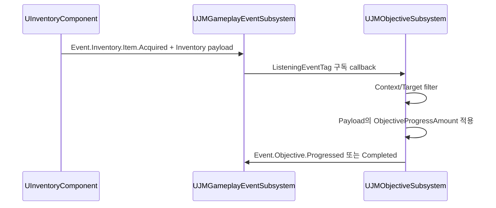

# 08. GameplayTag 기반 Event Bus

[교재 목차](README.md)

## 1. 개념

GameplayTag는 `Event.Inventory.Item.Acquired`처럼 계층을 가진 이름 식별자다. 이 프로젝트의 event bus는 Tag로 channel을 선택하고 `FJMGameplayEventMessage`로 공통 envelope를 전달한다. Exact와 IncludeChildren 구독이 있어 부모 Tag 구독자가 하위 event를 받을 수 있다.

## 2. Unreal Engine에서 필요한 이유

Inventory가 Objective를 직접 호출하고 Door가 UI를 직접 숨기기 시작하면 Plugin 사이에 양방향 build dependency가 생긴다. 공통 Tag와 message contract를 사용하면 발행자는 구독자를 몰라도 되고, 새 시스템이 기존 발행 event에 참여할 수 있다.

## 3. 이 프로젝트에서 사용된 위치

| 파일/타입 | 역할 |
|---|---|
| `Plugins/JMGameplayEvent/.../JMGameplayEventTypes.h` / `FJMGameplayEventMessage` | 공통 envelope |
| `Plugins/JMGameplayEvent/.../JMGameplayEventSubsystem.cpp` / `PublishEvent` | routing과 dispatch |
| `Plugins/InventorySystem/.../InventoryComponent.cpp` / `PublishInventoryEvent` | 획득·사용·버림 발행 |
| `Plugins/JMObjective/.../JMObjectiveSubsystem.cpp` / `SubscribeObjective` | 정의별 Tag 구독 |
| `Plugins/JMDoor/.../JMDoorGameplayEventPayload.h` | Door typed payload |

## 4. 실제 코드 분석

Message는 tag 외에도 source와 목적별 payload를 운반한다.

```cpp
USTRUCT(BlueprintType)
struct FJMGameplayEventMessage
{
    GENERATED_BODY()
    FGameplayTag EventTag;
    TObjectPtr<UObject> Source = nullptr;
    TObjectPtr<AActor> Instigator = nullptr;
    TObjectPtr<UObject> Target = nullptr;
    FGameplayTagContainer ContextTags;
    TObjectPtr<UObject> Payload = nullptr;
};
```

`PublishEvent`는 `Message.EventTag.MatchesTag(Pair.Key)`로 부모 bucket을 찾되, 해당 subscription이 `IncludeChildren`일 때만 포함한다. 무한 재발행을 막기 위해 `MaximumNestedDispatchDepth`를 확인한다. Header 주석과 구현은 game-thread 동기 dispatch이며 RPC/replication을 하지 않는다고 명시한다.

Inventory, Interaction, Door payload는 `UJMGameplayEventPayloadBase`를 상속한다. 공통 `ObjectiveTargetIdentifier`, `ObjectiveProgressAmount`, `ObjectiveContextTags` 덕분에 `UJMObjectiveSubsystem::HandleGameplayEvent`는 concrete Inventory payload를 몰라도 목표 진행량과 필터를 읽는다.

## 5. 실행 흐름



`UJMObjectiveSubsystem::DoesEventPassFilters`는 message와 payload context tag를 합치고 required/blocked tag와 target identifier를 검사한다. 진행이 완료되면 해당 objective 구독을 해제한 뒤 completed event를 다시 발행한다.

## 6. 왜 이런 구조를 선택했는지

**코드상 확인 가능한 사실:** producer와 Objective 사이에는 direct 호출이 없고, Tag와 base payload contract를 통해 진행이 연결된다. bus는 동기·game-thread·GameInstance 범위다.

**설계 의도 추론:** 재사용 Plugin 간 compile-time 결합을 낮추면서 계층적 event 관찰과 데이터 기반 objective 연결을 제공하려는 구조로 해석된다. 네트워크 event bus로 만들려는 의도는 오히려 코드 주석에서 명시적으로 부정된다.

## 7. 다른 구현 방법

- 시스템별 직접 interface 호출
- Gameplay Message Router 또는 GAS Gameplay Event 사용
- C++ enum channel + variant payload
- engine multicast delegate를 중앙 registry 없이 사용

GAS를 이미 쓰는 프로젝트라면 native Gameplay Event가 더 자연스러울 수 있다. enum은 rename-safe하지만 Plugin 독립 확장과 계층 match가 어렵다.

## 8. 현재 구현의 장단점

장점은 계층 Tag routing, producer/consumer 분리, Objective용 공통 payload, mutation-safe dispatch다. 단점은 `UObject* Payload` 자체는 compile-time type safety가 약하며, 동기 nested dispatch가 깊어질 수 있고, Tag 이름 계약이 문서·테스트에 의존한다.

## 9. 개선 가능한 부분

- Event Tag별 허용 payload class를 registry나 테스트로 검증한다.
- 중요 Tag와 payload schema를 단일 reference 문서/코드 생성 원본으로 관리한다.
- nested dispatch depth 차단 시 gameplay 복구 정책을 정의한다.
- multiplayer에서는 발행 지점의 authority와 복제 경계를 별도로 설계한다.

## 10. 면접에서 설명한다면 어떻게 설명할지

“`JMGameplayEventSubsystem`은 GameplayTag 기반 동기 event bus입니다. Exact/IncludeChildren matching과 공통 message envelope를 제공하고, payload는 목적별 UObject지만 objective용 공통 base를 상속합니다. Inventory 획득 event를 Objective가 데이터 정의의 Tag로 구독해 target/context를 필터링하므로 두 Plugin은 서로 concrete 타입을 직접 호출하지 않습니다.”

