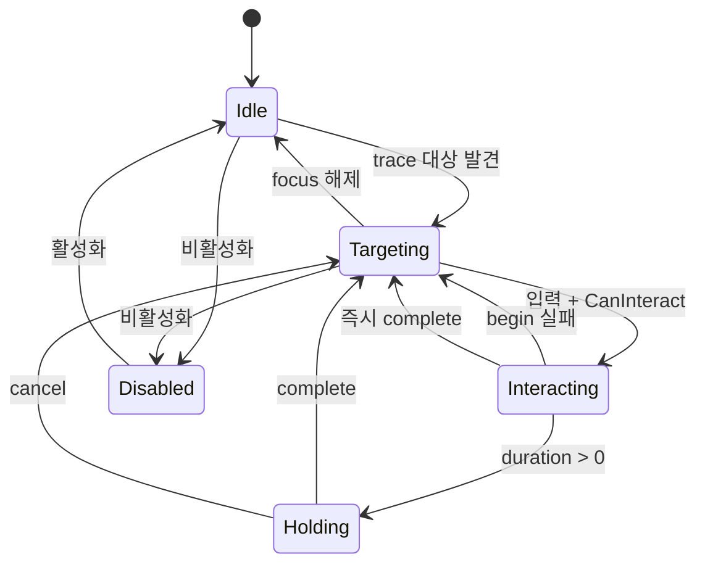

# 09. 상호작용 Trace와 상태 머신

[교재 목차](README.md)

## 1. 개념

상호작용 시스템은 시야나 cursor trace로 후보를 찾고, focus를 관리하며, 입력을 begin/hold/complete/cancel 단계로 변환한다. `UJMInteractionComponent`는 이 과정을 `Disabled`, `Idle`, `Targeting`, `Interacting`, `Holding` 상태로 명시한다.

## 2. Unreal Engine에서 필요한 이유

단순히 hit Actor에 `Interact()`를 호출하면 hold duration, 대상 소멸, UI modal, focus prompt, 입력 가로채기 같은 실제 게임 조건을 처리하기 어렵다. 탐색과 실행 사이에 상태와 context/result 계약이 필요하다.

## 3. 이 프로젝트에서 사용된 위치

| 파일 | 클래스/함수 | 책임 |
|---|---|---|
| `Plugins/JMInteraction/.../JMInteractionComponent.cpp` | `RefreshCurrentInteractable` | cursor/view trace 선택 |
| 같은 파일 | `TryBeginInteraction` | 검증과 begin/hold 분기 |
| 같은 파일 | `CompleteInteraction`, `CancelInteraction` | 완료와 정리 |
| 같은 파일 | `SetCurrentInteractable` | focus end/begin과 prompt |
| `Plugins/JMInteraction/.../JMInteractionTypes.h` | `FJMInteractionContext/Result` | 호출 데이터와 실패 code |

## 4. 실제 코드 분석

입력 진입점은 상태를 순서대로 방어한다.

```cpp
if (!CurrentInteractableObject.IsValid() &&
    TraceMode == EJMInteractionTraceMode::OnInput)
{
    RefreshCurrentInteractable();
}

UObject* Object = CurrentInteractableObject.Get();
if (!IsValid(Object))
{
    const FJMInteractionResult Result = FJMInteractionResult::Failure(
        EJMInteractionResultCode::NoTarget,
        NSLOCTEXT("JMInteraction", "NoTarget",
            "No interactable target was found."));
    PublishInteractionEvent(JMInteractionEventTags::Failed, nullptr,
        Result, FJMInteractionContext());
    return Result;
}

const FJMInteractionContext Context = BuildInteractionContext(Object);
InteractionState = EJMInteractionState::Interacting;
const FJMInteractionResult BeginResult =
    IJMInteractableInterface::Execute_BeginInteract(Object, Context);
```

실제 코드는 각 실패에도 `PublishInteractionEvent`를 호출한다. duration이 `KINDA_SMALL_NUMBER` 이하면 즉시 `CompleteInteraction`으로 가고, 아니면 `Holding`으로 전환한다. 완료 후 active weak pointer를 비우고 현재 focus 유무에 따라 `Targeting` 또는 `Idle`로 돌아간다.

입력 실행 전에 owner의 모든 component 중 `UJMInteractionInputInterceptorInterface` 구현을 순회한다. Hide 같은 시스템이 기본 interaction보다 입력을 먼저 소비할 수 있는 확장점이다.

## 5. 실행 흐름



## 6. 왜 이런 구조를 선택했는지

**코드상 확인 가능한 사실:** 탐색 모드는 cursor/view, 갱신 모드는 tick/timer/on-input을 지원한다. 대상은 weak pointer이고 실행은 Interface로 위임한다. modal event는 prompt suppression depth를 증감한다.

**설계 의도 추론:** 다양한 입력 장치와 성능 요구를 같은 component에서 설정으로 바꾸고, 상호작용 대상 수명을 안전하게 다루려는 구조로 해석된다. 모든 모드를 한 클래스에 둔 이유는 문서화되어 있지 않다.

## 7. 다른 구현 방법

- PlayerController가 line trace와 대상별 cast를 모두 수행
- overlap volume이 후보 목록을 유지하고 거리/우선순위로 선택
- Gameplay Ability로 hold와 cancellation을 모델링
- Enhanced Input Trigger의 hold 완료만 사용

overlap 후보 방식은 시야 trace 비용을 줄일 수 있지만 장애물/조준 판정이 추가로 필요하다. GAS는 예측·네트워크가 필요할 때 강력하다.

## 8. 현재 구현의 장단점

장점은 구조화된 Result, Interface 기반 대상, weak reference, 여러 trace cadence, 명시적 상태다. prompt와 gameplay event도 같은 전환에서 발행된다. 단점은 component 책임이 탐색·상태·UI prompt·modal 억제·event 발행까지 넓고, hold 진행 갱신의 호출 주체를 함께 이해해야 한다.

## 9. 개선 가능한 부분

- detection strategy를 별도 객체/component로 분리해 cursor/view/overlap 확장을 단순화한다.
- 상태 전환 함수를 중앙화해 모든 transition의 delegate/event 불변식을 검사한다.
- 대상이 hold 중 파괴되는 경우와 modal 중첩을 자동화 테스트로 고정한다.
- network interaction이 추가되면 client focus와 server authoritative execute를 분리한다.

## 10. 면접에서 설명한다면 어떻게 설명할지

“`UJMInteractionComponent`는 trace 탐색과 실행을 상태 머신으로 연결합니다. 입력 시 interceptor를 먼저 확인하고 Disabled/Busy/NoTarget/CanInteract를 구조화된 Result로 검증합니다. duration이 0이면 즉시 완료하고 아니면 Holding으로 전환합니다. 대상은 weak pointer, 실행은 Unreal Interface이므로 Door 같은 concrete 타입과 분리됩니다.”
