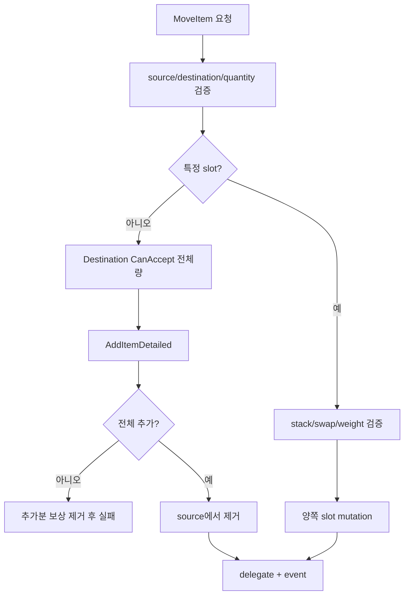

# 10. 인벤토리 도메인과 원자성

[교재 목차](README.md)

## 1. 개념

인벤토리 도메인은 아이템 정적 정의, 슬롯별 런타임 상태, 용량·무게 불변식, 작업 결과를 구분해야 한다. “원자적 이동”은 destination이 전체 수량을 받을 수 있을 때만 source를 최종 차감하고, 중간 실패 시 관찰 가능한 부분 이동을 남기지 않는 것을 뜻한다.

## 2. Unreal Engine에서 필요한 이유

Blueprint에서 bool 하나만 받으면 왜 실패했는지 UI가 설명하기 어렵다. 두 Inventory 사이 이동 중 destination에 일부만 추가된 뒤 source 차감이 실패하면 아이템 복제나 손실이 발생한다. gameplay state 변경은 명시적 결과와 rollback 규칙이 필요하다.

## 3. 이 프로젝트에서 사용된 위치

| 파일 | 타입/함수 | 역할 |
|---|---|---|
| `Plugins/InventorySystem/.../InventoryTypes.h` | `FInventorySlot` | Definition, Quantity, InstanceId |
| 같은 파일 | `FInventoryAddOutcome` | requested/added/remaining |
| `Plugins/InventorySystem/.../InventoryComponent.cpp` | `AddItemDetailed` | stack 채우기와 partial result |
| 같은 파일 | `MoveItem`, `SwapItem` | Inventory 간 transfer |
| `Plugins/InventorySystem/.../InventoryComponent.h` | `SetMaxInventorySlots` | 내용 보존 용량 변경 |

## 4. 실제 코드 분석

`MoveItem`은 먼저 source snapshot과 전체 요청량을 확정한다.

```cpp
const FInventorySlot SourceSnapshot = Slots[SourceSlotIndex];
const int32 Requested =
    Quantity < 0 ? SourceSnapshot.Quantity : Quantity;

if (!Destination->CanAccept(SourceSnapshot.ItemDefinition, Requested))
{
    return Destination->GetAcceptableQuantity(
        SourceSnapshot.ItemDefinition, Requested) < Requested
        ? EInventoryOperationResult::OverWeight
        : EInventoryOperationResult::InventoryFull;
}
```

자동 배치에서는 `AddItemDetailed` 결과가 요청량보다 작으면 추가된 수량을 destination에서 제거해 보상하고 실패를 반환한다. 특정 destination slot에서는 `CanMove` 검증 후 destination 수량을 먼저 계산하고 source를 차감한다. 서로 다른 아이템이 이미 있으면 전체 stack 이동일 때만 `SwapItem`으로 위임한다.

`AddItemDetailed`은 기존 stack을 먼저 채우고 빈 slot을 사용하며 새 stack에 `FGuid::NewGuid()`를 부여한다. 이 API는 partial add를 정상 outcome으로 표현한다. 반면 `MoveItem`은 전체 요청 이동을 성공 조건으로 삼는다.

## 5. 실행 흐름



## 6. 왜 이런 구조를 선택했는지

**코드상 확인 가능한 사실:** add는 `FInventoryAddOutcome`으로 partial acceptance를 표현하지만 transfer는 enum 결과와 full acceptance를 요구한다. capacity 축소는 occupied slot을 먼저 모으고 수용 불가능하면 거부한다.

**설계 의도 추론:** 월드 획득은 가능한 만큼 받는 UX를 허용하고, Inventory 간 이동은 복제·손실을 막기 위해 transaction처럼 처리하려는 구분으로 해석된다. 이것이 기획 의도라는 직접 문서는 확인되지 않았다.

## 7. 다른 구현 방법

- 모든 연산을 bool로 반환하고 UI가 재계산
- command object에 validate/apply/rollback을 분리
- immutable inventory snapshot을 만들고 성공 시 전체 교체
- server authoritative transaction과 replicated delta 사용

snapshot 방식은 원자성이 명확하지만 슬롯 수가 많으면 복사 비용이 있다. command 방식은 복잡하지만 로그, undo, 네트워크 재실행에 유리하다.

## 8. 현재 구현의 장단점

장점은 상세 결과 enum, partial add와 full transfer의 구분, 무게와 slot 불변식, 실패 시 보상 처리다. 단점은 자동 배치 rollback이 `RemoveItem(ItemDefinition, AddedQuantity)`이므로 동일 Definition stack이 여러 개일 때 원래 추가 위치까지 보존하는 강한 transaction log는 아니다. single-thread/game-thread 가정도 명시적으로 고려해야 한다.

## 9. 개선 가능한 부분

- transfer mutation을 slot delta 목록으로 기록해 정확한 rollback과 감사 로그를 제공한다.
- `SwapItem`의 빈/invalid Definition 접근 가능성을 테스트로 고정한다.
- ItemId 동일성과 Definition pointer 동일성을 사용하는 연산을 명확히 구분한다.
- multiplayer 도입 시 client 요청, server 검증, replicated inventory revision을 추가한다.

## 10. 면접에서 설명한다면 어떻게 설명할지

“아이템 획득과 transfer의 성공 의미를 분리했습니다. `AddItemDetailed`은 added/remaining을 반환해 부분 획득을 표현하고, `MoveItem`은 destination이 전체 요청량을 받을 수 있을 때만 source를 차감합니다. 자동 배치가 부분 성공하면 추가분을 보상 제거합니다. 현재 구현은 game-thread transaction에는 적합하지만 더 강한 rollback에는 slot delta log가 필요합니다.”
