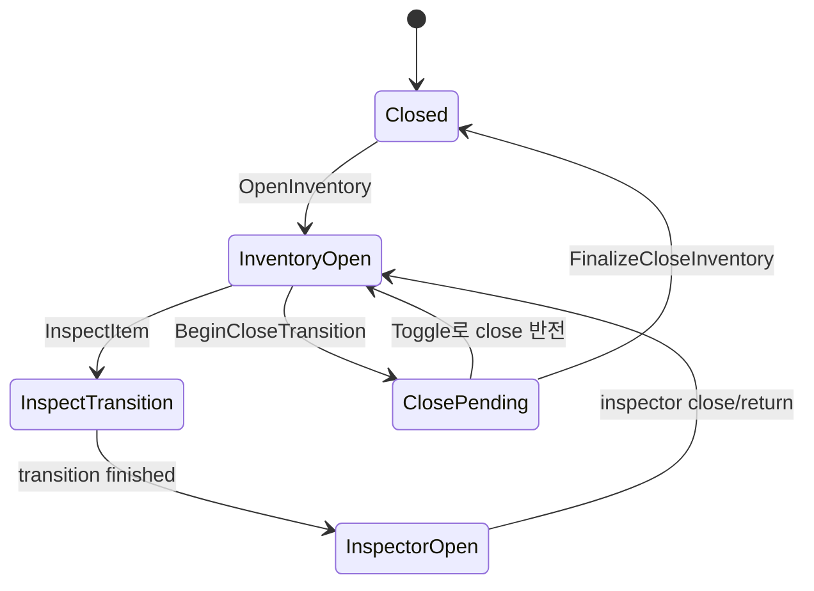

# 11. UMG와 입력 모드 수명

[교재 목차](README.md)

## 1. 개념

Modal UI는 Widget을 화면에 추가하는 것만으로 끝나지 않는다. cursor, 이동·시점 입력 차단, pawn input, focus, Enhanced Input binding을 획득하고 닫을 때 이전 상태를 반환해야 한다. 이는 UI의 “자원 획득과 해제” 수명 문제다.

## 2. Unreal Engine에서 필요한 이유

인벤토리를 닫은 뒤 캐릭터가 움직이지 않거나 cursor가 남는 버그는 이전 상태를 무조건 기본값으로 덮어쓸 때 생긴다. Inspector처럼 두 UI가 전환되는 동안 close animation과 input ownership이 겹치면 단순 toggle boolean으로 처리하기 어렵다.

## 3. 이 프로젝트에서 사용된 위치

| 파일 | 클래스/함수 | 역할 |
|---|---|---|
| `Plugins/InventorySystem/.../InventoryUIComponent.cpp` | `OpenInventory` | Widget 생성, delegate binding, input 적용 |
| 같은 파일 | `ToggleInventory` | Inspector 우선 close와 전환 반전 |
| 같은 파일 | `InspectItem` | Inspector transition 시작 |
| 같은 파일 | `FinalizeCloseInventory` | delegate/widget/input 최종 정리 |
| 같은 파일 | `ApplyInputMode`, `RestoreInputMode` | 이전 입력 상태 보존·복원 |

## 4. 실제 코드 분석

Widget을 열 때 callback을 중복 없이 연결하고 input을 인벤토리가 소유한다.

```cpp
InventoryWidget->OnCloseRequested.AddUniqueDynamic(
    this, &UInventoryUIComponent::HandleWidgetCloseRequested);
InventoryWidget->AddToViewport(50);
ApplyInputMode(PlayerController);
InventoryWidget->FocusSelectedSlot();
```

`ApplyInputMode`는 `bShowMouseCursor`, move/look ignore 상태, pawn input block 상태를 저장한다. 자신이 새로 적용한 block인지도 `bAppliedMoveInputBlock`, `bAppliedLookInputBlock`으로 기억한다. `RestoreInputMode`는 자신이 적용한 것만 해제하고 cursor를 복원한다.

`FinalizeCloseInventory`는 세 dynamic delegate를 `RemoveDynamic`한 뒤 Widget을 제거하고 약속된 상태를 비운 다음 input을 복원한다. Widget이 이미 null인 조기 종료 경로에서도 `RestoreInputMode`를 호출한다.

## 5. 실행 흐름



## 6. 왜 이런 구조를 선택했는지

**코드상 확인 가능한 사실:** input 이전 상태와 “이 component가 적용한 block”을 별도로 저장하고, close animation 완료 후에 최종 제거한다. Inspector는 `InspectorBridge`로 위임한다.

**설계 의도 추론:** 다른 UI나 gameplay system이 먼저 설정한 input block을 인벤토리가 실수로 풀지 않게 하고, animation 전환 동안 UI ownership을 보존하려는 구조로 해석된다. bridge 도입 이유에 대한 확정 ADR은 확인되지 않았다.

## 7. 다른 구현 방법

- 열 때 UIOnly, 닫을 때 항상 GameOnly로 고정
- PlayerController의 중앙 modal stack이 input을 독점 관리
- CommonUI의 activatable widget stack 사용
- GameplayTag로 input layer를 중첩 관리

중앙 stack/CommonUI는 여러 modal이 겹칠 때 더 강하지만 Plugin 독립성과 도입 비용을 고려해야 한다.

## 8. 현재 구현의 장단점

장점은 delegate 대칭 해제, close transition, Inspector bridge, 이전 move/look/cursor 상태의 조건부 복원이다. 단점은 임의의 기존 `FInputMode` 객체 자체를 capture하지 못해 cursor 상태를 근거로 GameAndUI/GameOnly를 재구성한다. 여러 modal이 동시에 입력을 바꾸면 완전한 stack semantics는 아니다.

## 9. 개선 가능한 부분

- 프로젝트 공통 modal/input ownership stack을 두고 token 기반 push/pop을 사용한다.
- inventory/dialogue/objective UI가 동일한 입력 복원 정책을 공유하게 한다.
- Widget 생성 실패, controller 교체, EndPlay, 중첩 modal 순서를 PIE 테스트한다.
- soft InputAction/MappingContext의 동기 로드를 초기 preload로 옮긴다.

## 10. 면접에서 설명한다면 어떻게 설명할지

“인벤토리 UI를 Widget 표시가 아니라 입력 자원 수명으로 다뤘습니다. 열 때 cursor와 move/look block 상태를 저장하고 자신이 새로 막은 항목을 별도 flag로 기록합니다. 닫기 animation이 끝난 `FinalizeCloseInventory`에서 delegate를 해제하고 Widget을 제거한 뒤 자신이 획득한 상태만 반환합니다. 다중 modal에는 중앙 token stack이 다음 개선점입니다.”

