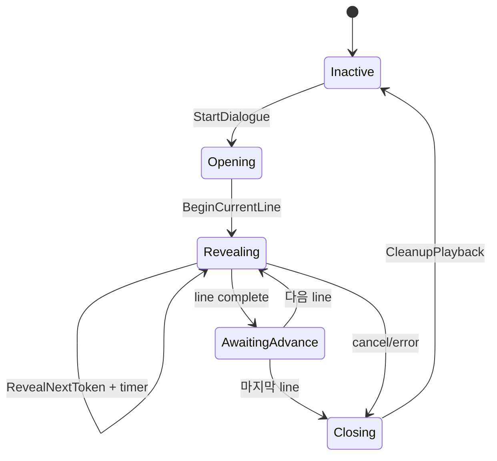

# 12. 대화 Tokenizer와 Timer 상태

[교재 목차](README.md)

## 1. 개념

Typewriter 대화는 문자열을 표시 token으로 분해하고, token마다 기본 지연과 문장부호 추가 지연을 계산해 timer로 순차 공개한다. Tokenizer는 문자열 규칙을, Subsystem은 재생 상태·Widget·Audio·입력을 소유한다.

## 2. Unreal Engine에서 필요한 이유

매 frame substring 길이를 늘리는 구현은 word reveal, 줄바꿈, 말줄임표, surrogate pair, 효과음 조건을 섞기 쉽다. Timer callback은 대화 취소나 Widget 파괴 이후에도 올 수 있으므로 명시적인 상태 검증과 cleanup이 필요하다.

## 3. 이 프로젝트에서 사용된 위치

| 파일 | 클래스/함수 | 역할 |
|---|---|---|
| `Plugins/ReusableDialogueSystem/.../DialogueTokenizer.cpp` | `FDialogueTokenizer::TokenizeWords` | 단어+뒤 공백 token |
| 같은 파일 | `TokenizeCharacters` | UTF-16 surrogate pair 보존 |
| 같은 파일 | `CalculatePunctuationDelay` | 문장부호별 추가 지연 |
| `Plugins/ReusableDialogueSystem/.../DialogueSubsystem.cpp` | `StartDialogue` | sequence와 UI 시작 |
| 같은 파일 | `BeginReveal`, `RevealNextToken` | token 재생 |
| 같은 파일 | `CleanupPlayback` | timer/audio/widget/input 정리 |

## 4. 실제 코드 분석

문자 tokenization은 UTF-16 code unit 둘로 이루어진 surrogate pair를 하나의 표시 token으로 유지한다.

```cpp
int32 Count = 1;
const uint32 First = static_cast<uint32>(Source[Index]);
const uint32 Second = Index + 1 < Source.Len()
    ? static_cast<uint32>(Source[Index + 1]) : 0;
if (First >= 0xD800 && First <= 0xDBFF &&
    Second >= 0xDC00 && Second <= 0xDFFF)
{
    Count = 2;
}
Token.Text = Source.Mid(Index, Count);
```

`BeginReveal`은 Instant면 즉시 완료하고, Word/Character면 tokenizer 결과를 만든 뒤 `RevealNextToken`을 시작한다. 각 callback은 `State == Revealing`, sequence line index, Widget 유효성을 다시 확인한다. 다음 token은 `SetTimer`로 예약한다.

`CleanupPlayback`은 reveal timer를 지우고 text/voice audio를 중지하며 Widget을 닫고 input을 복원한다.

## 5. 실행 흐름



## 6. 왜 이런 구조를 선택했는지

**코드상 확인 가능한 사실:** tokenizer는 engine object가 아닌 정적 C++ helper이고, 재생/수명은 `UGameInstanceSubsystem`에 있다. punctuation delay와 sound 가능 여부도 token에 계산된다.

**설계 의도 추론:** 문자열 알고리즘을 World/Widget에서 분리해 단위 테스트 가능하게 하고, map 수준 호출자가 중앙 대화 상태에 접근하도록 한 것으로 해석된다. GameInstance 수명을 택한 기획 이유는 코드에 직접 기록되지 않았다.

## 7. 다른 구현 방법

- Widget tick에서 누적 시간으로 글자 수 계산
- animation sequence나 Blueprint timer로만 구현
- RichText layout run을 먼저 분석해 grapheme cluster 단위 처리
- async coroutine/task로 대화 재생

현재 surrogate pair 처리는 보조 평면 문자를 보호하지만 결합 문자나 emoji ZWJ sequence 전체를 grapheme 하나로 보장하지는 않는다.

## 8. 현재 구현의 장단점

장점은 pure tokenizer, timer 기반 cadence, punctuation별 delay, line/state guard, 중앙 cleanup이다. 단점은 token마다 timer를 다시 설정하는 비용과 grapheme cluster 한계가 있다. 또한 `RestoreInteractionMode`는 modal 종료 시 항상 `FInputModeGameOnly`로 설정하고 cursor만 이전 값으로 되돌려 기존 복합 input mode를 완전 복원하지 않는다.

## 9. 개선 가능한 부분

- Unicode grapheme segmentation이 필요한 언어/emoji 범위를 테스트하고 알고리즘을 교체한다.
- UI input은 공통 modal token stack으로 통합한다.
- 대화 교체 정책 Reject/Replace, 취소 중 timer, Widget 제거를 자동화 테스트한다.
- 매우 긴 문장은 frame scheduler나 누적 token batch로 timer churn을 줄인다.

## 10. 면접에서 설명한다면 어떻게 설명할지

“대화 표시는 `FDialogueTokenizer`와 `UDialogueSubsystem`으로 분리했습니다. Tokenizer는 단어/문자 token과 문장부호 지연을 계산하고 UTF-16 surrogate pair를 보존합니다. Subsystem은 상태와 timer를 소유하며 callback마다 현재 상태와 Widget을 재검증합니다. 종료 시 timer, audio, Widget, input을 한 cleanup 경로에서 정리합니다.”

