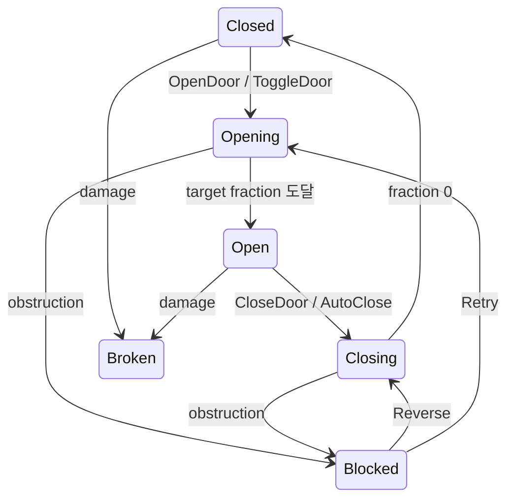

# 13. 문 상태와 Movement 전략

[교재 목차](README.md)

## 1. 개념

Door 시스템은 “열라는 명령”, “현재 상태”, “어떻게 움직이는가”를 분리한다. `UJMDoorComponent`는 상태·잠금·내구도·방해물 정책을 소유하고, `UJMDoorMovementComponent` 계층은 open fraction을 실제 transform으로 바꾸는 전략이다.

## 2. Unreal Engine에서 필요한 이유

회전문과 미닫이문은 gameplay 규칙은 같지만 transform 계산은 다르다. 한 클래스에서 door type enum으로 모든 움직임을 분기하면 dual panel, custom curve, 장애물 예측이 추가될수록 거대한 조건문이 된다.

## 3. 이 프로젝트에서 사용된 위치

| 파일 | 클래스/함수 | 책임 |
|---|---|---|
| `Plugins/JMDoor/Source/JMDoorRuntime/Private/Door/JMDoorComponent.cpp` | `BeginMovement` | 상태 검증과 이동 시작 |
| 같은 파일 | `TickComponent` | fraction 갱신, 방해물, 완료 |
| `.../Public/Movement/JMDoorMovementComponent.h` | `CalculateRelativeTransform` | movement 전략 계약 |
| `.../Private/Movement/JMRotatingDoorMovementComponent.cpp` | rotating 구현 | 축과 각도 |
| `.../Private/Movement/JMSlidingDoorMovementComponent.cpp` | sliding 구현 | panel별 변위 |

## 4. 실제 코드 분석

Base movement는 fraction과 방향을 정규화한 뒤 polymorphic 계산으로 보낸다.

```cpp
FTransform UJMDoorMovementComponent::GetRelativeTransformAtFraction(
    float OpenFraction, int32 DirectionSign) const
{
    return CalculateRelativeTransform(
        FMath::Clamp(OpenFraction, 0.0f, 1.0f),
        DirectionSign >= 0 ? 1 : -1);
}
```

`UJMRotatingDoorMovementComponent::CalculateRelativeTransform_Implementation`은 `LocalRotationAxis`와 `OpenAngle * OpenFraction * DirectionSign`으로 quaternion을 만든다. Sliding 구현은 panel별 상대 transform을 계산한다.

`UJMDoorComponent::BeginMovement`은 Broken/Jammed/MovementComponent 유효성 등을 검사하고 target fraction, duration, direction을 정한 뒤 Opening/Closing 상태로 전환해 tick을 활성화한다. 정지 상태에서는 tick을 끈다. 방해 시 Stop, Reverse, Retry 정책이 별도 분기로 동작한다.

## 5. 실행 흐름



각 tick의 fraction은 movement component를 통해 transform으로 바뀐다. Door component는 회전/슬라이드 수식을 알 필요가 없다.

## 6. 왜 이런 구조를 선택했는지

**코드상 확인 가능한 사실:** Door gameplay 상태와 movement transform 계산이 서로 다른 ActorComponent에 있고, rotating/sliding/custom이 같은 virtual BlueprintNativeEvent를 override한다. tick은 이동 중에만 활성화된다.

**설계 의도 추론:** 동일한 잠금·손상·접근 규칙을 여러 시각적 문 형태에 재사용하고 유휴 비용을 줄이려는 전략 패턴으로 해석된다. Custom movement가 어느 프로젝트 요구로 생겼는지는 확인할 수 없다.

## 7. 다른 구현 방법

- Door component 하나에서 enum switch로 transform 계산
- Timeline component/Blueprint animation으로 전부 이동
- animation montage나 Level Sequence로 문 연출
- Strategy UObject를 ActorComponent 대신 instanced object로 소유

Timeline/Sequence는 연출 저작에 좋지만 충돌 예측과 현재 fraction 저장·복원을 같은 규칙으로 맞추는 추가 작업이 필요하다.

## 8. 현재 구현의 장단점

장점은 상태와 표현 분리, 이동 중 tick, rotating/sliding 확장, obstruction 정책, dual panel 지원이다. 단점은 `UJMDoorComponent` 자체가 접근·잠금·손상·소리·noise·충돌·저장까지 많은 책임을 갖고 있고 sliding dual panel 분기가 core에 다시 들어와 있다.

## 9. 개선 가능한 부분

- access, durability, obstruction을 독립 policy/service로 분리할 기준을 정한다.
- movement 전략 contract test로 fraction 0/1, actor rotation, local-space 결과를 고정한다.
- dual panel aggregate state를 일반화된 panel collection 모델로 옮길지 검토한다.
- tick 경로의 overlap query와 character push 비용을 profile한다.

## 10. 면접에서 설명한다면 어떻게 설명할지

“Door는 상태 머신과 movement 전략을 분리했습니다. `UJMDoorComponent`가 Open/Closing/Blocked 같은 gameplay 상태와 정책을 관리하고, `UJMDoorMovementComponent::CalculateRelativeTransform`을 rotating/sliding 구현이 override합니다. fraction 0~1이 공통 계약이라 저장과 장애물 예측은 문 종류에 덜 의존하며, 이동 중에만 tick을 켭니다.”

