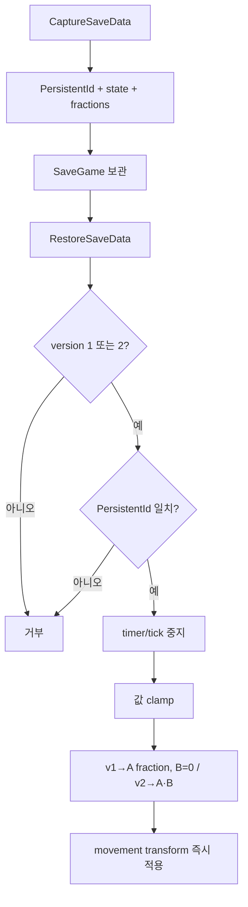

# 14. 저장 데이터와 버전 이관

[교재 목차](README.md)

## 1. 개념

Save contract는 런타임 UObject pointer를 그대로 보존하는 일이 아니라 안정적인 식별자와 복원에 필요한 값만 직렬화하는 버전된 데이터 규약이다. 데이터 형태가 바뀌면 이전 version을 어떻게 해석할지 migration이 필요하다.

## 2. Unreal Engine에서 필요한 이유

Asset이나 Actor instance의 메모리 주소는 다음 실행에서 유효하지 않다. Plugin 업데이트로 single sliding door가 dual panel로 바뀌어도 기존 save가 crash하거나 임의 상태가 되면 안 된다. 대상 일치 검증과 범위 clamp도 필요하다.

## 3. 이 프로젝트에서 사용된 위치

| 파일 | 타입/함수 | 역할 |
|---|---|---|
| `Plugins/JMDoor/.../Public/Door/JMDoorTypes.h` | `FJMDoorSaveData` | `Version = 2`와 상태 |
| `Plugins/JMDoor/.../Private/Door/JMDoorComponent.cpp` | `CaptureSaveData` | runtime → save DTO |
| 같은 파일 | `RestoreSaveData` | 검증, v1/v2 해석, transform 적용 |
| `Plugins/JMDoor/.../Public/Interfaces/JMDoorSaveInterface.h` | `IJMDoorSaveInterface` | actor 저장 계약 |
| `Plugins/InventorySystem/.../InventoryTypes.h` | `FInventorySaveEntry` | ItemId, Quantity, InstanceId |

## 4. 실제 코드 분석

Door restore는 지원 version과 target identity를 먼저 거부 조건으로 검사한다.

```cpp
if ((SaveData.Version != 1 && SaveData.Version != 2) ||
    (SaveData.PersistentId.IsValid() &&
     SaveData.PersistentId != PersistentId))
{
    return false;
}
```

그 뒤 retry/auto-close timer를 모두 지우고 tick을 끈다. durability는 0 이상, fraction은 0~1로 clamp한다. dual panel sliding door에서 v2는 A/B 값을 각각 사용하지만 v1은 기존 `OpenFraction`을 A에 적용하고 B는 0으로 둔다.

`AJMDoorActor`는 `IJMDoorSaveInterface`를 구현하고 `CaptureDoorSaveData_Implementation`과 `RestoreDoorSaveData_Implementation`을 내부 `UJMDoorComponent`에 위임한다.

Inventory의 `MakeSaveEntries`는 UObject pointer 대신 Definition의 안정적인 `ItemId`, quantity, slot instance GUID를 만든다. 확인한 component API에는 그 entry들을 Definition으로 resolve해 복원하는 대칭 public 함수가 없다.

## 5. 실행 흐름



## 6. 왜 이런 구조를 선택했는지

**코드상 확인 가능한 사실:** Door save version은 2이고 v1 migration branch가 존재한다. PersistentId가 유효하면 대상 불일치를 거부한다. Inventory save는 ItemId를 사용한다.

**설계 의도 추론:** dual panel 기능 추가 후 기존 single-panel save를 계속 읽기 위한 호환성으로 해석된다. Inventory가 capture만 제공하는 이유와 전체 save orchestration의 소유자는 이 코드 범위에서 확인되지 않는다.

## 7. 다른 구현 방법

- `USaveGame`이 모든 Actor를 직접 알고 concrete restore 호출
- custom version GUID와 Unreal serialization operator 사용
- snapshot JSON/schema migration pipeline
- interface 대신 SaveGame component를 모든 Actor에 부착

custom version은 복잡한 binary serialization에 유리하고, 단순 reflected struct는 Blueprint와 Plugin API에 이해하기 쉽다.

## 8. 현재 구현의 장단점

장점은 explicit version, persistent identity, timer 초기화, 값 clamp, 실제 v1 migration, Interface 위임이다. 단점은 지원하지 않는 version을 단순 거부하며 future migration chain이 없고, Inventory는 item Definition resolution과 restore 대칭이 외부 책임으로 남아 있다.

## 9. 개선 가능한 부분

- 버전별 migration 함수를 분리하고 v1/v2 fixture save를 자동화 테스트로 보존한다.
- PersistentId 중복을 Editor validation에서 검사한다.
- Inventory에 ItemId → Definition resolver 계약과 restore 결과/누락 항목 보고를 추가한다.
- save 중 이동 상태를 중단 상태로 저장할지 목표 fraction까지 저장할지 정책을 명문화한다.

## 10. 면접에서 설명한다면 어떻게 설명할지

“Door 저장은 `FJMDoorSaveData Version=2`와 `PersistentId`를 사용합니다. 복원 전에 version과 대상 ID를 확인하고 timer/tick을 중지한 뒤 값을 clamp합니다. v1 single-panel save는 A panel에 기존 fraction을 적용하고 B는 닫힘으로 migration합니다. Inventory도 pointer 대신 `ItemId`와 instance GUID를 저장하지만, 대칭 restore resolver는 개선 과제로 확인했습니다.”

