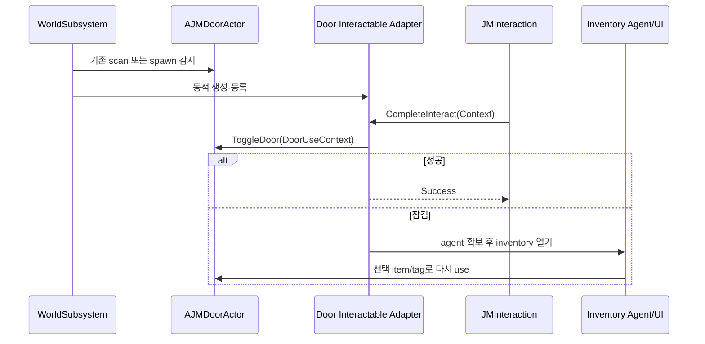

# 15. Integration Plugin과 Bridge

[교재 목차](README.md)

## 1. 개념

Integration Plugin은 독립 base Plugin 두 개 이상을 연결하는 adapter를 소유한다. base A가 base B를 직접 참조하는 대신 Integration만 양쪽 Module에 의존하고 context/result를 변환한다.

## 2. Unreal Engine에서 필요한 이유

Door를 interaction 가능하게 만들고 잠긴 문에서 Inventory key를 선택하게 하려면 세 시스템이 만난다. 이 코드를 Door core에 넣으면 Door가 Interaction과 Inventory 없이는 빌드되지 않는다. Interaction core에 넣으면 구체 Door 지식이 들어간다.

## 3. 이 프로젝트에서 사용된 위치

| 파일 | 클래스/설정 | 역할 |
|---|---|---|
| `Plugins/JMDoorGameplayIntegration/JMDoorGameplayIntegration.uplugin` | Plugin dependency | JMDoor, JMInteraction, InventorySystem 연결 |
| `.../JMDoorGameplayIntegration.Build.cs` | Module dependency | 세 Runtime Module 링크 |
| `.../JMDoorInteractionWorldSubsystem.cpp` | `UJMDoorInteractionWorldSubsystem` | Door adapter 자동 부착 |
| `.../JMDoorInteractableAdapterComponent.cpp` | adapter | Interaction context → Door use context |
| `.../JMDoorInventoryAgentComponent.cpp` | agent | 잠금 실패 → inventory UI/item 전달 |

## 4. 실제 코드 분석

World subsystem은 이미 배치된 Door와 이후 spawn된 Door를 모두 처리한다.

```cpp
void UJMDoorInteractionWorldSubsystem::EnsureDoorAdapter(AActor* Actor)
{
    AJMDoorActor* Door = Cast<AJMDoorActor>(Actor);
    if (!Door ||
        Door->FindComponentByClass<UJMDoorInteractableAdapterComponent>())
        return;

    UJMDoorInteractableAdapterComponent* Adapter =
        NewObject<UJMDoorInteractableAdapterComponent>(
            Door, TEXT("JMDoorInteractableAdapter"));
    Door->AddInstanceComponent(Adapter);
    Adapter->RegisterComponent();
}
```

`CompleteInteract_Implementation`은 owner Door를 검증하고 `FJMInteractionContext`를 `FJMDoorUseContext`로 변환해 `ToggleDoor`를 호출한다. 성공/실패 message를 다시 `FJMInteractionResult`로 변환한다. 잠김 결과에서는 interactor 쪽 Actor에 `UJMDoorInventoryAgentComponent`가 없으면 동적으로 붙여 item 선택 흐름을 시작한다.

## 5. 실행 흐름



## 6. 왜 이런 구조를 선택했는지

**코드상 확인 가능한 사실:** Integration descriptor와 Build.cs만 세 base Plugin에 동시에 의존한다. Door/Interaction base는 이 Integration을 역참조하지 않는다. adapter는 context/result 변환을 실제로 수행한다.

**설계 의도 추론:** base Plugin의 단독 재사용성을 보존하고 조합 비용을 integration layer로 모으려는 구조로 해석된다. 모든 Door에 자동 부착한 이유가 zero-authoring 편의를 위한 것인지는 코드만으로 확정할 수 없다.

## 7. 다른 구현 방법

- Door Actor가 `IJMInteractableInterface`를 직접 구현
- Blueprint child가 adapter component를 authored component로 포함
- GameplayTag event만으로 toggle 요청
- Host 프로젝트 Module이 모든 연결 코드를 소유

직접 구현은 단순하지만 hard dependency가 생긴다. authored component는 명시적이지만 모든 Asset에 수작업이 필요하다. Host bridge는 Plugin 조합을 프로젝트 전용으로 둘 때 적절하다.

## 8. 현재 구현의 장단점

장점은 base dependency 방향 보존, context/result adapter, 기존·동적 spawn 모두 지원, 중복 component 검사다. 단점은 World 시작 시 전체 Door scan을 하고 runtime에 Actor 구성을 변경한다. 자동 부착이 disabled 설정, authored custom adapter, network authority와 어떻게 상호작용하는지 정책이 복잡해질 수 있다.

## 9. 개선 가능한 부분

- 자동 부착 opt-out과 custom adapter 우선순위를 settings로 명시한다.
- server/client 어느 쪽에서 component를 만들고 interaction을 실행할지 authority 정책을 추가한다.
- Integration마다 “연결하는 base, 변환 contract, 자동 복구” 표준 문서를 둔다.
- adapter 탐색 비용과 streaming level 진입을 functional test로 검증한다.

## 10. 면접에서 설명한다면 어떻게 설명할지

“Door, Interaction, Inventory를 서로 직접 의존시키지 않고 `JMDoorGameplayIntegration`이 세 Module에만 의존하도록 했습니다. World subsystem이 Door에 adapter를 보장하고, adapter가 Interaction context를 Door context로 바꿔 toggle합니다. 잠긴 경우 별도 inventory agent가 item 선택을 연결합니다. 따라서 base Plugin은 단독 사용 가능하고 결합은 Integration에 국한됩니다.”
