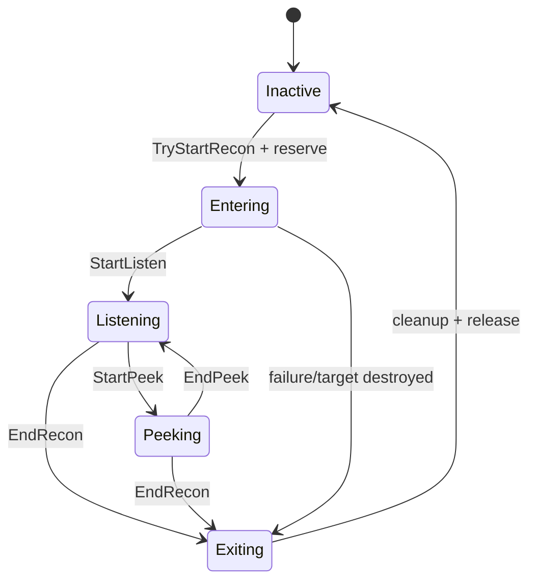

# 16. Recon 세션과 예약

[교재 목차](README.md)

## 1. 개념

Recon은 플레이어가 특정 target에 진입해 듣기·엿보기 같은 모드를 수행하는 여러 단계 작업이다. `FGuid SessionId`는 한 번의 작업을 식별하고, target reservation은 동시에 둘 이상의 interactor가 같은 target을 소유하지 못하게 한다.

## 2. Unreal Engine에서 필요한 이유

Timer로 camera transition을 기다리는 동안 target이 파괴되거나 새 recon이 시작될 수 있다. 이전 timer callback이 새 세션 상태를 변경하는 stale callback 문제와, 두 사용자가 같은 target을 점유하는 경쟁을 막아야 한다.

## 3. 이 프로젝트에서 사용된 위치

| 파일 | 클래스/함수 | 책임 |
|---|---|---|
| `Plugins/JMRecon/Source/JMReconRuntime/Private/Components/JMReconInteractorComponent.cpp` | `TryStartRecon` | 검증, session 생성, 예약 |
| 같은 파일 | `ScheduleTransition` | timer callback 예약 |
| 같은 파일 | session 종료 경로 | audio/camera/binding/reservation cleanup |
| `Plugins/JMRecon/Source/JMReconRuntime/Private/Components/JMReconTargetComponent.cpp` | `TryReserve` | exclusive reservation |
| 같은 파일 | `ReleaseReservation` | 같은 SessionId만 해제 |

## 4. 실제 코드 분석

Target 예약 해제는 소유 세션을 검사한다.

```cpp
FJMReconRequestResult UJMReconTargetComponent::TryReserve(
    const FGuid& SessionId)
{
    if (!bEnabled)
    {
        return FJMReconRequestResult::Failure(
            EJMReconFailureReason::Disabled);
    }
    if (!SessionId.IsValid())
    {
        return FJMReconRequestResult::Failure(
            EJMReconFailureReason::InvalidTarget);
    }
    if (ReservedSessionId.IsValid() &&
        ReservedSessionId != SessionId)
    {
        return FJMReconRequestResult::Failure(
            EJMReconFailureReason::AlreadyInUse);
    }
    ReservedSessionId = SessionId;
    return FJMReconRequestResult::Success();
}

void UJMReconTargetComponent::ReleaseReservation(
    const FGuid& SessionId)
{
    if (ReservedSessionId == SessionId)
    {
        ReservedSessionId.Invalidate();
    }
}
```

`TryStartRecon`은 active session 여부, target 유효성, owner와 target interface 판정 후 새 GUID를 만들고 `Target->TryReserve(NewSessionId)`를 호출한다. 성공 후 weak target/contract를 session에 저장하고 target destroyed callback을 연결한다.

전환 timer callback은 weak self와 예상 session을 확인하는 형태로 구성된다. 종료는 timer를 지우고 SoundMix를 pop하며 peek 종료, destroyed binding 해제, reservation 반환, camera restore event 발행, session reset을 한 경로에서 수행한다.

## 5. 실행 흐름



## 6. 왜 이런 구조를 선택했는지

**코드상 확인 가능한 사실:** interactor와 target은 동일 GUID를 공유하고, reservation은 matching GUID만 해제한다. session은 weak object reference를 갖고 target destruction을 관찰한다.

**설계 의도 추론:** 비동기 전환의 이전 callback과 잘못된 owner 해제를 막고, target을 한 세션에 독점시키려는 transaction token으로 GUID를 사용한 것으로 해석된다. single-player 전용 선택인지 multiplayer까지 고려한 것인지는 코드로 확정할 수 없다.

## 7. 다른 구현 방법

- target에 bool `bOccupied`만 저장
- interactor pointer를 owner token으로 저장
- async task/coroutine cancellation token 사용
- server-side replicated reservation component 사용

bool은 어느 세션이 해제 권한을 갖는지 알 수 없다. pointer token은 같은 interactor의 연속 세션을 구분하지 못한다. GUID는 두 경우를 모두 구분한다.

## 8. 현재 구현의 장단점

장점은 exclusive reservation, stale session 구분, weak reference, target destroyed 대응, 중앙 cleanup이다. `IsDataValid`도 target 설정을 Editor에서 검사한다. 단점은 timer/상태 분기가 interactor component에 집중되고, 관찰한 구현에는 replicated reservation이나 server authority가 없다. `AllowedReconModes == 22`를 새 bitmask로 해석하는 legacy compatibility도 유지 비용이다.

## 9. 개선 가능한 부분

- session transition을 표 기반 상태 머신으로 고정하고 illegal transition 테스트를 추가한다.
- timer callback마다 expected session/state 검사를 공통 helper로 강제한다.
- legacy mode 값 22의 migration 종료 시점과 Asset upgrade 도구를 정한다.
- multiplayer 도입 시 reservation authority, RPC result, disconnect cleanup을 설계한다.

## 10. 면접에서 설명한다면 어떻게 설명할지

“Recon은 단순 bool 대신 GUID session을 사용합니다. `TryStartRecon`에서 target을 같은 GUID로 예약하고, 종료 시 matching GUID만 해제합니다. Timer와 target destruction이 섞이므로 weak reference와 expected session 검증을 사용하며, cleanup에서 audio, camera, delegate, reservation을 한 번에 반환합니다. 이 방식은 같은 interactor의 이전 callback도 새 세션을 오염시키지 않게 합니다.”
