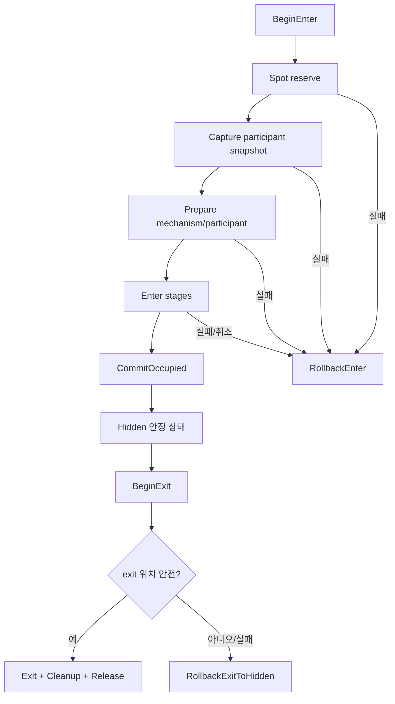

# 17. Hide 세션과 Rollback

[교재 목차](README.md)

## 1. 개념

Hide 진입은 spot 예약, participant 원상태 capture, mechanism 열기, participant 이동, hidden 상태 commit으로 이루어진 다단계 transaction이다. 중간 실패 시 진입 전 상태로 rollback하고, exit 실패 시에는 안전한 hidden 상태로 rollback해야 한다.

## 2. Unreal Engine에서 필요한 이유

옷장 문은 열렸는데 캐릭터 이동이 실패하거나, exit 위치가 충돌로 막혔을 수 있다. 단순 animation 완료 callback만 연결하면 오래된 callback, 반쪽 상태, spot 점유 누수가 생긴다. 각 완료가 어느 session과 operation에 속하는지 검증해야 한다.

## 3. 이 프로젝트에서 사용된 위치

| 파일 | 클래스/함수 | 책임 |
|---|---|---|
| `Plugins/JMHide/Source/JMHideRuntime/Private/Components/JMHideInteractorComponent.cpp` | `BeginEnter` | session과 enter transaction 시작 |
| 같은 파일 | 완료 handler | SessionId/operation/phase 검증 |
| 같은 파일 | `RollbackEnter` | 진입 전 상태 복구 |
| 같은 파일 | `RollbackExitToHidden` | exit 실패 시 hidden 유지 |
| 같은 파일 | `Cleanup` | idempotent 최종 정리 |
| `.../JMHideSpotComponent.cpp` | `TryReserve`, `CommitOccupied`, `Release` | spot 상태 전이 |

## 4. 실제 코드 분석

`FJMHideSession::IsActive`는 식별자, cleanup flag, terminal phase를 모두 확인한다.

```cpp
bool IsActive() const
{
    return SessionId.IsValid() && !bCleanupCompleted &&
        CurrentPhase != EJMHidePhase::None &&
        CurrentPhase != EJMHidePhase::Completed &&
        CurrentPhase != EJMHidePhase::Cancelled &&
        CurrentPhase != EJMHidePhase::Failed;
}
```

`BeginEnter`는 session을 만들고 `HideSpot->TryReserve`한 뒤 anchor, participant driver, mechanism을 검증한다. `CaptureState`와 `PrepareForHide`가 실패하면 즉시 `RollbackEnter`다. 여러 stage가 성공한 뒤에야 `Spot->CommitOccupied(SessionId, Owner)`를 호출한다.

`CancelCurrentTransition`은 stable `Hidden` 상태의 cancel을 거부하고 Exit 또는 ForceExit을 요구한다. exit 중 취소/실패는 `RollbackExitToHidden`, enter 중 취소/실패는 `RollbackEnter`로 분기한다. `Cleanup`은 `bCleanupCompleted`면 바로 반환해 중복 실행을 막는다.

## 5. 실행 흐름



## 6. 왜 이런 구조를 선택했는지

**코드상 확인 가능한 사실:** spot은 Reserved와 Occupied를 구분하고 commit API가 따로 있다. participant snapshot을 capture하고 enter/exit에 서로 다른 rollback 함수를 사용한다. 완료 message에는 SessionId와 Operation이 있다.

**설계 의도 추론:** hide를 animation sequence가 아니라 보상 가능한 transaction으로 취급하고, 가장 안전한 안정 상태로 되돌리려는 구조로 해석된다. 단계 수와 순서가 특정 콘텐츠 요구에서 나온 이유는 코드만으로 알 수 없다.

## 7. 다른 구현 방법

- 하나의 Timeline 완료 후 teleport와 collision 변경
- Level Sequence가 Actor와 Door 상태를 모두 소유
- Gameplay Ability의 activation/cancel/end로 transaction 구성
- generic saga/command pipeline으로 stage와 compensation 등록

generic pipeline은 Hide 외 시스템에도 재사용할 수 있지만 Unreal object 수명과 Blueprint 노출 adapter가 추가로 필요하다.

## 8. 현재 구현의 장단점

장점은 reserve/commit 분리, snapshot 복원, 세션·operation 식별, idempotent cleanup, enter/exit별 보상 경로다. primary와 alternative exit anchor, 충돌 검사, 설정된 force fallback도 있다. 단점은 interactor가 stage orchestration과 많은 cleanup flag를 소유해 복잡하고, 모든 provider가 completion contract를 정확히 지켜야 한다. 네트워크 authority는 확인되지 않는다.

## 9. 개선 가능한 부분

- stage와 compensation을 데이터/command 목록으로 표현해 분기 중복을 줄인다.
- 모든 completion handler가 SessionId, operation, expected phase를 확인하는지 테스트한다.
- target/provider 파괴, 두 번 완료, 늦은 완료, exit 충돌을 회귀 테스트한다.
- 강제 exit가 collision을 무시하는 조건을 gameplay/안전 정책으로 명확히 기록한다.

## 10. 면접에서 설명한다면 어떻게 설명할지

“Hide는 여러 비동기 stage를 가진 transaction으로 설계했습니다. spot은 reserve 후 모든 enter 단계가 끝나야 occupied로 commit합니다. participant 원상태 snapshot을 보존하고 enter 실패는 `RollbackEnter`, exit 실패는 `RollbackExitToHidden`으로 안전한 상태를 선택합니다. 각 completion에 GUID와 operation을 넣고 cleanup은 idempotent하게 만들어 늦거나 중복된 callback을 방어했습니다.”

