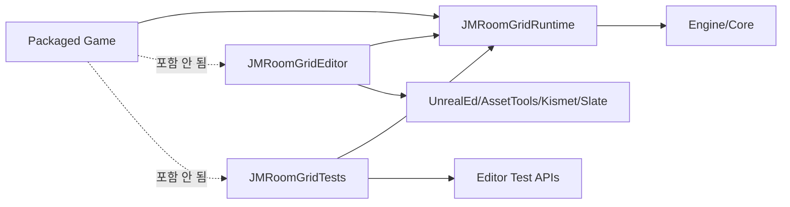

# 18. Runtime·Editor·Test Module 분리

[교재 목차](README.md)

## 1. 개념

같은 Plugin 안에서도 Runtime gameplay, Editor 도구, 자동화 테스트는 서로 다른 build/link/load 요구를 가진다. Module 분리는 Public API와 dependency closure를 이 요구에 맞게 제한한다.

## 2. Unreal Engine에서 필요한 이유

`UnrealEd`, `AssetTools`, `KismetCompiler`는 packaged game에서 사용할 수 없다. Editor customization과 test fixture가 Runtime Module에 들어가면 Shipping 빌드가 실패하거나 불필요한 dependency가 전파된다.

## 3. 이 프로젝트에서 사용된 위치

`JMRoomGrid`가 완성도 높은 실제 예다.

| 파일/Module | Type/역할 |
|---|---|
| `Plugins/JMRoomGrid/JMRoomGrid.uplugin` | Runtime, Editor, Tests 세 Module |
| `Plugins/JMRoomGrid/Source/JMRoomGridRuntime/JMRoomGridRuntime.Build.cs` | 게임에서 필요한 grid/data API |
| `Plugins/JMRoomGrid/Source/JMRoomGridEditor/JMRoomGridEditor.Build.cs` | Asset, Blueprint, Details, ToolMenus |
| `Plugins/JMRoomGrid/Source/JMRoomGridTests` | Editor automation tests |
| `Plugins/JMRoomGrid/Source/JMRoomGridEditor/Private/JMRoomGridEditorModule.cpp` | Editor 등록/해제 |

## 4. 실제 코드 분석

Descriptor는 수명과 대상 platform을 분리한다.

```json
{ "Name": "JMRoomGridRuntime", "Type": "Runtime",
  "LoadingPhase": "Default" },
{ "Name": "JMRoomGridEditor", "Type": "Editor",
  "LoadingPhase": "Default", "TargetAllowList": ["Editor"] },
{ "Name": "JMRoomGridTests", "Type": "Editor",
  "LoadingPhase": "PostEngineInit", "TargetAllowList": ["Editor"] }
```

Runtime 공개 dependency는 `Core`, `CoreUObject`, `Engine`, `DeveloperSettings`, `GameplayTags`뿐이다. Editor Module은 private dependency로 `UnrealEd`, `AssetTools`, `AssetRegistry`, `BlueprintGraph`, `Kismet`, `KismetCompiler`, `ToolMenus`, `Slate`, `PropertyEditor`와 Runtime Module을 가진다.

Editor Module의 `StartupModule`은 details/menu 등을 등록하고 `ShutdownModule`은 해제한다. Test는 engine 초기화 후 실행 가능하도록 `PostEngineInit`이다.

## 5. 실행 흐름



## 6. 왜 이런 구조를 선택했는지

**코드상 확인 가능한 사실:** Editor와 Tests에는 Editor target allow-list가 있고 Runtime Build.cs에는 Editor Module이 없다. Editor dependency는 private다.

**설계 의도 추론:** Runtime 재사용성과 Shipping 빌드 안전성을 보존하면서 Plugin 자체에 저작 도구와 테스트를 함께 제공하려는 구조로 해석된다. 세 Module을 반드시 유지해야 한다는 ADR은 확인되지 않았다.

## 7. 다른 구현 방법

- 단일 Runtime Module 내부의 `#if WITH_EDITOR`
- Runtime + Editor 두 Module, 테스트는 Host에만 배치
- 별도 Test Plugin으로 완전히 분리

작은 editor-only helper에는 `WITH_EDITOR`가 충분할 수 있지만 Module dependency 자체가 `UnrealEd`라면 Runtime Build.cs에 넣을 수 없다. Plugin test를 Host에만 두면 재사용 시 테스트가 따라가지 않는다.

## 8. 현재 구현의 장단점

장점은 dependency closure, Shipping 안전성, Plugin과 함께 이동하는 Editor UX/테스트다. 단점은 Module boilerplate와 API export 관리가 늘고, Runtime private 타입을 Editor/Test에서 직접 검사하기 어렵다. 같은 Plugin의 변경도 여러 target 빌드로 확인해야 한다.

## 9. 개선 가능한 부분

- CI에서 Runtime-only target과 Editor target을 모두 빌드한다.
- Runtime Build.cs에 `UnrealEd` 계열이 들어오지 않는 정적 검사를 추가한다.
- Editor module의 모든 registration이 shutdown에서 대칭 해제되는지 점검한다.
- 테스트에만 필요한 seam을 Public Runtime API로 과도하게 노출하지 않는다.

## 10. 면접에서 설명한다면 어떻게 설명할지

“`JMRoomGrid`는 Runtime, Editor, Tests를 세 Module로 분리했습니다. Runtime은 Engine과 settings/tag만 공개 의존하고, Editor는 Runtime 위에서 UnrealEd·AssetTools·Kismet·Slate를 private 의존합니다. Test Module은 Editor의 PostEngineInit에만 로드됩니다. 그래서 저작 도구와 테스트를 Plugin에 포함하면서 packaged game dependency는 깨끗하게 유지했습니다.”
