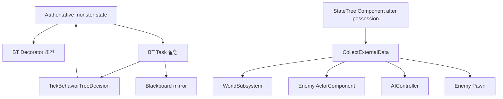

# 19. BehaviorTree와 StateTree 경계

[교재 목차](README.md)

## 1. 개념

BehaviorTree는 Blackboard와 task/decorator로 분기 실행을 구성하고, StateTree는 state와 task가 요청한 external data를 실행 context에 주입한다. 이 프로젝트에는 Host 전용 monster BehaviorTree node와 재사용 `JMMonsterFramework`의 StateTree component가 함께 존재한다.

## 2. Unreal Engine에서 필요한 이유

AI Actor 내부 상태와 시각적 orchestration asset이 서로 다른 진실을 가지면 행동이 어긋난다. Tree node는 authoritative gameplay state를 읽고 전환을 반영해야 한다. StateTree task는 controller, pawn, component, world subsystem 같은 external data를 안전하게 얻어야 한다.

## 3. 이 프로젝트에서 사용된 위치

| 파일 | 클래스/함수 | 역할 |
|---|---|---|
| `Source/P_060715/Private/AI/Common/JMMonsterBehaviorTreeNodes.cpp` | `UBTDecorator_JMMonsterState` | Monster state와 branch 조건 일치 |
| 같은 파일 | `UBTTask_JMMonsterState::ExecuteTask/TickTask` | 기존 Monster decision 실행과 Blackboard 동기화 |
| `Plugins/JMMonsterFramework/.../JMEnemyStateTreeComponent.cpp` | `StartFrameworkTree` | possession 후 tree 시작 |
| 같은 파일 | `CollectExternalData` | 요청 타입별 UObject 제공 |
| `Plugins/JMMonsterFramework/.../JMEnemyPerceptionComponent.*` | perception | stimulus 정규화, behavior 선택은 하지 않음 |

## 4. 실제 코드 분석

BehaviorTree task는 자체 상태를 새로 만들지 않고 Monster의 상태를 확인한다.

```cpp
AJMDungeonMonster* Monster = GetMonster(OwnerComp);
if (!Monster || Monster->GetMonsterState() != StateToRun)
{
    return EBTNodeResult::Failed;
}

if (UBlackboardComponent* Blackboard =
    OwnerComp.GetBlackboardComponent())
{
    Monster->SyncBehaviorTreeBlackboard(*Blackboard);
}
SetNextTickTime(NodeMemory, FMath::Max(0.02f, DecisionInterval));
return EBTNodeResult::InProgress;
```

`TickTask`는 `Monster->TickBehaviorTreeDecision(StateToRun)`을 실행하고 Blackboard를 다시 동기화한다. Monster state가 바뀌면 task를 Succeeded로 끝낸다. 즉 BT는 state의 원본이 아니라 실행/관찰 layer다.

`UJMEnemyStateTreeComponent`는 constructor에서 `SetStartLogicAutomatically(false)`를 호출한다. `StartFrameworkTree`에서 possession 후 StateTree를 설정하고 시작한다. `CollectExternalData`는 요청 `UStruct`가 WorldSubsystem, ActorComponent, AIController, Pawn/Actor 중 무엇의 자식인지 확인해 현재 World/Enemy/Controller에서 값을 제공한다. required data가 없으면 false다.

## 5. 실행 흐름



## 6. 왜 이런 구조를 선택했는지

**코드상 확인 가능한 사실:** Host BT node는 `AJMDungeonMonster` concrete 타입을 직접 안다. 반면 Plugin StateTree component는 `AJMEnemyBase`와 타입 기반 external data를 사용한다. perception component 주석은 behavior를 선택하지 않는다고 명시한다.

**설계 의도 추론:** 프로젝트 전용 BT는 기존 Monster state machine을 시각화·조율하고, 재사용 Plugin은 더 일반적인 StateTree 실행 기반을 제공하려는 과도기 또는 병행 구조로 해석된다. 어느 체계를 최종 표준으로 삼을지는 코드만으로 결정할 수 없다.

## 7. 다른 구현 방법

- AI 의사결정을 BehaviorTree/Blackboard만으로 통일
- StateTree만 authoritative state로 사용
- Utility AI scoring system
- GameplayTag state와 Mass/SmartObject 기반 orchestration

두 tree 체계를 병행하면 migration과 학습 비용이 생기므로 역할 경계를 명시해야 한다.

## 8. 현재 구현의 장단점

장점은 BT task가 interval tick을 사용하고 authoritative Monster state와 Blackboard를 계속 동기화한다는 점, StateTree가 possession 시점을 존중하고 required external data 실패를 감지한다는 점이다. 단점은 Host BT node가 concrete Monster에 강결합되고, BehaviorTree와 StateTree 두 모델의 책임 중복 가능성이 있다. 타입 분기형 external data resolver도 지원 타입이 늘면 커진다.

## 9. 개선 가능한 부분

- 프로젝트 AI의 authoritative state 소유자와 BT/StateTree 역할을 ADR로 결정한다.
- Host BT node가 concrete Actor 대신 interface/component contract를 읽도록 완화한다.
- external data type 지원을 provider registry로 확장할지 평가한다.
- possession 전 시작, required component 누락, state 전환 중 task 종료를 테스트한다.

## 10. 면접에서 설명한다면 어떻게 설명할지

“현재 Host BehaviorTree는 Monster state를 authoritative source로 두고 decorator가 branch를 검사하며 task가 기존 decision 함수를 주기적으로 실행한 뒤 Blackboard를 mirror합니다. 재사용 Monster Framework의 StateTree component는 possession 후 수동 시작하고 requested external data를 WorldSubsystem, component, controller, pawn에서 제공합니다. 두 체계의 중복은 향후 표준화할 경계로 봤습니다.”
