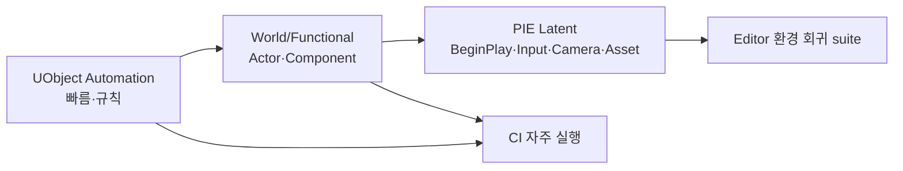

# 20. Automation·Functional·PIE 테스트

[교재 목차](README.md)

## 1. 개념

Unreal 테스트는 UObject만 생성해 빠르게 규칙을 검사하는 Automation Test, 실제 World Actor를 구동하는 Functional Test, Editor에서 게임을 실행해 입력·camera·timer까지 확인하는 latent PIE Test로 나눌 수 있다. 검증 대상에 필요한 가장 낮은 층을 선택한다.

## 2. Unreal Engine에서 필요한 이유

순수 C++ 계산 테스트만 통과해도 Blueprint asset 경로, component registration, BeginPlay, PlayerController input, camera restoration은 깨질 수 있다. 반대로 모든 검증을 PIE로 하면 느리고 실패 원인을 찾기 어렵다.

## 3. 이 프로젝트에서 사용된 위치

| 종류 | 파일/클래스 | 실제 검증 |
|---|---|---|
| UObject Automation | `Plugins/JMGameplayEvent/.../JMGameplayEventAutomationTests.cpp` | exact/children/unsubscribe/mutation/nested/GC |
| World Automation | `Plugins/JMDoor/.../JMDoorAutomationTests.cpp` | movement math, dual panel, save |
| Functional Test | `Plugins/JMDoor/.../JMDoorFunctionalTest.h/.cpp` / `AJMDoorFunctionalTest` | 실제 Door Blueprint 동작 |
| PIE latent | `Source/P_060715Tests/Private/Tests/JMReconLevelTestPIETest.cpp` | map, recon, camera/input 복원 |
| PIE latent | `JMHideGameplayPIETest.cpp` | 실제 character input entry |

## 4. 실제 코드 분석

Event bus GC 테스트는 테스트 자체가 UObject 수명을 정확히 만든다.

```cpp
TStrongObjectPtr<UJMGameplayEventTestReceiver> Receiver(
    NewObject<UJMGameplayEventTestReceiver>());
Subscribe(Subsystem.Get(), DoorOpenedTag(), Receiver.Get(),
    EJMGameplayEventMatchType::Exact,
    &UJMGameplayEventTestReceiver::Receive);
Receiver.Reset();
CollectGarbage(RF_NoFlags);
TestEqual(TEXT("Destroyed listener is not called"),
    Publish(Subsystem.Get(), DoorOpenedTag()), 0);
```

Mutation test는 callback 중 자기 구독을 제거해도 다른 listener가 안정적으로 두 번 호출되는지 확인한다. Nested test는 callback이 다른 event를 발행하는 경로를 검사한다.

Recon PIE test는 `LoadMap("/Game/Level/Level_test")`, `FStartPIECommand(false)`, custom latent verify command, `FEndPlayMapCommand` 순으로 실행한다. verify command는 PIE World를 찾고 runtime component가 준비될 때까지 기다리며 timeout을 둔다. Recon 도중 control rotation을 변경한 뒤 종료해 camera pose와 input/prompt가 복원되는지 확인한다.

## 5. 실행 흐름



테스트 피라미드의 위로 갈수록 실제 실행과 가깝지만 속도와 환경 의존성이 커진다.

## 6. 왜 이런 구조를 선택했는지

**코드상 확인 가능한 사실:** event bus는 World 없이 NewObject로 테스트하고, Door는 새 map/Actor와 Functional Test를 함께 쓰며, Recon/Hide는 실제 map PIE latent test가 있다. Test Module은 Editor 전용이다.

**설계 의도 추론:** 순수 규칙은 빠르게 격리하고 실제 Asset·수명·입력 통합만 PIE로 올리려는 층화 전략으로 해석된다. 전체 suite의 공식 실행 빈도는 코드만으로 확인할 수 없다.

## 7. 다른 구현 방법

- 모든 기능을 수동 플레이테스트
- 모든 테스트를 하나의 대형 end-to-end map에서 실행
- Gauntlet로 packaged build 자동화
- spec/Bdd 스타일 `BEGIN_DEFINE_SPEC` 사용

Gauntlet은 packaged multiplayer/long-running 검증에 유리하고, 현재 Editor Automation을 대체하기보다 상위 계층으로 추가하는 편이 맞다.

## 8. 현재 구현의 장단점

장점은 GC·구독 mutation 같은 어려운 edge case, Door local-space 수학, 실제 Blueprint/PIE camera 복원을 각각 알맞은 층에서 검증한다는 점이다. 단점은 Editor context 의존 테스트가 많고, Asset/map path 변경에 PIE test가 민감하다. 전체 CI 실행 결과와 coverage 기준은 코드에서 확인되지 않는다.

## 9. 개선 가능한 부분

- smoke, fast, PIE, content validation suite를 명명하고 CI 단계별 timeout을 정한다.
- PIE latent command는 항상 timeout과 정리 경로를 갖게 한다.
- 문서의 핵심 실행 흐름마다 대응 테스트 이름을 연결한다.
- Shipping에 가까운 packaged build는 Gauntlet 또는 commandlet 기반 상위 테스트로 보강한다.
- 테스트가 만든 SaveGame, Actor, PIE session을 실패 시에도 정리하는 fixture를 공통화한다.

## 10. 면접에서 설명한다면 어떻게 설명할지

“테스트를 실행 환경 기준으로 층화했습니다. `JMGameplayEvent`는 NewObject와 강한/약한 참조를 이용해 GC와 callback mutation을 빠른 Automation Test로 검증합니다. Door는 World 수학과 실제 Functional Actor를 검사하고, Recon/Hide는 map을 열어 PIE에서 camera·input·BeginPlay 수명까지 검증합니다. 규칙은 낮은 층, Asset과 실제 player flow만 높은 층에 둡니다.”
