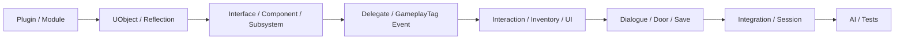

# P_260729 실전 Unreal Engine C++ 학습 교재

이 교재는 일반적인 Unreal Engine 문법 요약이 아니다. `P_260729`의 Runtime, Editor, Test 코드에서 실제로 사용된 구조를 따라가며 개념을 익힌다. 모든 챕터는 동일한 10단계 형식을 사용하고, 구현에서 직접 확인되는 사실과 설계 의도에 대한 추론을 분리한다.

## 학습 순서

### 1부: Unreal 객체 모델과 경계

1. [Plugin과 Module 경계](01_PLUGIN_MODULE_BOUNDARIES.md)
2. [Reflection과 UObject](02_REFLECTION_AND_UOBJECT.md)
3. [Data Asset, Developer Settings, Soft Reference](03_DATA_ASSETS_SETTINGS_SOFT_REFERENCES.md)
4. [Unreal Interface](04_UNREAL_INTERFACES.md)
5. [ActorComponent 조합](05_ACTOR_COMPONENT_COMPOSITION.md)
6. [Subsystem 수명 선택](06_SUBSYSTEM_LIFETIMES.md)
7. [Delegate와 객체 수명](07_DELEGATES_AND_LIFETIME.md)
8. [GameplayTag 기반 Event Bus](08_GAMEPLAY_TAG_EVENT_BUS.md)

### 2부: 실제 Gameplay 시스템

9. [상호작용 Trace와 상태 머신](09_INTERACTION_TRACE_STATE_MACHINE.md)
10. [인벤토리 도메인과 원자성](10_INVENTORY_DOMAIN_AND_ATOMICITY.md)
11. [UMG와 입력 모드 수명](11_UMG_INPUT_MODE_LIFECYCLE.md)
12. [대화 Tokenizer와 Timer 상태](12_DIALOGUE_TOKENIZER_TIMER_STATE.md)
13. [문 상태와 Movement 전략](13_DOOR_STATE_AND_MOVEMENT_STRATEGY.md)
14. [저장 데이터와 버전 이관](14_SAVE_DATA_VERSIONING.md)

### 3부: 통합, 비동기 세션, AI, 검증

15. [Integration Plugin과 Bridge](15_INTEGRATION_PLUGIN_BRIDGES.md)
16. [Recon 세션과 예약](16_RECON_SESSION_RESERVATION.md)
17. [Hide 세션과 Rollback](17_HIDE_SESSION_ROLLBACK.md)
18. [Runtime·Editor·Test Module 분리](18_RUNTIME_EDITOR_TEST_MODULES.md)
19. [BehaviorTree와 StateTree 경계](19_BEHAVIOR_TREE_AND_STATE_TREE.md)
20. [Automation·Functional·PIE 테스트](20_AUTOMATION_FUNCTIONAL_PIE_TESTS.md)

### 면접 대비

- [게임 프로그래머 신입 포트폴리오 면접 질문 150선](INTERVIEW_QUESTIONS_KO.md)

초급 30개, 중급 50개, 고급 50개, 압박 질문 20개로 구성한다. 20개 챕터를 먼저 읽은 뒤 각 답변의 클래스와 함수를 실제 코드에서 다시 찾는 방식으로 사용한다.

## 읽는 법

- `코드상 확인 가능한 사실`은 명시된 파일, 클래스, 함수에서 직접 확인했다.
- `설계 의도 추론`은 코드 형태로부터 가능한 해석이며 원 저자의 확정 의도로 취급하지 않는다.
- 코드 조각은 설명에 필요한 부분만 발췌했다. 생략 부호가 있는 경우 원문을 그대로 연속 복사한 것이 아니다.
- 각 챕터의 “다른 구현 방법”은 현재 구현 사실이 아니라 비교 학습을 위한 대안이다.
- 코드가 바뀌면 관련 챕터의 `last_verified`와 `verified_against`를 갱신하거나 상태를 `ReviewRequired`로 내려야 한다.

## 전체 학습 흐름

## 기준

- 코드 기준 commit: `7c765f0348e2d6a766b83ccacf936e14d3122971`
- 검증일: 2026-08-20
- 범위: `Source`, `Plugins/*/Source`, `*.uplugin`, `*.Build.cs` 및 관련 설정
