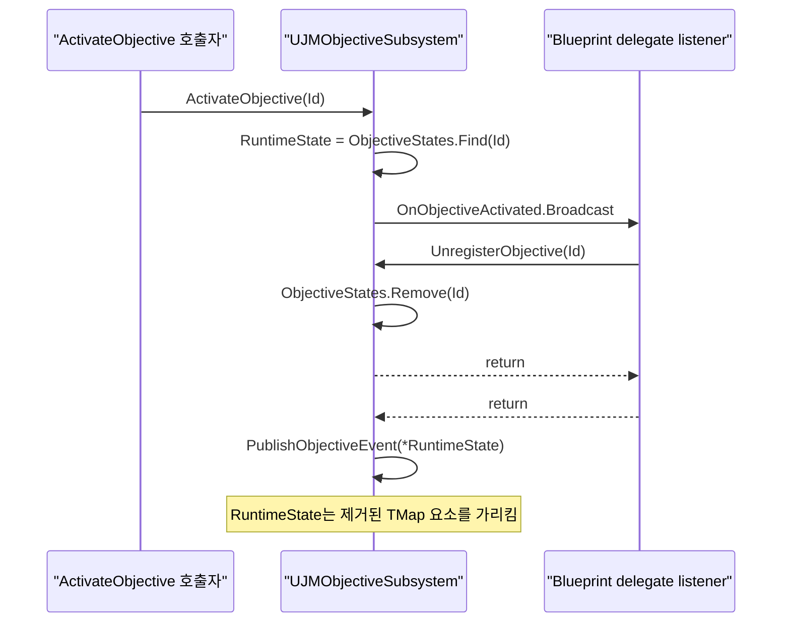
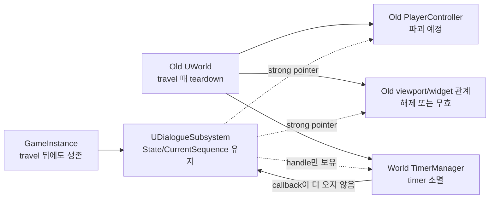
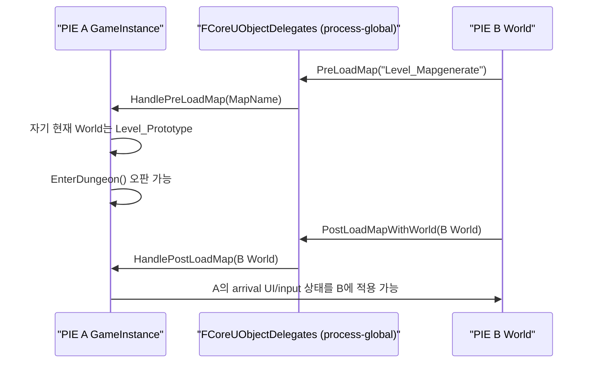

# 프로젝트 런타임 안전성 정적 감사

## 1. 결론

이 문서는 `P_260729/Source`, 21개 Plugin의 `Source`, 45개 `Build.cs`/`Target.cs`, 21개 `.uplugin`, `Config`의 5개 `.ini`를 대상으로 수행한 **정적 코드 감사 결과**다. C++ 기준으로 헤더·구현·인라인 파일 568개를 검색하고, 의심 지점은 선언부와 호출부를 함께 대조했다. 코드, Config, Asset은 수정하지 않았다.

가장 우선해서 처리해야 할 문제는 다음 네 계열이다.

1. `JMObjective`가 `TMap` 요소의 포인터/참조를 잡은 채 Blueprint delegate를 동기 호출한다. 콜백이 같은 Subsystem을 다시 호출하면 요소 제거 또는 `TMap` 재해시 뒤에 무효 포인터를 사용한다.
2. `ReusableDialogueSystem`과 `ItemInspector`는 상태 변경 delegate가 현재 작업을 닫을 수 있는데도, broadcast 뒤에 세션 포인터를 재검증하지 않고 사용한다.
3. `UGameInstanceSubsystem`/`ULocalPlayerSubsystem`이 보유한 상태는 맵 전환을 넘어가지만, 연결된 `UWorld` timer, Actor, PlayerController, Widget은 이전 월드에 속한다. 전환 중 travel이 발생하면 정지한 세션 또는 파괴된 객체 접근이 가능하다.
4. 전역 map delegate와 대상 없는 modal event가 다중 PIE·다중 LocalPlayer를 구분하지 않는다.

이번 감사에서 **명백한 UObject 멤버의 `UPROPERTY` 누락이나 production 코드의 raw `this` 비동기 lambda는 찾지 못했다.** 그러나 이것이 전체 UHT·런타임 안전성을 증명하지는 않는다. 아래 발견 사항과 테스트 공백이 더 직접적인 위험이다.

## 2. 판정 기준

| 판정 | 의미 |
|---|---|
| 정적 확정 | 현재 공개 API와 동기 호출 순서만으로 잘못된 접근 또는 상태 변경 경로를 구성할 수 있음 |
| 고신뢰 위험 | Unreal의 객체·월드 수명 규칙과 코드 수명이 어긋남. PIE 재현으로 최종 확인해야 함 |
| 조건부 | 현재 프로젝트의 명시적 전제에서는 즉시 장애가 아닐 수 있으나, 기능 범위를 넓히면 결함이 됨 |
| 방어 양호 | 요청된 위험 항목에 대해 실제 방어 코드가 확인됨 |

심각도는 `Critical`, `High`, `Medium`, `Low`로 표시한다. “정적 확정”은 실제 Editor에서 크래시까지 실행했다는 뜻이 아니라, 해당 콜백을 연결했을 때 코드 경로가 성립한다는 뜻이다.

## 3. 발견 사항 요약

| ID | 심각도 | 판정 | 영역 | 요약 |
|---|---|---|---|---|
| OBJ-001 | Critical | 정적 확정 | container invalidation | Objective delegate 재진입으로 `TMap` 요소 포인터/참조 무효화 |
| OBJ-002 | High | 정적 확정 | container invalidation | Objective Flow delegate 재진입으로 `FlowStates` 참조 무효화 |
| DLG-001 | High | 정적 확정 | delegate/nullptr | Dialogue 상태 콜백이 세션을 닫은 뒤 `DialogueWidget` 역참조 |
| DLG-002 | High | 고신뢰 위험 | world/timer/GC | GameInstance Dialogue 상태가 map travel 뒤 고착될 수 있음 |
| INS-001 | High | 고신뢰 위험 | ticker/destroyed actor | LocalPlayer ItemInspector ticker가 이전 월드 객체에 접근 가능 |
| INS-002 | High | 정적 확정 | delegate/nullptr | inspection opened 콜백에서 닫은 Widget을 다시 호출 |
| INV-001 | High | 정적 확정 | reentrancy/data corruption | 아이템 사용 콜백이 정렬한 뒤 다른 슬롯을 소비할 수 있음 |
| INV-002 | Medium | 정적 확정 | transaction/reentrancy | 부분 완료 inventory mutation을 외부 delegate에 노출 |
| WLD-001 | High | 고신뢰 위험 | PIE/multiple world | 전역 map delegate가 다른 GameInstance의 travel에도 반응 |
| INP-001 | Medium | 정적 확정 | lifetime/ownership | Modal 종료가 다른 시스템의 input lock과 input mode를 덮어씀 |
| MOD-001 | Medium | 정적 확정 | multiple local player | modal event의 `Target`을 소비자가 무시하고 상태도 보존하지 않음 |
| EDT-001 | Medium | 고신뢰 위험 | editor/runtime | Door integration WorldSubsystem이 Editor world에도 생성됨 |
| DEL-001 | Medium | 정적 확정 | delegate unbind | Inventory UI rebind 시 이전 Enhanced Input binding 잔류 |
| JMP-001 | Medium | 정적 확정 | state reentrancy/timer | JumpScare 상태 콜백 취소 뒤 원래 호출이 timer/overlay를 재개 |
| GC-001 | Low | 정적 확정 | weak pointer/container | 파괴된 once-key의 invalid weak entry가 세션 동안 누적 |
| NUL-001 | Low | 조건부 | nullptr/world teardown | BlueprintCallable grab API에서 `GetWorld()`를 무검사 역참조 |
| NET-001 | High | 조건부 | replication | gameplay state에 authority/RPC/replication 계약이 없음 |

## 4. 최우선 결함 상세

### OBJ-001 — Objective delegate 재진입으로 `TMap` 요소가 dangling 상태가 됨

- 심각도: `Critical`
- 판정: 정적 확정
- 핵심 파일: `UJMObjectiveSubsystem`, `JMObjectiveSubsystem.cpp`

[`JMObjectiveSubsystem.cpp`](../../Plugins/JMObjective/Source/JMObjective/Private/Subsystems/JMObjectiveSubsystem.cpp)의 `ActivateObjective`는 89행에서 `ObjectiveStates.Find`가 반환한 요소 포인터를 저장하고, 107행에서 `OnObjectiveActivated.Broadcast`를 호출한 뒤 108행에서 같은 포인터를 `PublishObjectiveEvent`에 다시 넘긴다. `DeactivateObjective`, `CompleteObjective`, `FailObjective`, `ResetObjective`, `ApplyProgress`도 같은 형태다. 특히 `ApplyProgress`는 400행의 포인터를 418행 broadcast 뒤 419~426행에서 계속 사용한다.

헤더의 delegate는 `BlueprintAssignable`이고 `UnregisterObjective`, `RegisterObjective`, progress/state 변경 함수는 `BlueprintCallable`이다. 따라서 listener가 다음처럼 동기 재진입할 수 있다.

`UnregisterObjective`가 같은 요소를 제거하면 포인터는 즉시 무효다. 다른 Objective를 등록해 `TMap`이 재해시돼도 기존 요소 참조가 무효화될 수 있다. `RegisterObjective`의 57행 `ObjectiveStates.Add`로 얻은 참조 또한 67행 broadcast 이후 계속 사용되므로 같은 문제를 가진다.

영향:

- use-after-free에 해당하는 undefined behavior와 간헐적 크래시
- progress callback 재진입에 따른 중복 complete event 또는 잘못된 payload
- Blueprint 그래프 구성에 따라 재현 여부가 달라지는 비결정적 장애

권장 수정 원칙:

1. 외부 callback 전에는 필요한 상태를 값으로 snapshot한다.
2. callback 이후 `ObjectiveId`로 다시 `Find`하고, 세션/수정 revision도 일치할 때만 계속한다.
3. 하나의 mutation이 끝난 뒤 event를 내보내는 transaction 경계를 만든다.
4. 모든 BlueprintAssignable delegate에 대해 remove/register/complete 재진입 자동화 테스트를 추가한다.

### OBJ-002 — Objective Flow도 `FlowStates` 참조를 외부 callback 너머 유지함

- 심각도: `High`
- 판정: 정적 확정
- 핵심 파일: `UJMObjectiveFlowSubsystem`, `JMObjectiveFlowSubsystem.cpp`

[`JMObjectiveFlowSubsystem.cpp`](../../Plugins/JMObjective/Source/JMObjective/Private/Subsystems/JMObjectiveFlowSubsystem.cpp)의 `StartObjectiveFlow`는 74행에서 `FlowStates.Add`의 참조를 얻고, `ActivateCurrentStep`과 88행의 `OnObjectiveFlowStarted.Broadcast`를 거쳐 89행에서 그 참조를 다시 사용한다. `StopObjectiveFlow`, `RestartObjectiveFlow`, `ActivateCurrentStep`, `AdvanceFlow`, objective failure handler도 동일하게 외부 delegate 또는 Objective Subsystem 호출 전후로 참조를 유지한다.

Flow 제거 API가 없더라도 listener가 다른 Flow의 `StartObjectiveFlow`를 호출하면 `FlowStates.Add`가 재해시를 유발할 수 있다. 또한 Objective Subsystem의 activation 자체가 외부 Blueprint delegate를 동기 호출하므로 Flow는 자기 delegate가 아닌 간접 callback에도 재진입될 수 있다.

개선 방향은 OBJ-001과 같다. Flow ID + operation serial로 현재 작업을 식별하고, 외부 호출 뒤에는 참조를 다시 얻어야 한다.

### DLG-001 — Dialogue 상태 callback에서 Stop하면 `StartDialogue`가 null Widget을 사용함

- 심각도: `High`
- 판정: 정적 확정
- 핵심 함수: `UDialogueSubsystem::StartDialogue`, `SetState`, `StopDialogue`, `CleanupPlayback`

[`DialogueSubsystem.cpp`](../../Plugins/ReusableDialogueSystem/Source/ReusableDialogueSystem/Private/DialogueSubsystem.cpp)의 실행 순서는 다음과 같다.

1. 73행에서 `DialogueWidget`을 생성한다.
2. 79행에서 `SetState(Opening)`을 호출한다.
3. `SetState`는 96행에서 `OnDialogueStateChanged.Broadcast`를 동기 호출한다.
4. Blueprint listener는 공개된 `StopDialogue()`를 호출할 수 있다.
5. `FinishDialogue` → `CleanupPlayback`은 291행에서 `DialogueWidget = nullptr`로 만든다.
6. 원래 `StartDialogue`는 80행으로 돌아와 `DialogueWidget->AddToViewport()`를 호출한다.

즉 허용된 Blueprint API만으로 null dereference 경로가 성립한다. 같은 callback에서 `StartDialogue(..., Replace)`를 재호출하면 바깥 세션과 안쪽 세션의 상태도 섞일 수 있다.

권장 수정은 transition guard와 session serial을 두고, broadcast 뒤에는 `DialogueWidget`, `CurrentSequence`, state, session serial을 모두 재검증하는 것이다. 장기적으로는 상태 변경을 완료한 뒤 event snapshot을 발행하거나, 재진입 요청을 queue로 지연해야 한다.

### DLG-002 — Dialogue Subsystem 수명과 World 자원의 수명이 다름

- 심각도: `High`
- 판정: 고신뢰 위험

`UDialogueSubsystem`은 `UGameInstanceSubsystem`이다. 헤더에는 `CurrentSequence`, `DialogueWidget`, `OwningPlayerController`, audio 객체가 `UPROPERTY` strong reference로 있고, 구현은 현재 `UWorld`의 `FTimerManager`에 reveal/start/advance timer를 등록한다. 정리는 `Deinitialize`와 명시적 종료에서만 한다.

대화 reveal 또는 start delay 중 `OpenLevel`이 실행되면 이전 World timer는 사라지지만 Subsystem의 `State`는 `Revealing`/`WaitingForAdvance` 등에 남을 수 있다. 이후 `StartDialogue`의 reject 정책은 새 대화를 거부할 수 있고, 수동 종료는 이전 월드의 Widget/PlayerController를 단순 null 검사만으로 호출할 수 있다.

필요한 조치:

- `PreLoadMap` 또는 world cleanup 시 명시적 종료 사유로 세션을 닫는다.
- 월드에 속한 presentation 객체는 `TWeakObjectPtr`로 보유하고 `IsValid` 및 owning world를 확인한다.
- timer handle뿐 아니라 “이 timer가 속한 World”를 세션에 기록한다.
- active dialogue 도중 travel을 수행하는 PIE 회귀 테스트를 추가한다.

### INS-001 — ItemInspector의 CoreTicker가 map travel과 분리되어 있음

- 심각도: `High`
- 판정: 고신뢰 위험
- 핵심 클래스: `UJMItemInspectionSubsystem`

`UJMItemInspectionSubsystem`은 `ULocalPlayerSubsystem`이라 일반적인 map travel을 넘어 생존한다. 반면 preview actor는 현재 World에 371행에서 spawn되고, transition은 437/458/738/795행의 `FTSTicker::GetCoreTicker().AddTicker`로 진행된다. CoreTicker는 해당 World의 `TimerManager`에 묶이지 않는다.

`TickEnterTransition`은 607행에서 `CurrentPreviewActor`와 Widget을 null 검사한 뒤 650행에서 Actor를 호출한다. `TickExitTransition`도 같은 패턴이다. Actor가 이전 World teardown으로 `PendingKill` 상태가 되면 strong `UPROPERTY` 포인터가 즉시 null이 된다는 보장은 없으므로 null 검사는 충분하지 않다. `Deinitialize`의 정리는 LocalPlayer 자체가 종료될 때만 실행된다.

재현 테스트는 enter/exit transition 중 `OpenLevel`을 호출한 뒤 다음 CoreTicker tick에서 Actor/Widget 유효성과 state를 관찰하면 된다. 수정 시에는 travel 전에 ticker를 제거하고, session World를 weak reference로 저장하며, tick마다 `IsValid`와 World 일치를 확인해야 한다. World-bound transition이면 `FTimerManager` 또는 해당 World의 tickable 객체가 더 자연스럽다.

### INS-002 — 일반 open 경로는 callback 뒤 Widget을 재검증하지 않음

- 심각도: `High`
- 판정: 정적 확정

[`JMItemInspectionSubsystem.cpp`](../../Plugins/ItemInspector/Source/ItemInspectorRuntime/Private/ItemInspection/JMItemInspectionSubsystem.cpp)의 transition 없는 경로는 111행에서 `OnInspectionOpened.Broadcast(CurrentInspectionData)`를 호출한 직후 112행에서 `CurrentWidget->OnInspectionOpened`를 무조건 호출한다. listener가 공개 `CloseInspection`을 부르면 `FinalizeCloseInspection`이 161행에서 Widget을 null로 만든 후 바깥 호출이 돌아와 역참조한다.

transition 완료 경로의 698~702행은 broadcast 뒤 `if (CurrentWidget)`로 다시 확인한다. 따라서 두 경로의 안전성도 일관되지 않다. 단순 null 검사보다 session ID, state, `IsValid(CurrentWidget)`를 함께 검사해야 한다.

### INV-001 — 사용 callback 뒤 동일 slot index에서 다른 아이템을 소비할 수 있음

- 심각도: `High`
- 판정: 정적 확정
- 핵심 함수: `UInventoryComponent::UseItemAtSlot`

[`InventoryComponent.cpp`](../../Plugins/InventorySystem/Source/InventorySystem/Private/Components/InventoryComponent.cpp)의 `UseItemAtSlot`은 273행에서 `FInventorySlot`을 snapshot하고, 294행에서 effect를 실행하고, 300행에서 `OnItemUsed.Broadcast`를 호출한다. effect와 Blueprint listener는 같은 Inventory의 정렬·이동·제거 API를 호출할 수 있다.

그러나 consume 단계인 305~310행은 원래 `SlotSnapshot.InstanceId`나 `ItemDefinition`이 아니라 “같은 숫자 index가 유효하고 수량이 충분한가”만 확인한다. 콜백이 `SortItemsByQuantityDescending` 또는 `MoveItem`을 호출해 다른 stack이 그 index로 이동하면 다른 아이템이 소비된다.

수정 시 consume 대상을 `InstanceId`로 다시 찾고 definition까지 일치하는지 확인해야 한다. 또한 use effect와 Inventory 중 누가 소비 책임을 갖는지 계약을 하나로 정해야 한다.

### INV-002 — Inventory mutation 중간 상태가 delegate에 노출됨

- 심각도: `Medium`
- 판정: 정적 확정

`AddItemDetailed`는 146~175행의 loop 안에서 stack 하나를 변경할 때마다 `OnItemAdded.Broadcast`를 호출한 후 다음 stack을 계속 처리한다. listener가 Slots를 정렬·제거·이동하면 현재 loop의 index와 최종 `Outcome`이 더 이상 원래 transaction을 나타내지 않을 수 있다. `MoveItem`의 destination index가 `INDEX_NONE`인 경로도 destination `AddItemDetailed`가 event를 먼저 내보낸 뒤 559행에서 source를 제거한다.

이는 곧바로 메모리 크래시가 난다고 단정할 수는 없지만, event listener가 보는 상태와 반환 결과가 불일치하는 데이터 정합성 결함이다. mutation을 먼저 계산·commit하고 immutable change list를 마지막에 발행하는 방식이 필요하다.

## 5. World, PIE, UI 소유권 결함

### WLD-001 — process-global map delegate에 GameInstance 필터가 없음

- 심각도: `High`
- 판정: 고신뢰 위험

`UJMPrototypeTravelTransitionSubsystem`은 `FCoreUObjectDelegates::PostLoadMapWithWorld`에 등록하지만, [`HandlePostLoadMap`](../../Source/P_060715/Private/Prototype/JMPrototypeTravelTransitionSubsystem.cpp)은 `LoadedWorld->GetGameInstance() == GetGameInstance()`인지 확인하지 않는다. 이 Subsystem에 `bArrivalPending`이 설정된 상태에서 다른 PIE instance의 World가 먼저 load되면 그 World의 viewport/controller에 arrival overlay와 input lock을 적용할 수 있다.

`UJMPrototypeProgressionSubsystem`도 process-global `PreLoadMap`에 등록한다. [`HandlePreLoadMap`](../../Source/P_060715/Private/Prototype/JMPrototypeProgressionSubsystem.cpp)은 callback의 `MapName`과 자기 GameInstance의 현재 source World를 조합한다. 예를 들어 PIE A가 `Level_Prototype`에 남아 있는데 PIE B가 `Level_Mapgenerate`로 이동하면 A도 “던전 진입”으로 판정할 수 있다.

multi-process PIE에서는 숨을 수 있고 single-process multi-PIE에서 드러난다. World context가 포함된 callback은 owning GameInstance를 필터링하고, `PreLoadMap`처럼 World가 없는 전역 callback은 portal/coordinator의 명시적 요청이나 context별 travel hook으로 대체해야 한다.

### INP-001 — input lock을 소유권 없이 해제함

- 심각도: `Medium`
- 판정: 정적 확정

다음 시스템이 기존 input state를 완전히 저장하지 않고 자기 종료 시 전역 상태를 재구성한다.

- `UJMPrototypeTravelTransitionSubsystem::ShowArrivalScreen`: cursor만 저장하고 move/look ignore를 `true`, UIOnly로 설정한다. `DismissArrivalScreen`은 무조건 move/look ignore를 `false`, GameOnly로 만든다.
- `AJMPrototypeLevelPortal`: transition 시작 시 ignore를 켜고 cancel/EndPlay에서 무조건 끈다.
- `UDialogueSubsystem`: cursor만 저장하고 종료 시 항상 GameOnly로 복원한다.
- ItemInspector와 Inventory UI는 move/look lock 여부를 별도 추적하지만 기존 input mode와 focus를 정확히 보존하지 않고 cursor 상태로 mode를 추정한다.

따라서 cutscene, pause, 다른 modal이 먼저 input을 잠근 상태에서 위 UI를 열었다 닫으면 다른 시스템의 잠금까지 해제할 수 있다. 해결책은 “설정/해제” boolean이 아니라 owner token 또는 reference-counted input/modal lease다. 각 owner는 자신이 획득한 token만 반납하고, 최상위 presentation state가 실제 input mode와 focus를 결정해야 한다.

### MOD-001 — modal event가 LocalPlayer를 구분하지 않고 현재 상태도 제공하지 않음

- 심각도: `Medium`
- 판정: 정적 확정

Inventory UI는 `FJMGameplayEventMessage.Target`에 PlayerController를 넣고, ItemInspector도 LocalPlayer의 PlayerController를 넣는다. 그러나 `UJMInteractionComponent::HandleModalOpened/Closed`와 `UJMObjectiveUISubsystem::HandleModalOpened/Closed`는 `Message.Target`을 전혀 사용하지 않고 정수 depth만 증감한다.

결과:

- split-screen에서 한 플레이어의 modal이 다른 플레이어 prompt/objective UI까지 숨긴다.
- modal이 열린 뒤 생성되거나 재등록된 Pawn/UI는 과거 `Opened` event를 받지 못하므로 modal 아래에서 표시된다.
- `Closed`가 누락되면 depth가 영구적으로 남는다.

Gameplay Event Bus는 일회성 notification에 적합하지만 modal visibility는 상태다. LocalPlayer별 stateful modal registry를 두고 `{Token, Owner, Target}`을 저장하며, 새 subscriber가 현재 상태를 query할 수 있어야 한다.

### EDT-001 — Door gameplay integration이 Editor world에도 자동 component를 추가함

- 심각도: `Medium`
- 판정: 고신뢰 위험

`UJMDoorInteractionWorldSubsystem`은 `ShouldCreateSubsystem` 또는 world type override가 없다. UE 5.7의 `UWorldSubsystem::DoesSupportWorldType` 기본 구현은 Game, Editor, PIE를 지원한다. 이 Subsystem은 actor-spawn handler와 `OnWorldBeginPlay`에서 모든 `AJMDoorActor`에 `UJMDoorInteractableAdapterComponent`를 `NewObject` → `AddInstanceComponent` → `RegisterComponent`로 추가한다.

같은 프로젝트의 `UJMDoorReconIntegrationWorldSubsystem`과 `UJMReconGameplayIntegrationWorldSubsystem`은 `ShouldCreateSubsystem`에서 `Game`/`PIE`만 허용한다. Door gameplay integration만 필터가 빠져 있어 Editor preview/spawn에서도 runtime component가 붙고 패키지 dirty 또는 editor-side 부작용을 만들 가능성이 있다.

의도적으로 Editor authoring을 지원하는 것이 아니라면 동일한 world filter를 적용해야 한다. 의도된 기능이면 editor mutation과 저장 여부를 명시하고 별도 테스트해야 한다.

## 6. Delegate, timer, state-machine 결함

### DEL-001 — Enhanced Input component 재바인딩 시 이전 binding이 남음

- 심각도: `Medium`
- 판정: 정적 확정

`UInventoryUIComponent::BindEnhancedInput`은 새 `UEnhancedInputComponent`가 기존 weak pointer와 다르면 131행에서 새 action을 bind하고 132행에서 pointer를 교체한다. 이전 component에서 `ClearBindingsForObject` 또는 binding handle 제거를 하지 않는다. `EndPlay`에도 제거 코드가 없다.

UObject delegate라 receiver 파괴 시 dangling 호출 가능성은 낮지만, 이전 input component가 계속 살아 있으면 toggle이 두 번 실행되거나 더 이상 활성 경로가 아닌 input stack에서 호출된다. rebind 전과 `EndPlay`에서 자신이 만든 binding만 제거해야 한다.

### JMP-001 — JumpScare callback 취소 뒤 원래 state transition이 계속됨

- 심각도: `Medium`
- 판정: 정적 확정

`UJMJumpScareSubsystem::PlayJumpScare`는 active state를 설정하고 68행에서 `SetPhase(Preparing)`을 부른다. `SetPhase`는 `OnPhaseChanged`와 `OnStateChanged`를 동기 broadcast한다. listener는 BlueprintCallable `CancelJumpScare`를 호출해 cleanup할 수 있다. 그러나 바깥 `PlayJumpScare`는 취소 여부를 확인하지 않고 71행에서 start timer를 설정하거나 75행에서 `ShowOverlay`를 호출하고 `Started`를 반환한다.

callback에서 cancel/replay가 가능한 state machine은 모든 외부 callback 뒤 session serial과 phase를 재검증해야 한다. finish/cleanup 단계의 callback도 같은 원칙을 적용해 terminal event 중복을 막아야 한다.

### GC-001 — invalid `TWeakObjectPtr` once-key가 장기 세션에서 누적됨

- 심각도: `Low`
- 판정: 정적 확정

`UJMJumpScareSubsystem::TriggeredOnceKeys`는 `TSet<TWeakObjectPtr<UObject>>`라 dangling 역참조는 방지한다. 그러나 source object가 파괴된 invalid weak key는 `Deinitialize` 또는 명시적 `ResetOncePolicy` 전까지 제거되지 않는다. 동적으로 생성·파괴되는 source가 많으면 long-running world에서 set이 계속 커질 수 있다.

새 key 추가 시 또는 일정 주기마다 invalid entry를 제거하거나, object lifetime과 무관한 stable ID를 once-policy key로 쓰는 편이 낫다.

### NUL-001 — BlueprintCallable grab 함수에서 `GetWorld()` guard가 없음

- 심각도: `Low`
- 판정: 조건부

`UJMPhysicalGrabberComponent::TryGrab`은 `BlueprintCallable`이고 view 획득 성공 뒤 69행에서 `GetWorld()->LineTraceSingleByChannel`을 바로 호출한다. 정상 등록·BeginPlay 이후 ActorComponent라면 World가 있지만, construction/teardown 중 Blueprint 호출 또는 비정상 outer로 생성된 component에서는 null일 수 있다. 같은 함수가 73행 debug draw에도 World를 다시 사용한다.

일반적인 gameplay 경로에서 즉시 재현된 결함은 아니므로 낮은 심각도로 분류한다. 공개 callable 함수는 시작점에서 `IsValid(GetOwner())`, `UWorld* World = GetWorld()`를 한 번 확보하고 실패 결과를 반환하는 편이 안전하다.

## 7. Network replication 판정

### NET-001 — 현재 gameplay 상태는 process-local single-player 계약임

- 심각도: multiplayer 도입 전 `High`
- 판정: 조건부

전체 `Source`와 `Plugins` 검색에서 `GetLifetimeReplicatedProps`, `DOREPLIFETIME`, Server/Client/NetMulticast RPC, `HasAuthority`, `SetReplicates` 사용을 찾지 못했다. 유일한 명시적 replication 설정은 `AJMItemInspectionPreviewActor`의 `bReplicates = false`다. `JMGameplayEventSubsystem`의 공개 계약도 synchronous, game-thread-only, process-local event bus다.

따라서 Inventory slot, Objective/Flow state, Door/Hide/Recon/Throwable state, 동적 integration component는 네트워크 권위나 복제 경계를 갖지 않는다. 현재 프로젝트가 single-player prototype이라면 결함이 아니라 범위 제약이다. 하지만 listen/dedicated server 또는 network PIE를 켜면 다음이 발생한다.

- client가 BlueprintCallable mutation을 직접 실행해도 authority 검사가 없음
- 서버와 client의 inventory/objective state가 독립적으로 달라짐
- local event가 원격 peer로 전달되지 않음
- runtime에 자동 추가한 component와 projectile 상태가 복제되지 않음

멀티플레이 지원 전에는 각 Plugin manifest/README에 single-player-only를 명시하거나, server authority → RPC → replicated state/`OnRep` → local presentation event 순서로 계약을 별도 설계해야 한다.

## 8. 요청 항목별 검사 결과

| 검사 항목 | 결과 | 근거/관련 ID |
|---|---|---|
| `nullptr` | 공개 callable과 reentrant callback 뒤 guard 누락 확인 | DLG-001, INS-002, NUL-001 |
| dangling UObject pointer | `TMap` 내부 구조체 포인터가 외부 callback으로 무효화됨. UObject 멤버 자체의 명백한 raw dangling 저장은 미발견 | OBJ-001, OBJ-002 |
| GC | strong subsystem pointer가 world-bound 객체 수명을 부자연스럽게 연장; weak set stale entry 확인 | DLG-002, INS-001, GC-001 |
| `UPROPERTY` 누락 | UObject 멤버·UObject container의 명백한 누락 미발견. 정적 검색 결과이며 UHT 보증 아님 | 9장 |
| `TWeakObjectPtr` | Recon/GameplayEvent에서 적절한 사용 확인; weak entry pruning 공백 확인 | GC-001, 9장 |
| delegate unbind | 다수 대칭 해제 확인; Enhanced Input 이전 binding 제거 누락 | DEL-001 |
| timer lifetime | World timer와 GameInstance 상태의 수명 불일치, callback 재진입 뒤 ghost timer 가능 | DLG-002, JMP-001 |
| async callback lifetime | `LoadPackageAsync(CreateUObject)`와 StateTree weak execution context는 방어 양호 | 9장 |
| world teardown | Dialogue/ItemInspector cleanup hook 공백 | DLG-002, INS-001 |
| `BeginPlay`/`EndPlay` | 대다수 ActorComponent 정리 양호; input binding과 editor world filter 공백 | DEL-001, EDT-001 |
| Destroyed Actor 접근 | ItemInspector가 null만 검사하고 `IsValid`/World를 확인하지 않음 | INS-001 |
| Component lifetime | dynamic integration component 등록은 owner/instance component로 유지; input component 재bind 문제 | DEL-001 |
| Subsystem lifetime | GameInstance/LocalPlayer와 World 자원의 수명 경계 불일치 | DLG-002, INS-001 |
| PIE 재시작 | Deinitialize delegate 제거는 대체로 양호; active travel/inspection/dialogue 회귀 테스트 없음 | WLD-001, 10장 |
| multiple world | process-global map delegate에 context 필터 없음 | WLD-001 |
| editor/runtime | WorldSubsystem 하나가 Editor world를 허용 | EDT-001 |
| thread safety | Gameplay Event는 game-thread ensure. 다른 gameplay API도 game thread를 전제로 하나 명시적 guard는 제한적 | 9장 |
| container invalidation | 가장 높은 위험 두 건 확인 | OBJ-001, OBJ-002 |
| lambda capture | production timer lambda의 raw `this` capture 미발견; Recon은 weak capture 사용 | 9장 |
| raw pointer | 함수 local/parameter 위주. UObject 장기 보유 raw member의 명백한 문제 미발견 | 9장 |
| Unreal reflection | delegate와 mutator의 Blueprint 동시 노출이 재진입 위험을 확대 | OBJ-001, DLG-001, INS-002, JMP-001 |
| Blueprint exposure | lifecycle 중간 상태에서 callable mutation을 허용하나 guard/queue 없음 | 동일 ID |
| network replication | replication/authority 계약 전체 부재 | NET-001 |

## 9. 확인된 안전한 패턴

문제만 있는 것은 아니다. 다음 구현은 그대로 확산할 가치가 있다.

### Gameplay Event의 listener 수명과 container mutation 방어

`UJMGameplayEventSubsystem`은 listener를 `TWeakObjectPtr<UObject>`로 저장한다. publish 시 subscription ID 목록을 snapshot하고, 각 실행 전에 map에서 다시 찾으며, delegate를 값으로 복사한 뒤 실행한다. callback이 subscribe/unsubscribe를 수행해도 현재 요소 참조를 유지하지 않는다. publish/subscribe/unsubscribe에는 `IsInGameThread()` ensure가 있고 `Deinitialize`에서 registry를 비운다. OBJ-001/002가 따라야 할 좋은 비교 사례다.

### StateTree callback lifetime

`JMEnemyStateTreeTasks.cpp`의 task callback은 `Context.MakeWeakExecutionContext()`를 캡처하고 callback에서 strong execution context로 승격한 뒤 instance data와 request ID를 다시 확인한다. 완료/error/`ExitState`에서 delegate handle도 제거한다. async 성격의 callback에서 raw execution context를 오래 잡지 않는다.

### Recon timer/lambda 정리

`UJMReconPlayerBridgeComponent`의 timer lambda는 `TWeakObjectPtr<UJMReconPlayerBridgeComponent>`를 캡처하고 유효할 때만 접근한다. `EndPlay`에서 retry/failure timer와 event/delegate를 해제한다. `UJMReconInteractorComponent`도 transition callback에 `WeakThis`와 session ID를 사용하고 종료 시 timer를 clear한다.

### Throwable delegate와 async load

Throwable integration은 장기 보유 UObject를 `UPROPERTY`로 유지하고 native delegate에 `BindUObject`를 사용한다. Interactor cleanup/EndPlay에서 commit delegate를 제거한다. Portal의 `LoadPackageAsync` completion도 `FLoadPackageAsyncDelegate::CreateUObject(this, ...)`를 사용해 Actor 파괴 후 raw callback을 피하고, preloaded package는 `UPROPERTY TObjectPtr<UPackage>`로 travel까지 유지한다.

### 동적 component 소유

Integration Subsystem이 만드는 ActorComponent는 Actor를 Outer로 사용하고 `AddInstanceComponent`와 `RegisterComponent`를 호출한다. GC 관점의 소유와 component 등록은 확인된다. EDT-001은 이 생성 방식이 아니라 생성되는 World 범위의 문제다.

## 10. 반드시 추가할 회귀 테스트

| 우선순위 | 테스트 | 성공 조건 |
|---:|---|---|
| P0 | `OnObjectiveActivated`에서 같은 Objective unregister | 크래시/UB 없음, publish 정책이 한 번으로 결정됨 |
| P0 | `OnObjectiveProgressed`에서 unregister/register/complete 재진입 | stale state·중복 complete 없음 |
| P0 | Flow callback에서 다른 Flow 시작 | `FlowStates` 참조 무효화 없이 기존 Flow 결과 일관 |
| P0 | Dialogue `Opening` state callback에서 `StopDialogue` | null 접근 없음, 최종 state `Inactive` |
| P0 | ItemInspector `OnInspectionOpened` callback에서 close | null 접근 없음, modal/input 상태 원복 |
| P0 | consumable `OnItemUsed`에서 inventory 정렬/이동 | 원래 `InstanceId`만 소비되거나 명시적 실패 |
| P1 | reveal timer 중 `OpenLevel` | old timer/Widget/PC 접근 없음, 새 대화 시작 가능 |
| P1 | ItemInspector enter/exit ticker 중 `OpenLevel` | ticker 제거, preview Actor 접근 없음, modal close 보장 |
| P1 | single-process 2-client PIE에서 서로 다른 map travel | 다른 GameInstance run state/UI/input에 영향 없음 |
| P1 | split-screen에서 Player 1만 modal open | Player 2 prompt/objective UI 유지 |
| P1 | JumpScare Preparing callback에서 cancel/replay | ghost timer/overlay와 terminal event 중복 없음 |
| P2 | input lock 상태에서 Dialogue/Inventory/Inspector open-close | 기존 owner의 lock/mode/focus 보존 |
| P2 | Editor world에서 Door actor spawn/load | runtime adapter가 붙지 않거나 의도된 editor 정책 검증 |
| P2 | Inventory UI를 서로 다른 Enhanced Input component에 재bind | action 1회 실행, 이전 binding 제거 |
| P2 | PIE 종료/재시작 반복 후 delegate/ticker 수 측정 | listener, ticker, overlay 누적 없음 |

기존 자동화 테스트에는 Gameplay Event의 destroyed listener/GC와 Recon·Door·Hide 등의 단위/PIE 검증이 있으나, 위의 재진입, active travel, multi-world, split-screen 조합은 검색상 확인되지 않았다.

## 11. 개선 우선순위

### 1단계 — callback 경계를 안전하게 만들기

- Objective/Flow에서 `TMap` 요소 포인터와 참조를 외부 callback 너머 유지하지 않는다.
- Dialogue, ItemInspector, JumpScare에 session serial/reentrancy guard를 추가한다.
- Inventory mutation은 commit 이후 change snapshot을 발행한다.

### 2단계 — World 수명 소유권 명시

- GameInstance/LocalPlayer Subsystem의 active session에 owning World weak reference를 둔다.
- `PreLoadMap`/world cleanup에서 timer, ticker, Widget, Actor, input token을 하나의 idempotent cleanup으로 회수한다.
- 모든 world-bound UObject 사용은 null이 아니라 `IsValid`와 World 일치를 검사한다.

### 3단계 — LocalPlayer와 UI state를 1급 개념으로 만들기

- modal/input 관리자를 LocalPlayer 단위로 둔다.
- notification event와 지속 상태 registry를 분리한다.
- input mode/focus/lock을 owner token stack으로 관리한다.

### 4단계 — 실행 환경 계약 고정

- WorldSubsystem마다 지원 WorldType을 명시한다.
- map delegate는 WorldContext/GameInstance를 필터링한다.
- single-player-only인지 replication 대상인지 Plugin별로 선언한다.

## 12. 감사 한계

- 이 결과는 정적 감사다. Unreal Editor 실행, map travel, PIE, network PIE, sanitizer, GC stress를 수행하지 않았다.
- Blueprint Asset graph와 map에 배치된 instance 설정은 C++ 검색만으로 모든 listener 조합을 확인할 수 없다. “정적 확정” 항목은 문제가 되는 listener를 연결할 수 있고 그 코드 경로가 성립한다는 뜻이다.
- `UPROPERTY` 누락 검색은 선언 패턴 기반이다. generated code/UHT 전체 빌드나 Unreal Insights의 객체 추적을 대체하지 않는다.
- line number는 `working-tree-runtime-safety-audit-2026-08-20` 기준이며 이후 편집으로 이동할 수 있다. 클래스명과 함수명을 우선 식별자로 사용한다.

이 문서는 현재 위험의 기준 보고서다. 실제 수정이 시작되면 각 ID를 regression test 이름과 연결하고, 수정 완료 뒤 PIE 실행 결과와 검증 commit을 추가해야 한다.

## 13. 2026-08-20 Current-code 재분류 및 Remediation

이 절은 최초 감사 이후 현재 working tree를 다시 대조하고 수행한 remediation 기록이다. 최초 판정과 심각도는 3~7장의 원문을 보존하며, 아래 `Current-code 판정`과 검증 수준을 별도로 사용한다.

### 13.1 수정 전 Baseline

| 항목 | 결과 |
|---|---|
| `P_060715Editor Win64 Development` | `PASS` — 40 actions, `Result: Succeeded` |
| `JM.Objective` | `9/9 PASS` |
| `InventorySystem` | `11/11 PASS` |
| `ReusableDialogue` | `1/1 PASS` |
| `JM.ItemInspector` | `1/1 PASS` |
| `JM.JumpScare` | `3/3 PASS` |
| `JM.Door.Integration` | `2/2 PASS` |
| `JM.Prototype` | `6/6 PASS` |

Known pre-existing test/build failure는 없었다. Wintab/optional profiler DLL 및 headless WebBrowser 경고는 Automation 결과와 무관한 환경 경고로 관찰됐다.

### 13.2 Issue 결과

| ID | 기존 판정 | Current-code 판정 | 변경 | Regression | Runtime Verification | 상태 |
|---|---|---|---|---|---|---|
| OBJ-001 | Critical / 정적 확정 | `CONFIRMED` | delegate용 상태를 값 snapshot으로 만들고 progress callback 뒤 ID/definition/activation/count를 재검증 | `JM.Objective.Reentrancy.ActivationUnregister`, `JM.Objective.Reentrancy.ProgressMutations` | `AUTOMATION PASS` | Implementation/Automation `COMPLETE` |
| OBJ-002 | High / 정적 확정 | `CONFIRMED` | Flow helper를 `FlowId` 기반 재조회로 변경하고 Objective API/delegate 뒤 기존 map reference를 사용하지 않음 | `JM.Objective.Flow.Reentrancy.StartOtherFlow` | `AUTOMATION PASS` | Implementation/Automation `COMPLETE` |
| DLG-001 | High / 정적 확정 | `CONFIRMED` | session serial, finish guard, Opening/line callback 뒤 state·sequence·widget 재검증 | `NOT AUTOMATED` | Static `PASS`, Build `PASS`, PIE `NOT RUN` | Implementation `COMPLETE`, runtime repro pending |
| DLG-002 | High / 고신뢰 위험 | `CONFIRMED` | session World weak ownership, `OnWorldCleanup` 대칭 등록/해제, owning World timer cleanup | `NOT AUTOMATED` | Static `PASS`, PIE Travel `NOT RUN` | Implementation `COMPLETE`, runtime travel pending |
| INS-001 | High / 고신뢰 위험 | `CONFIRMED` | session World 기록, matching World cleanup, ticker 제거, Actor `IsValid`+World 검증 | `NOT AUTOMATED` | Static `PASS`, PIE Travel `NOT RUN` | Implementation `COMPLETE`, runtime travel pending |
| INS-002 | High / 정적 확정 | `CONFIRMED` | open delegate 뒤 serial/state/data/widget/world 재검증 | `NOT AUTOMATED` | Static `PASS`, Build `PASS` | Implementation `COMPLETE`, direct callback automation pending |
| INV-001 | High / 정적 확정 | `CONFIRMED` | callback 뒤 원래 `InstanceId`를 다시 찾아 definition/quantity가 일치할 때만 소비 | `InventorySystem.Component.UseReentrancyPreservesInstanceIdentity` | `AUTOMATION PASS` | Implementation/Automation `COMPLETE` |
| INV-002 | Medium / 정적 확정 | `CONFIRMED` | `AddItemDetailed`의 모든 slot mutation을 먼저 commit한 뒤 immutable per-stack notification 발행 | `InventorySystem.Component.AddTransactionCommitsBeforeNotifications` | `AUTOMATION PASS` | Add transaction `COMPLETE`; cross-container 이동은 Remaining Risk |
| WLD-001 | High / 고신뢰 위험 | `CONFIRMED` | PostLoad는 owning GameInstance 필터, PreLoad 전역 추론은 제거하고 두 실제 `OpenLevel` 호출점에서 명시적 destination capture | 기존 `JM.Prototype.*` | `6/6 PASS`; multi-PIE `NOT RUN` | Implementation `COMPLETE`, multi-PIE pending |
| INP-001 | Medium / 정적 확정 | `CONFIRMED / ARCHITECTURAL` | 코드 변경 없음 | `NOT AUTOMATED` | Nested input PIE `NOT RUN` | `DEFERRED` |
| MOD-001 | Medium / 정적 확정 | `CONFIRMED / ARCHITECTURAL` | 코드 변경 없음 | `NOT AUTOMATED` | Split-screen `NOT RUN` | `DEFERRED` |
| EDT-001 | Medium / 고신뢰 위험 | `CONFIRMED` | Door Integration WorldSubsystem을 Game/PIE/GamePreview로 제한 | `JM.Door.Integration.RuntimeWorldTypesOnly` | `AUTOMATION PASS` | Implementation/Automation `COMPLETE` |
| DEL-001 | Medium / 정적 확정 | `CONFIRMED` | 생성한 Enhanced Input binding handle만 rebind/EndPlay에서 제거 | `InventorySystem.UI.EnhancedInputRebindOwnsOnlyCurrentBinding` | `AUTOMATION PASS` | Implementation/Automation `COMPLETE` |
| JMP-001 | Medium / 정적 확정 | `CONFIRMED` | phase/state callback을 session serial로 검증하고 cleanup을 idempotent하게 차단 | `JM.JumpScare.Reentrancy.CancelDuringPreparing` | `AUTOMATION PASS` | Implementation/Automation `COMPLETE` |
| GC-001 | Low / 정적 확정 | `CONFIRMED` | 새 play request 검증 시 invalid weak once-key prune | `NOT AUTOMATED` | Static `PASS`, Build `PASS` | Implementation `COMPLETE` |
| NUL-001 | Low / 조건부 | `CONFIRMED AS DEFENSIVE BOUNDARY` | `TryGrab` 시작에서 owner/world/teardown 검증 후 cached World 사용 | `NOT AUTOMATED` | Static `PASS`, Build `PASS` | Defensive implementation `COMPLETE` |
| NET-001 | High before multiplayer / 조건부 | `OUT_OF_SCOPE` | RPC/Replication 변경 없음 | N/A | 문서 정적 대조 `PASS` | 현재 single-player/process-local 계약 유지 |

### 13.3 Issue별 Remediation 상세

#### OBJ-001 / OBJ-002

Remediation:
- Objective mutation 뒤 delegate와 Gameplay Event에는 `FJMObjectiveRuntimeState` 값 snapshot을 전달한다.
- progress callback 뒤 자동 완료는 `ObjectiveId`, Definition, ActivationTime, CurrentCount가 모두 기대값일 때만 계속한다.
- Flow는 Objective API와 외부 callback 전후에 `FlowStates` element reference를 유지하지 않고 `FlowId`로 재조회한다.

Remaining Risk:
- Branching/parallel Quest는 현재 Public 계약 밖이다. 현재 선형 Flow 범위에서 검증했다.

#### DLG-001 / DLG-002

Remediation:
- Dialogue session마다 serial과 weak owning World를 기록한다.
- Opening, line start/reveal/advance callback 뒤 현재 session을 다시 확인한다.
- `OnWorldCleanup`은 session World가 일치할 때만 중앙 `FinishDialogue`/`CleanupPlayback`을 실행하며 `Deinitialize`에서 delegate를 제거한다.

Regression:
- `NOT AUTOMATED` — 현재 Dialogue test module에는 PlayerController+viewport Widget session fixture가 없다.

Verification:
- Implementation: `COMPLETE`
- Static Verification: `PASS`
- Editor Build: `PASS`
- PIE Opening→Stop: `NOT RUN`
- PIE Travel: `NOT RUN`

Manual PIE repro:
1. `Opening` state listener에서 `StopDialogue`를 호출한다.
2. reveal/start-delay 중 `OpenLevel`을 호출한다.
3. destination에서 새 Dialogue를 시작한다.

Expected:
- null Widget 접근, old World timer/audio/widget 잔류, 새 Dialogue reject가 없어야 한다.

#### INS-001 / INS-002

Remediation:
- Inspection session World와 serial을 기록하고 open delegate 뒤 Widget/state/data/world를 재검증한다.
- CoreTicker enter/exit에서 Widget/Preview Actor/Source Actor의 `IsValid`와 owning World 일치를 검사한다.
- matching `OnWorldCleanup`에서 ticker와 preview/UI/input/modal 상태를 기존 중앙 cleanup으로 회수한다.

Regression:
- `NOT AUTOMATED` — 현재 ItemInspector test module의 surface-widget test는 실제 LocalPlayer travel session을 구성하지 않는다.

Verification:
- Implementation: `COMPLETE`
- Static Verification: `PASS`
- Editor Build: `PASS`
- PIE Opened→Close: `NOT RUN`
- PIE Transition Travel: `NOT RUN`

#### INV-001 / INV-002

Remediation:
- Use Effect와 `OnItemUsed` 이후 소비 대상은 원래 stack의 `InstanceId`로 찾는다. 사라졌거나 definition/quantity가 달라졌으면 effect 성공은 유지하되 추가 소비하지 않는다.
- `AddItemDetailed`은 전체 stack mutation과 Outcome 계산을 commit한 뒤 기존 per-stack `OnItemAdded` 호출을 발행한다.

Remaining Risk:
- `MoveItem(Destination, Source, INDEX_NONE)`는 두 Inventory를 아우르는 공통 transaction/rollback object가 없으므로 destination notification과 source removal을 완전히 하나의 observer transaction으로 만들지 않았다. 이를 고치려면 transfer 전용 internal commit/change-set을 추가해야 하며 후속 Medium 작업으로 남긴다.

#### WLD-001 / EDT-001

Remediation:
- arrival overlay는 `LoadedWorld->GetGameInstance() == GetGameInstance()`인 경우만 표시한다.
- World가 없는 process-global `PreLoadMap` 구독은 제거했다. Portal과 RunReset의 실제 `OpenLevel` 직전에 destination을 넘겨 해당 GameInstance progression이 직접 capture한다.
- Door gameplay integration은 Runtime world type만 지원한다.

Verification:
- Prototype Automation: `6/6 PASS`
- Door Integration Automation: `3/3 PASS`
- single-process multi-PIE: `NOT RUN`

#### DEL-001 / JMP-001 / GC-001 / NUL-001

Remediation:
- Inventory UI는 `BindAction`이 반환한 handle 하나만 소유하고 이전 component/EndPlay에서 그 handle만 제거한다.
- JumpScare는 callback 뒤 session serial을 확인하고 cleanup 중 중복 cancel을 무시한다.
- once weak set은 새 요청 시 invalid entry를 prune하며 Tick은 추가하지 않았다.
- PhysicalGrabber는 공개 grab 경계에서 cached World를 검증한다.

Verification:
- Inventory Automation: `14/14 PASS`
- JumpScare Automation: `4/4 PASS`
- PhysicalGrabber targeted Automation: 최종 검증 절 참조

#### INP-001 / MOD-001 — Deferred architecture

Current owner 조사:
- Dialogue, Inventory, Inspector, Prototype Travel/Portal, JumpScare, Recon Integration이 각자 PlayerController input lock/mode/cursor를 획득·복구한다.
- Inventory와 Inspector가 `Event.UI.Modal.Opened/Closed`를 발행하지만 Interaction과 Objective UI는 persistent state 없이 process-local notification depth만 보유한다.
- 현재 공통 LocalPlayer presentation owner/token registry는 없다.

따라서 LocalPlayer 구분만 consumer에 부분 추가하거나 일부 close 경로만 보정하면 late subscriber, focus arbitration, 다른 owner의 lock 해제를 해결하지 못한다. 이번 버그 수정에서는 여러 독립 Plugin의 dependency/Public API를 동시에 바꾸지 않았다.

후속 설계:
1. 하위 공통 `JMPresentation` Runtime Plugin에 `ULocalPlayerSubsystem` registry를 둔다. 이 Plugin은 feature Plugin을 참조하지 않는다.
2. acquire는 `{Token GUID, Weak Owner, LocalPlayer, Requested Mode, Cursor, Move/Look/Pawn lock, Focus Widget, Priority}` lease를 반환한다.
3. release는 token owner만 가능하고 owner 파괴/World cleanup에서 자동 회수한다.
4. modal registry는 notification과 분리된 persistent state이며 `AcquireModal`, `ReleaseModal`, `IsModalActive`, active lease query를 제공한다.
5. 실제 input mode/focus/cursor는 registry가 모든 lease를 arbitration한 결과로 한 번만 적용한다.
6. 기존 `Event.UI.Modal.*`은 compatibility notification으로 유지하되 payload에 LocalPlayer/token을 싣고, 새 subscriber는 먼저 registry state를 query한다.
7. migration 순서는 Inventory/Inspector → Dialogue/JumpScare → Prototype UI → Interaction/Objective UI subscriber 순서로 한다.
8. 모든 producer migration 전에는 기존 event path를 제거하지 않고 compatibility adapter를 유지한다.

필수 후속 검증:
- nested owner lock, out-of-order release, owner destruction, late subscriber, split-screen Player 1 only modal, single-process multi-PIE.

#### NET-001

Remediation:
- 코드 변경 없음. 현재 문서는 Gameplay Event의 process-local/non-replicated 계약과 주요 Runtime Plugin의 local single-player 범위를 이미 명시하며 multiplayer-ready라고 주장하지 않는다.

Remaining Risk:
- Multiplayer 도입은 별도 authority/RPC/replicated state 설계 범위다.

### 13.4 Public Surface / Dependency 확인

| Surface | 변화 |
|---|---|
| BlueprintCallable / BlueprintAssignable API | 변경 없음 |
| Gameplay Tags | 변경 없음 |
| Config | 변경 없음 |
| Save structure | 변경 없음 |
| `.uplugin` / `Build.cs` dependency | 변경 없음 |
| Native Public API | 호환 overload `MarkLevelTravelPending(FName)` 추가; 기존 no-arg 유지 |
| Public implementation declarations | Subsystem lifecycle/world-type override와 private helper 선언만 추가 |

### 13.5 실행하지 않은 Runtime 검증

- Dialogue Opening→Stop 실제 viewport/Blueprint callback PIE
- Dialogue reveal/start-delay map travel PIE
- Inspector Opened→Close 실제 LocalPlayer/Widget PIE
- Inspector enter/exit transition map travel PIE
- single-process multi-PIE cross-GameInstance travel
- split-screen modal isolation
- nested input ownership/focus arbitration
- Shipping build/package

위 항목은 코드 패치 또는 Editor Automation 통과로 `PIE PASS`라고 간주하지 않는다.

### 13.6 최종 검증 결과 (2026-08-20)

| 검증 | 결과 |
|---|---:|
| `P_060715Editor Win64 Development` | `PASS` |
| `JM.Objective` | `12/12 PASS` |
| `InventorySystem` | `14/14 PASS` |
| `ReusableDialogue` | `1/1 PASS` |
| `JM.ItemInspector` | `1/1 PASS` |
| `JM.JumpScare` | `4/4 PASS` |
| `JM.Door.Integration` | `3/3 PASS` |
| `JM.Prototype` | `6/6 PASS` |
| `JM.PhysicalGrabber` | `12/12 PASS` |
| Automation 합계 | `53/53 PASS` |
| `Docs/Tools/Validate-Docs.ps1` | `158 Markdown files PASS` |
| `git diff --check` | `PASS` (CRLF 변환 안내만 존재) |

Automation은 각 filter를 별도 `UnrealEditor-Cmd` process에서 `-NullRHI -Unattended`로 실행했다. 이는 정적 검사와 Editor Automation 결과이며, 13.5의 실제 viewport PIE, travel, single-process multi-PIE, split-screen, Shipping 검증을 대체하지 않는다.
