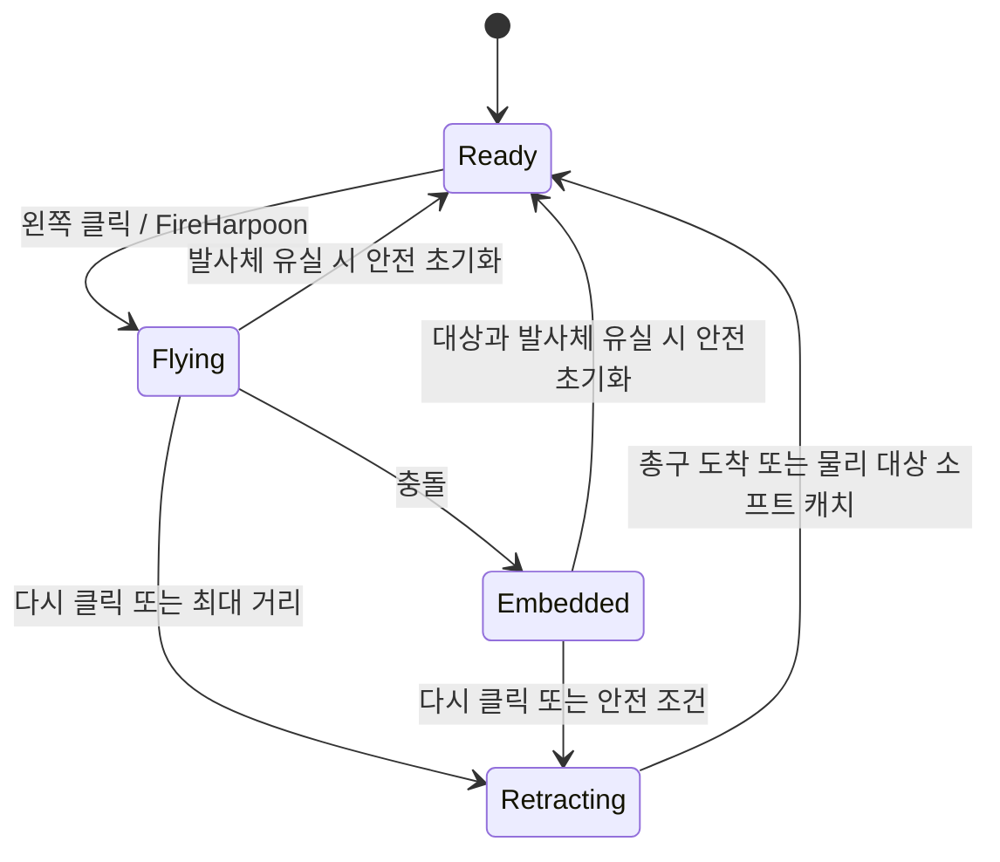

# JM 작살총 사용 및 수정 문서

이 문서는 현재 프로젝트에 적용된 `JM Harpoon Gun`의 기능, 수정 위치, 기본값, 외형 파츠, Blueprint API, 테스트 방법을 정리한다. 화물·장애물·몬스터 부산물·포탈 코어 반응은 [작살 작업 도구 상호작용 사용법](WORK_TOOL_INTERACTIONS_KO.md)을 참고한다.

편집 가능한 벡터 원본: [JM_HARPOON_PARTS_POSTER_KO.svg](../JM_HARPOON_PARTS_POSTER_KO.svg)

## 1. 현재 적용 상태

- 적용 캐릭터: `/Game/FirstPerson/Blueprints/BP_FirstPersonCharacter`
- 기능 컴포넌트: `JMHarpoonGun`
- 기본 입력: 왼쪽 클릭은 발사/회수, 오른쪽 클릭 유지는 플레이어 그래플
- 총 외형 클래스: `/Game/FirstPerson/Blueprints/BP_JMHarpoonGunVisual`
- 발사체 외형 클래스: `/Game/FirstPerson/Blueprints/BP_JMHarpoonProjectile`
- 기존 근거리 `JMPhysicalGrabber` 컴포넌트는 비활성화되어 있다.

마우스 왼쪽 버튼은 상태에 따라 다음처럼 동작한다.

| 현재 상태 | 왼쪽 클릭 결과 |
|---|---|
| `Ready` | 작살 발사 |
| `Flying` | 비행 중인 작살 회수 시작 |
| `Embedded` | 박힌 작살 또는 물리 오브젝트 회수 시작 |
| `Retracting` | 추가 입력 무시 |

마우스 오른쪽 버튼은 `Enable Player Grapple`이 켜져 있을 때 다음처럼 동작한다.

| 현재 상태 | 오른쪽 버튼 결과 |
|---|---|
| `Ready` | 무시 |
| `Flying` | `Armed`. 버튼을 유지하면 명중 순간 당김 시작 |
| `Embedded` | 버튼을 누르는 동안 플레이어를 작살 방향으로 당김 |
| `Retracting` | 무시 |
| `Pulling` 중 버튼 해제 | 당김만 중단하고 작살은 박힌 상태 유지 |

## 2. 기능 요약

### 발사

- 플레이어 카메라가 바라보는 지점을 기준으로 조준한다.
- 실제 작살은 총의 `MuzzlePoint`에서 생성된다.
- 빠른 발사체에서도 충돌을 놓치지 않도록 CCD와 서브스테핑을 사용한다.
- 비행 중 작살은 진행 방향을 바라보도록 자동 회전한다.
- 발사 시 총이 뒤로 밀리는 반동과 작은 카메라 피치 반동이 적용된다.
- 작살과 총구 사이에 접촉점 기반 Spline 와이어가 표시되며, 기존 `Cable Component`도 폴백으로 선택할 수 있다.
- `Max Range`에 도달하면 자동으로 회수가 시작된다.

### 명중 및 박힘

- 작살의 충돌 채널에서 `Block`으로 판정되는 프리미티브에는 우선 박힌다.
- 명중한 컴포넌트와 본 이름을 저장하고, 실제 충돌 지점에 작살을 부착한다.
- 움직이는 물체나 스켈레탈 메시의 본에 맞아도 부착된 대상을 따라간다.
- 물리 시뮬레이션 중인 대상에는 명중 충격량을 가한다.
- 명중 순간 짧은 주황색 포인트 라이트가 켜진다.
- 명중 후에는 윈치 회전이 정지한다.

### 회수

- 고정 오브젝트 또는 물리 시뮬레이션을 하지 않는 오브젝트에서는 작살만 빠져나와 돌아온다.
- 물리 오브젝트에서는 박힌 지점에 힘을 가해 물체와 작살을 함께 당긴다.
- 당기는 힘은 질량에 비례해서 증가하지 않는 고정 최대 힘 방식이다. 따라서 무거운 물체일수록 가속이 느리고 회수가 어렵다.
- 물리 오브젝트가 플레이어로부터 `Physics Release Distance` 안에 들어오면 힘을 풀고 작살 회수를 완료한다.
- 가까움 판정은 박힌 점뿐 아니라 물체의 실제 충돌 표면까지의 최단거리도 사용하므로, 큰 물체가 플레이어와 겹친 채 계속 매달리지 않는다.
- 힘을 풀 때 플레이어 방향 속도를 감속해 물체가 플레이어 뒤로 넘어가는 현상을 줄인다.
- 너무 무거워 일정 시간 동안 충분히 움직이지 않은 물체에서는 작살이 분리되어 작살만 돌아온다.
- 작살만 회수할 때는 완전한 물리 시뮬레이션 대신 가벼운 절차적 중력, Sphere Sweep, 바닥 Trace를 사용한다.
- 회수 초기에는 작살이 중력을 받아 실제 바닥을 찾을 때까지 떨어진다.
- 바닥에 닿으면 작살이 눕고, 바닥의 경사와 작은 단차를 따라 플레이어 쪽으로 끌려온다.
- 바닥이 끊기면 수평 이동 속도를 유지한 채 다시 떨어지고 다음 바닥을 찾는다.
- 플레이어 근처에서는 바닥을 떠나 총구까지 짧게 들어 올려진다.
- 비행 중 바로 회수하면 기존 전진 속도를 조금 유지한 채 떨어진다.
- 아래에 바닥이 없으면 안전 시간 후 총구 호밍으로 전환되어 작살이 유실되지 않는다.
- 회수 중에는 작살이 이동 방향을 바라보며, 윈치는 발사 때와 반대 방향으로 회전한다.

### 플레이어 그래플

- 기능은 `Enable Player Grapple`로 독립적으로 켜고 끌 수 있으며, 꺼도 기존 좌클릭 작살 기능은 유지된다.
- 비행 중 우클릭을 유지하면 명중을 대기하고, 박힌 뒤에는 작살의 현재 위치를 앵커로 사용한다.
- 완전한 캐릭터 물리 시뮬레이션 대신 `CharacterMovement`의 속도를 가속도 한도 안에서 변경한다.
- 앵커 방향 속도를 높이면서 횡방향 속도를 보존해 직선 이동과 완만한 스윙 감각을 함께 만든다.
- 앵커 근처에서는 속도를 낮추고 도착 시 안쪽 속도를 감속해 벽에 강하게 충돌하는 현상을 줄인다.
- 카메라 위치에서 다음 프레임의 이동 경로를 구형 스윕으로 미리 검사한다. 천장이나 벽에 닿기 전에 표면 안쪽 속도만 제거하므로 카메라 관통을 막으면서 옆 방향 관성은 유지한다.
- 우클릭을 놓으면 현재 관성을 유지한 채 당김만 끝난다. 좌클릭 회수, 기능 Off, 앵커 유실, 맵 이탈에서는 즉시 취소된다.
- 물리 오브젝트 앵커는 선택적으로 허용할 수 있다. 허용한 경우 작살이 붙은 움직이는 대상을 계속 따라간다.
- 그래플 중 중력, 최대 하강 속도, 최대 사용 시간, 막힘 타임아웃을 별도로 제한한다.

### 외형 상태 처리

- `Ready`: `Projectile Class`와 동일한 `LoadedHarpoonPreview`가 표시된다.
- `Flying`: 장전 작살이 숨겨지고 발사체가 표시되며 윈치가 정방향으로 회전한다.
- `Embedded`: 윈치가 현재 각도에서 멈춘다.
- `Retracting`: 윈치가 역방향으로 회전한다.
- 회수 완료: 발사체와 줄이 사라지고 장전 작살이 다시 표시된다.

## 3. 상태 흐름

플레이어 그래플은 위 상태와 분리된 `Disabled → Idle → Armed/Pulling` 상태 머신을 사용한다. 따라서 우클릭 이동을 중단해도 작살의 `Embedded` 상태는 유지된다.

## 4. 가장 자주 수정하는 위치

### 기능과 느낌 수정

1. Content Browser에서 `/Game/FirstPerson/Blueprints/BP_FirstPersonCharacter`를 연다.
2. `Components` 패널에서 `JMHarpoonGun`을 선택한다.
3. `Details > JM > Harpoon Gun` 아래의 값을 수정한다.

발사 속도, 사거리, 당기는 힘, 바닥 회수, 마지막 들어 올림, 반동, 클래스 선택은 모두 이곳에서 수정한다.

### 총 외형 수정

1. `/Game/FirstPerson/Blueprints/BP_JMHarpoonGunVisual`을 연다.
2. `Components` 패널에서 원하는 파츠를 선택한다.
3. Viewport 또는 Details에서 `Static Mesh`, `Materials`, `Location`, `Rotation`, `Scale`을 수정한다.

총구와 장전 작살을 함께 조절하려면 `MuzzleAssembly`를 선택한다. 이 컴포넌트의 위치, 회전, 크기를 바꾸면 `Muzzle`, `MuzzlePoint`, `LoadedHarpoonPreview`가 한 조립체처럼 같이 움직인다. 실제 발사 위치와 케이블 시작점도 함께 변경되며, 조립체의 크기는 발사된 작살에도 전달된다.

`MuzzleAssembly`의 기본 피벗은 실제 작살 생성 지점에 있으므로, 선택하면 변환 기즈모가 장전 작살의 앞부분에 표시된다.

`Loaded Harpoon Preview Class`는 이 뷰포트에 표시할 발사체 클래스다. 샘플 에셋에는 `BP_JMHarpoonProjectile`이 지정되어 있으므로, 실제 커스텀 발사체를 총구와 함께 보면서 정렬할 수 있다.

총 전체의 카메라 기준 위치는 `BP_FirstPersonCharacter > JMHarpoonGun > Gun Visual Offset`에서 수정한다.

### 발사되는 작살 외형 수정

1. `/Game/FirstPerson/Blueprints/BP_JMHarpoonProjectile`을 연다.
2. `Shaft`, `Tip`, `FinA`, `FinB`를 선택한다.
3. 메시, 재질, 위치, 회전, 크기를 수정한다.

장전 상태도 `BP_JMHarpoonProjectile` 전체를 미리보기로 사용한다. 따라서 발사체의 `Shaft`, `Tip`, `FinA`, `FinB`에서 메시, 재질, 위치, 회전, 크기를 수정하면 장전 상태와 발사 상태에 동시에 반영된다. 총 Blueprint에서 장전용 파츠를 따로 맞출 필요가 없다.

## 5. JMHarpoonGun에서 수정 가능한 값

아래 값은 `BP_FirstPersonCharacter > JMHarpoonGun`에서 C++ 재빌드 없이 수정할 수 있다.

### Input

| 속성 | 기본값 | 설명 |
|---|---:|---|
| `Use Legacy Key Polling` | `true` | 기존 프로토타입 호환용 직접 키 Polling. 프로젝트 Enhanced Input을 연결한 뒤 끈다. |
| `Fire Key` | `Left Mouse Button` | Legacy Polling에서만 사용하는 발사/회수 토글 키 |

기본 구조에서는 Character 또는 Controller가 Enhanced Input을 받고 공개 함수를 호출한다. 플러그인은 프로젝트의 Input Action 에셋을 직접 참조하지 않는다.

Enhanced Input 연결 순서:

1. 프로젝트에서 Boolean Action `IA_HarpoonFire`, `IA_HarpoonRecall`, `IA_HarpoonGrapple`을 만든다.
2. 프로젝트의 Input Mapping Context에 원하는 키를 배정한다.
3. Character Blueprint에서 `IA_HarpoonFire / Started`를 `JMHarpoonGun > FireHarpoon`에 연결한다.
4. `IA_HarpoonRecall / Started`를 `RecallHarpoon`에 연결한다.
5. `IA_HarpoonGrapple / Started`를 `StartPlayerGrapple`, `Completed`와 `Canceled`를 `StopPlayerGrapple`에 연결한다.
6. 연결을 완료한 뒤 `Use Legacy Key Polling`을 꺼서 한 입력이 두 번 처리되지 않게 한다.

`StartPlayerGrapple()`은 비행 중 호출되면 `Armed`로 대기하고, 작살이 박히면 자동으로 당김을 시작한다.

### Player Grapple > Input

| 속성 | 기본값 | 설명 |
|---|---:|---|
| `Enable Player Grapple` | 플러그인 `false`, 현재 캐릭터 `true` | 플레이어 당김 전체 On/Off. 실행 중 끄면 즉시 정상 이동 값으로 복구한다. |
| `Player Grapple Key` | `Right Mouse Button` | 누르고 있는 동안 플레이어 그래플 사용 |
| `Allow Dynamic Player Grapple Anchors` | `true` | 물리 시뮬레이션 오브젝트에 박힌 작살도 앵커로 허용 |

### Player Grapple > Movement

| 속성 | 기본값 | 단위 | 설명 |
|---|---:|---:|---|
| `Player Grapple Acceleration` | `6500` | cm/s² | 앵커 방향으로 속도를 바꾸는 최대 가속도 |
| `Player Grapple Max Speed` | `2500` | cm/s | 그래플 중 캐릭터 최대 속도 |
| `Player Grapple Stop Distance` | `140` | cm | 앵커 도착으로 판정할 캐릭터 중심 거리 |
| `Player Grapple Approach Slow Distance` | `550` | cm | 앵커 접근 감속을 시작하는 거리 |
| `Player Grapple Tangential Retention` | `0.9` | 0~1 | 횡방향 관성 보존 비율. 높을수록 스윙 느낌이 강해진다. |
| `Player Grapple Gravity Scale` | `0.35` | 배율 | 그래플 중 CharacterMovement 중력 배율 |
| `Player Grapple Arrival Braking` | `0.8` | 0~1 | 도착 시 앵커 안쪽 속도를 제거하는 비율 |

### Player Grapple > Safety

| 속성 | 기본값 | 단위 | 설명 |
|---|---:|---:|---|
| `Player Grapple Max Duration` | `3.0` | s | 한 번 우클릭으로 플레이어를 당길 수 있는 최대 시간 |
| `Player Grapple Blocked Timeout` | `0.5` | s | 충분히 가까워지지 못할 때 막힘으로 취소하는 시간 |
| `Player Grapple Minimum Progress` | `10` | cm | 막힘 타이머를 초기화할 최소 접근 거리 |
| `Player Grapple Max Downward Speed` | `1200` | cm/s | 낙하 중인 동적 앵커가 플레이어를 아래로 끄는 최대 속도 |
| `Player Grapple Camera Clearance` | `55` | cm | 그래플 중 카메라와 진행 방향의 충돌 표면 사이에 확보할 여유 거리 |
| `Player Grapple Camera Probe Radius` | `14` | cm | 다음 프레임 카메라 경로를 검사하는 구의 반지름. 모서리에서 화면이 비치면 높인다. |

### Player Grapple > Presentation

| 속성 | 기본값 | 설명 |
|---|---:|---|
| `Player Grapple FOV Boost` | `6도` | 당김 중 카메라 FOV 증가량 |
| `Player Grapple FOV Interp Speed` | `10` | 시작과 종료 시 FOV 보간 속도 |

### Fire

| 속성 | 기본값 | 단위 | 설명 및 조정 방향 |
|---|---:|---:|---|
| `Fire Speed` | `6500` | cm/s | 발사 속도. 높일수록 즉각적이지만 빠른 표적에서 명중 연출을 보기 어려워진다. |
| `Max Range` | `2500` | cm | 최대 비행 거리. 도달 시 자동 회수한다. 박힌 상태에서는 `1.25배` 이상 멀어지면 자동 회수한다. |
| `Embed Depth` | `8` | cm | 명중 지점에서 진행 방향으로 더 들어가는 깊이. 너무 크면 얇은 벽을 관통해 보일 수 있다. |
| `Impact Impulse` | `30000` | Unreal impulse | 물리 오브젝트에 명중할 때 주는 충격량. 높이면 가벼운 물체가 크게 튕긴다. |
| `Fire Cooldown` | `0.15` | s | 회수 완료 후 다시 발사할 수 있을 때까지의 대기 시간 |

### Fire > Aim / Muzzle Safety

| 속성 | 기본값 | 단위 | 설명 |
|---|---:|---:|---|
| `Use Crosshair Aim Trace` | `true` | - | 카메라 중앙 Trace 명중점을 AimPoint로 사용한다. 미명중 시 최대거리 지점을 사용한다. |
| `Crosshair Trace Channel` | `Visibility` | - | 조준점 계산에 사용할 Trace 채널 |
| `Muzzle Obstruction Probe Radius` | `6` | cm | 총구 바로 앞을 검사하는 Sphere 반경 |
| `Muzzle Obstruction Probe Distance` | `30` | cm | 발사 직전에 검사할 총구 앞 거리. 막혀 있으면 생성된 Projectile에 즉시 실제 명중 처리를 수행한다. |

### Recall

| 속성 | 기본값 | 단위 | 설명 및 조정 방향 |
|---|---:|---:|---|
| `Reel Speed` | `1800` | cm/s | 공중 낙하 속도의 상한과 마지막 총구 호밍의 최대 이동 속도. 바닥 끌림 속도는 별도 값으로 조정한다. |
| `Max Pull Force` | `200000` | Unreal force | 물리 오브젝트에 적용할 수 있는 최대 힘. 무거운 물체의 난이도를 결정하는 핵심 값 |
| `Pull Strength` | `3000` | spring strength | 거리 오차에 비례해 요구하는 당김 힘. 높이면 반응이 빠르고 거칠어진다. |
| `Pull Damping` | `700` | damping | 현재 속도를 억제하는 감쇠. 높이면 흔들림과 튕김이 줄지만 둔해질 수 있다. |
| `Catch Distance` | `100` | cm | 작살만 회수할 때 총구 도착으로 판정하는 거리. 케이블의 최소 길이로도 사용한다. |
| `Physics Release Distance` | `220` | cm | 물리 오브젝트를 더 이상 당기지 않고 놓는 플레이어 주변 반경 |
| `Release Braking` | `0.85` | 0~1 | 물체가 해제 반경에 도달했을 때 플레이어 방향 속도를 제거하는 비율. `0`은 감속 없음, `1`은 해당 방향 속도를 전부 제거한다. |
| `Heavy Target Timeout` | `1.5` | s | 무거운 물체가 충분히 움직이지 않았다고 판단하기까지 기다리는 시간 |
| `Minimum Recall Progress` | `100` | cm | 위 시간 동안 이 거리보다 적게 움직이면 물체를 포기하고 작살만 회수한다. |
| `Return Separation Distance` | `20` | cm | 박힌 표면과 겹친 작살을 발사 반대 방향으로 먼저 빼낸 뒤 회수를 시작하는 거리 |

### Recall > Light

질량 비교는 `Mass < Light Object Mass Threshold`다. 따라서 기본값에서 4.99kg은 Light, 정확히 5kg은 기존 Standard Pull이다. 작살의 시각적 부착점은 실제 명중 위치에 유지하고, 힘만 무게중심에 적용한다.

| 속성 | 기본값 | 단위 | 설명 |
|---|---:|---:|---|
| `Light Object Mass Threshold` | `5` | kg | 이 값보다 가벼운 물체에 Light Pull 적용 |
| `Light Impact Velocity Kick` | `80` | cm/s | 명중점 Torque 없이 무게중심에 주는 작은 속도 변화 |
| `Light Min Pull Speed` | `220` | cm/s | 해제 반경 근처 목표 속도 |
| `Light Max Pull Speed` | `1100` | cm/s | 먼 거리 목표 속도 |
| `Light Approach Slow Distance` | `650` | cm | 거리 기반 감속 구간 |
| `Light Velocity Gain` | `8` | - | 목표 속도 오차를 가속도로 바꾸는 Gain |
| `Light Max Pull Acceleration` | `2500` | cm/s² | 순간 이동과 폭발적인 가속을 막는 상한 |
| `Light Tangential Retention` | `0.15` | 0~1 | 횡방향 관성을 남기는 비율 |
| `Light Angular Damping` | `9` | - | 현재 각속도의 반대 방향 감쇠 Gain |
| `Light Max Angular Deceleration` | `80` | rad/s² | 회전을 즉시 고정하지 않는 최대 각감속 |
| `Light Pull Ramp Time` | `0.10` | s | Recall 시작 후 최대 출력까지 SmoothStep으로 증가하는 시간 |

### Recall > Safety

| 속성 | 기본값 | 단위 | 설명 |
|---|---:|---:|---|
| `Fail Safe Max Distance` | `6000` | cm | 플레이어와 작살의 거리가 이 값을 넘으면 물체를 포기하고 비상 회수한다. 실제 판정은 `Max Range × 1.5`보다 작아지지 않는다. |
| `Fail Safe Max Vertical Drop` | `5000` | cm | 작살이 플레이어보다 이 높이 이상 아래로 떨어지면 비상 회수한다. |
| `Fail Safe Kill Z Margin` | `1000` | cm | 월드 `KillZ`에 도달하기 전에 미리 비상 회수하는 여유 높이 |
| `Fail Safe Recovery Distance` | `450` | cm | 기존 작살이 이미 엔진에서 삭제된 경우 플레이어 앞에 회수용 작살을 복구할 거리 |
| `Max Recall Duration` | `4.0` | s | 회수 시작부터 반드시 `Ready` 상태가 되기까지 허용하는 절대 최대 시간 |
| `Recall Deadline Lead Time` | `0.75` | s | 마감 전에 물체를 포기하고 플레이어 앞에서 마지막 귀환 연출을 시작할 시간 |

비상 회수 시 박힌 물리 오브젝트와의 연결을 끊고, 기존 작살이 유효하면 제거한다. 이후 플레이어 앞의 안전한 지점에 충돌 없는 회수용 작살을 생성하고 총구로 마지막 호밍을 수행한다. `Max Recall Duration - Recall Deadline Lead Time` 시점까지 정상 귀환하지 못하면 이 비상 귀환을 강제로 시작한다. 그래도 마감 시각까지 완료하지 못하면 작살을 총구에 즉시 복귀시키고 `Ready` 상태를 확정한다. 레벨 전환이나 월드 종료 때문에 생성 자체가 불가능한 경우에도 장전 상태로 즉시 복구된다.

물리 오브젝트를 더 쉽게 끌고 싶다면 먼저 `Max Pull Force`를 높인다. 당김 반응만 빠르게 만들고 싶다면 `Pull Strength`를 높이고, 진동하거나 플레이어를 지나치는 현상이 생기면 `Pull Damping`, `Physics Release Distance`, `Release Braking`을 조정한다.

### Recall > Arc

| 속성 | 기본값 | 단위 | 설명 및 조정 방향 |
|---|---:|---:|---|
| `Return Gravity` | `1800` | cm/s² | 작살이 바닥을 찾는 동안 계속 적용되는 절차적 중력. 높이면 더 빠르게 바닥으로 떨어진다. |
| `Return Gravity Fade Time` | `0.35` | s | 바닥 이동 또는 낙하 속도에서 마지막 총구 호밍 속도로 전환되는 보간 시간 |
| `Return Initial Drop Speed` | `280` | cm/s | 회수를 시작하는 순간 주는 초기 하강 속도 |
| `Return Forward Carry Speed` | `300` | cm/s | 비행 중 회수할 때 유지하는 전진 속도. 박힌 작살 회수에는 적용하지 않는다. |
| `Return Homing Responsiveness` | `5` | 보간 속도 | 마지막 단계에서 총구 방향으로 속도를 전환하는 민감도. 높이면 바닥을 떠난 뒤 더 빠르게 총구를 향한다. |

더 빨리 바닥에 떨어지게 하려면 `Return Initial Drop Speed`와 `Return Gravity`를 높인다. 마지막에 총구로 너무 천천히 올라오면 `Return Gravity Fade Time`을 줄이거나 `Return Homing Responsiveness`를 높인다.

### Recall > Ground

| 속성 | 기본값 | 단위 | 설명 및 조정 방향 |
|---|---:|---:|---|
| `Return Ground Drag Speed` | `1100` | cm/s | 바닥에서 작살이 끌려오는 최대 속도. 낮추면 무겁게, 높이면 빠르게 끌린다. |
| `Return Ground Drag Responsiveness` | `8` | 보간 속도 | 바닥 이동 방향과 속도가 목표를 따라가는 민감도. 낮추면 관성이 커지고 높이면 줄을 따라 즉시 방향을 바꾼다. |
| `Return Ground Height Responsiveness` | `24` | 보간 속도 | 단차와 울퉁불퉁한 바닥에서 작살 높이가 바뀌는 속도. 낮추면 부드럽지만 바닥에 잠시 겹칠 수 있다. |
| `Return Ground Normal Responsiveness` | `10` | 보간 속도 | 바닥 노멀에 맞춰 작살 자세를 바꾸는 속도. 낮추면 경계면에서 덜 튄다. |
| `Return Ground Clearance` | `7` | cm | 작살 루트를 바닥에서 띄우는 높이이며 최초 바닥 감지 Sphere 반경으로도 사용한다. |
| `Return Ground Probe Distance` | `120` | cm | 바닥을 따라가는 동안 아래쪽 바닥을 찾는 거리. 큰 하강 단차를 계속 따라가게 하려면 높인다. |
| `Return Ground Step Height` | `35` | cm | 바닥 추적 Trace의 시작 높이. 작은 계단과 올라가는 경사를 따라가는 능력에 영향을 준다. |
| `Return Ground Lift Distance` | `240` | cm | 플레이어와 이 거리 안에 들어오면 바닥 끌림을 끝내고 총구로 들어 올린다. |
| `Return Ground Search Timeout` | `1.5` | s | 바닥을 찾지 못했을 때 안전 호밍으로 전환하기까지의 공중 낙하 시간 |
| `Return Minimum Ground Normal Z` | `0.5` | 0~1 | 바닥으로 인정할 최소 노멀 Z. `0.5`는 약 60도 경사까지 허용한다. 높이면 완만한 바닥만 인정한다. |

바닥에서 더 묵직하게 끌리게 하려면 `Return Ground Drag Speed`를 낮추고 `Return Ground Drag Responsiveness`도 조금 낮춘다. 작살이 바닥에 파묻히거나 떠 보이면 `Return Ground Clearance`를 작살 메시 두께에 맞춰 조정한다.

### Presentation

| 속성 | 기본값 | 설명 |
|---|---:|---|
| `Muzzle Offset` | `(80, 18, -14)` | 비주얼 액터 또는 `MuzzlePoint`가 없을 때 사용하는 카메라 기준 예비 발사 위치 |
| `Gun Visual Offset` | `(38, 18, -20)` | 총 전체의 카메라 기준 상대 위치 |
| `Recoil Distance` | `12 cm` | 발사 시 총 외형이 뒤로 움직이는 최대 거리 |
| `Create Prototype Visuals` | `true` | 총 외형 액터 생성 여부. 꺼도 기능과 케이블은 동작한다. |
| `Visual Actor Class` | `BP_JMHarpoonGunVisual` | 생성할 총 외형 Blueprint 클래스 |

`BP_JMHarpoonGunVisual`이 정상 생성되어 있으면 발사 위치는 `Muzzle Offset`보다 외형 Blueprint의 `MuzzlePoint`를 우선 사용한다.

### Projectile

| 속성 | 현재값 | 설명 |
|---|---|---|
| `Projectile Class` | `BP_JMHarpoonProjectile` | 발사할 작살 Actor 클래스. 다른 `AJMHarpoonProjectile` 자식 Blueprint로 교체할 수 있다. |

### Debug

| 속성 | 기본값 | 설명 |
|---|---:|---|
| `Draw Debug` | `false` | 발사 시 조준선, 명중 시 구와 노멀 방향 화살표를 잠시 표시한다. |

## 6. 총 외형 Blueprint 파츠

수정 에셋: `/Game/FirstPerson/Blueprints/BP_JMHarpoonGunVisual`

| 컴포넌트 | 역할 | 수정 가능한 대표 항목 |
|---|---|---|
| `VisualRoot` | 모든 총 파츠의 기준 루트 | 자식 전체의 기준 Transform |
| `Body` | 총 몸체 | Mesh, Material, Transform |
| `Handle` | 손잡이 | Mesh, Material, Transform |
| `Barrel` | 총열 | Mesh, Material, Transform |
| `MuzzleAssembly` | 총구와 작살의 공통 조립체 | 이것 하나로 총구, 장전 작살, 발사 위치, 줄 시작점의 Location, Rotation, Scale을 함께 조절한다. |
| `Muzzle` | 총구 외형 | Mesh, Material, Transform |
| `Winch` | 줄을 감는 회전 파츠 | Mesh, Material, Transform. 비행/회수 중 코드가 회전을 추가한다. |
| `MuzzlePoint` | 실제 발사 및 케이블 시작 위치 | Location을 외형 총구 끝으로 옮긴다. 발사 방향은 이 컴포넌트의 Rotation이 아니라 카메라 조준으로 계산한다. |
| `LoadedHarpoonPreview` | 장전 상태 미리보기 | `JMHarpoonGun > Projectile Class`의 전체 외형을 자동 표시한다. 별도 메시를 수정하지 않는다. |
| `Loaded Harpoon Preview Class` | 뷰포트 미리보기 클래스 | 기본 샘플은 `BP_JMHarpoonProjectile`. 총 Blueprint 뷰포트에서 실제 발사체 외형을 함께 보여준다. |

주의 사항:

- 총구와 작살 전체를 배치할 때는 `MuzzleAssembly`를 사용한다.
- `Muzzle`은 보이는 메시일 뿐이며, 조립체 내부에서 총구 메시만 미세 조정할 때 사용한다.
- `MuzzlePoint`는 조립체 내부의 실제 발사 위치다. 총구 끝과 작살촉 기준점을 세부적으로 맞출 때만 상대 위치를 조정한다.
- `LoadedHarpoonPreview`의 기준점은 `MuzzlePoint`다. 장전 작살 자체의 회전과 파츠 배치는 `BP_JMHarpoonProjectile`에서 수정한다.
- `Winch`의 Blueprint 기본 회전을 기준으로 런타임 회전이 더해진다.
- 총 메시들은 충돌, 내비게이션 영향, 그림자가 기본적으로 꺼져 있다.
- 총 외형은 소유 플레이어에게만 보이도록 설정된다.

## 7. 발사체 Blueprint 파츠

수정 에셋: `/Game/FirstPerson/Blueprints/BP_JMHarpoonProjectile`

| 컴포넌트 | 역할 | 현재 주요 기본값 |
|---|---|---|
| `Collision` | 루트 충돌체와 실제 명중 판정 | Sphere Radius `6 cm`, `WorldDynamic`, Camera 무시, 나머지 채널 Block, CCD 사용 |
| `Shaft` | 작살 몸통 | Engine Cylinder, 위치 `(-30,0,0)`, 회전 `(0,90,0)`, 스케일 `(0.045,0.045,0.55)` |
| `Tip` | 작살촉 | Engine Cone, 위치 `(-1,0,0)`, 회전 `(0,90,0)`, 스케일 `(0.11,0.11,0.22)` |
| `FinA` | 뒤쪽 날개 A | Engine Cube, 위치 `(-55,0,5)`, 스케일 `(0.14,0.025,0.08)` |
| `FinB` | 뒤쪽 날개 B | Engine Cube, 위치 `(-55,0,-5)`, 스케일 `(0.14,0.025,0.08)` |
| `CableAnchor` | 줄이 연결되는 뒤쪽 기준점 | 위치 `(-62,0,0)`. 커스텀 작살의 꼬리 끝에 맞춰 Location을 조절한다. |
| `ImpactLight` | 명중 순간 플래시 | 색상 `(1.0,0.22,0.04)`, 반경 `180`, 그림자 없음 |
| `ProjectileMovement` | 발사 비행 처리 | 중력 배율 `0.12`, 속도 방향 회전, Bounce 없음, 서브스테핑 사용 |

발사 시 `ProjectileMovement`의 `Initial Speed`와 `Max Speed`는 `JMHarpoonGun > Fire Speed` 값으로 다시 설정된다. 따라서 실제 발사 속도는 발사체 Blueprint보다 `JMHarpoonGun`에서 수정해야 한다.

`ImpactLight`의 색상과 반경은 Blueprint에서 바꿀 수 있지만, 명중 시 세기 `12000`과 지속 시간 `0.09초`는 현재 C++ 런타임 값이므로 아래 C++ 수정 위치에서 변경해야 한다.

`Collision` 반경을 지나치게 줄이면 빠른 발사체가 작은 물체를 맞히기 어려워지고, 지나치게 키우면 작살촉이 닿기 전에 박히는 것처럼 보일 수 있다.

줄 위치가 작살 외형과 맞지 않으면 `BP_JMHarpoonProjectile > CableAnchor`만 선택해서 꼬리 끝으로 옮긴다. 케이블 끝은 이 컴포넌트의 위치에 오프셋 없이 연결된다.

## 8. 와이어 설정

와이어는 `JMHarpoonGunComponent`가 런타임에 생성한다. 1.7 기본값은 Cable 입자 로프가 아니라 접촉점 기반 Spline 경로다. 기존 `CableComponent`는 `Use Spline Wire`를 끌 때만 표시되는 비교·호환용 폴백이다.

### 기본 Spline 경로

설정 위치는 `BP_FirstPersonCharacter > JMHarpoonGun > Presentation > Wire Route`다.

| 속성 | 기본값 | 설명 |
|---|---:|---|
| `Use Spline Wire` | `true` | 접촉점 기반 와이어 사용. 끄면 기존 Cable 폴백을 사용한다. |
| `Collision Radius` | `2.5 cm` | 선분 전체 Sphere Sweep 반경. 보이는 1.2cm 두께와 분리되어 있다. |
| `Surface Offset` | `0.75 cm` | 충돌 표면의 바깥쪽 Normal 방향으로 추가 확보하는 간격 |
| `Collision Update Rate` | `25 Hz` | 접촉 경로 계산 상한. 화면 보간은 매 프레임 수행한다. |
| `Max Contact Points` | `3` | 바닥·경사·모서리에 유지할 최대 접촉점 수 |
| `Minimum Contact Time` | `0.15 s` | 접촉점이 생성 직후 사라지며 떨리는 현상을 막는 최소 수명 |
| `Contact Release Margin` | `4 cm` | 접촉 해제 검사에 더하는 여유 반경 |
| `Contact Merge Distance` | `12 cm` | 끝점이나 기존 접촉점과 너무 가까운 중복 접촉을 만들지 않는 거리 |
| `Contact Position Interp Speed` | `20` | 경사면 위 접촉점 위치 보간 속도 |
| `Contact Normal Interp Speed` | `14` | 삼각형 경계에서 표면 Normal이 급변하지 않게 하는 속도 |
| `Maximum Contact Correction Per Update` | `15 cm` | 충돌 한 번이 와이어 전체를 크게 튕기지 않도록 제한하는 보정량 |
| `Render Segment Length` | `120 cm` | 화면용 Spline Mesh 목표 길이 |
| `Max Render Segments` | `16` | 화면용 세그먼트 풀 상한 |
| `Render Point Interp Speed` | `28` | 25Hz 경로 결과를 프레임 사이에서 부드럽게 연결하는 속도 |
| `Sag Scale` | `0.6` | 박힌 상태의 남는 와이어 길이를 처짐으로 바꾸는 비율 |
| `Maximum Sag` | `25 cm` | 박힌 상태의 최대 처짐 |
| `Collide With World Dynamic` | `false` | 당기는 물체와의 피드백을 피하려고 기본적으로 WorldStatic만 검사한다. |

상태별 동작은 다음과 같다.

- `Flying`: 접촉 검사를 생략하고 팽팽한 직선으로 표시한다.
- `Embedded`: 직선 경로를 검사하며 장애물이 없고 길이가 남을 때만 약하게 처진다.
- `Retracting`: 각 경로 선분 전체를 Sphere Sweep하고 최대 3개의 접촉점으로 바닥과 경사면을 우회한다.
- `Ready`: 모든 와이어 Mesh를 숨기고 Trace를 중단한다.

접촉점은 `ImpactPoint + ImpactNormal * (CollisionRadius + SurfaceOffset)`에 둔다. 반드시 더하기 방향이어야 와이어 중심선이 지면 위에 남는다. 접촉점의 수명·해제 여유·Normal 보간·프레임당 보정 제한이 함께 작동하므로 경사면 삼각형 경계에서도 생성/삭제 떨림과 급회전을 줄인다.

### 공통 길이와 시작점

`Presentation > Cable`의 `Cable Width`, `Cable Material`, 길이/Slack, 시작점 안정화 값은 Spline 경로에도 사용한다. 시작점은 월드 공간 Proxy이며 총구의 0.2cm 이하 움직임을 무시하고 최대 1.5cm 안에서 추적한다. 와이어 길이는 발사·박힘 중 필요한 만큼만 풀리고 `Retracting`에서만 감긴다. 여유는 2.5~8cm로 제한된다.

### 기존 Cable 폴백

`Use Spline Wire=false`일 때 `Cable Num Segments`, Solver, Substep, Gravity, Ground Collision 설정이 적용된다. 이 모드는 입자 사이의 긴 선분을 직접 검사하지 않으므로 지면 관통과 충돌 보정에 의한 회전을 완전히 없앨 수 없다. PIE 중 `NumSegments`를 직접 변경하면 내부 파티클 배열과 맞지 않을 수 있으므로 Details 값을 바꾼 뒤 PIE를 다시 시작한다.

기존 Blueprint 컴포넌트가 과거 기본값을 저장했다면 Details의 노란 Reset 화살표로 `Use Spline Wire`와 `Wire Route Settings`를 1.7 기본값으로 되돌린다.

## 9. Blueprint에서 사용할 수 있는 함수와 이벤트

### 호출 함수

| 함수 | 반환 | 설명 |
|---|---|---|
| `FireHarpoon()` | `bool` | `Ready`이고 쿨다운이 끝났을 때 발사한다. 성공 여부를 반환한다. |
| `RecallHarpoon()` | `bool` | `Flying` 또는 `Embedded` 상태에서 회수를 시작한다. |
| `ResetHarpoon()` | 없음 | 활성 작살을 제거하고 줄을 숨긴 뒤 즉시 `Ready`로 초기화한다. |
| `GetHarpoonState()` | 상태 Enum | 현재 `Ready`, `Flying`, `Embedded`, `Retracting` 상태를 반환한다. |
| `GetActiveHarpoon()` | Projectile Actor | 현재 발사된 작살을 반환한다. 없으면 `None`이다. |
| `SetPlayerGrappleEnabled(bool)` | 없음 | 플레이어 그래플을 런타임에 켜거나 끈다. 끄면 진행 중 당김도 취소한다. |
| `IsPlayerGrappleEnabled()` | `bool` | 플레이어 그래플 On/Off 값을 반환한다. |
| `StartPlayerGrapple()` | `bool` | 박힌 작살과 유효한 CharacterMovement가 있을 때 당김을 시작한다. |
| `StopPlayerGrapple()` | 없음 | 작살은 유지하고 플레이어 당김만 중단한다. |
| `GetPlayerGrappleState()` | 상태 Enum | `Disabled`, `Idle`, `Armed`, `Pulling` 상태를 반환한다. |

### 이벤트 디스패처

| 이벤트 | 전달 값 | 호출 시점 |
|---|---|---|
| `On Harpoon Fired` | Projectile | 작살 생성과 발사에 성공한 직후 |
| `On Harpoon Embedded` | Projectile, Hit Result | 작살이 대상에 박힌 직후 |
| `On Harpoon Recall Started` | Projectile | 회수 상태로 전환한 직후 |
| `On Harpoon Returned` | Projectile | 작살을 파괴하고 `Ready`로 돌아가기 직전 |
| `On Player Grapple Started` | Projectile | 플레이어 당김이 실제로 시작된 직후 |
| `On Player Grapple Ended` | Projectile, End Reason | 해제, 도착, 회수, 앵커 유실, 시간 초과, 막힘, 기능 Off로 당김이 끝날 때 |

Player Grapple이 실제로 시작되면 당김 방향과 관계없이 Character Movement는
Walking을 벗어납니다. 따라서 보행 상태와 이동 거리로 재생되는 발소리는 당김을
달리기로 오인하지 않습니다. 이후 전용 오디오를 붙일 때는 `On Harpoon Fired`에
발사 One-shot을, `On Player Grapple Started/Ended`에 윈치 Loop의 시작/정지를
연결하면 됩니다.

이 이벤트에 사운드, 카메라 셰이크, Niagara, UI, 게임 규칙을 연결하면 C++ 핵심 로직을 수정하지 않고 타격감을 확장할 수 있다.

## 10. C++ 수정 위치

| 파일 | 담당 기능 |
|---|---|
| `Public/Components/JMHarpoonGunComponent.h` | Blueprint 노출 파라미터, 상태 Enum, 함수, 이벤트 선언 |
| `Private/Components/JMHarpoonGunComponent.cpp` | 입력, 발사, 명중 처리, 물리 당김, 바닥 회수와 마지막 총구 호밍, 와이어 상태 연결, 윈치/반동 처리 |
| `Public/Components/JMHarpoonWireRouteComponent.h` | 접촉 경로 설정, 시각 상태, Spline 와이어 API |
| `Private/Components/JMHarpoonWireRouteComponent.cpp` | 선분 Sphere Sweep, 접촉점 히스테리시스, 처짐과 Spline Mesh 렌더링 |
| `Public/Actors/JMHarpoonProjectile.h` | 발사체 파츠 및 클래스 인터페이스 |
| `Private/Actors/JMHarpoonProjectile.cpp` | 충돌체, 메시 기본값, Projectile Movement, 박힘, 임팩트 라이트 |
| `Public/Actors/JMHarpoonGunVisualActor.h` | 총 외형 파츠 인터페이스 |
| `Private/Actors/JMHarpoonGunVisualActor.cpp` | 기본 프로토타입 메시와 Transform, 윈치 및 장전 파츠 표시 처리 |

소스 기준 루트는 `Plugins/JMPhysicalGrabber/Source/JMPhysicalGrabber`다.

현재 C++에만 고정된 주요 연출 값은 다음과 같다.

- 발사 시 카메라 피치 입력: `-0.65`
- 명중 시 카메라 피치 입력: `+0.18`
- 총 반동 복귀 보간 속도: `14`
- 윈치 회전 속도: 초당 `720도`
- 명중 플래시 시간: `0.09초`
- 명중 플래시 최대 세기: `12000`
- 비행 중 케이블 여유 길이: 실제 거리의 약 `1.015배`
- 박힘/회수 중 케이블 여유 길이: 실제 거리의 약 `1.02배`

이 값들을 자주 튜닝해야 한다면 이후 `UPROPERTY(EditAnywhere)`로 옮겨 `JMHarpoonGun` Details에 노출하는 방식이 적합하다.

## 11. 테스트 방법

### 기본 테스트

1. `/Game/FirstPerson/Lvl_FirstPerson` 또는 `BP_FirstPersonCharacter`를 사용하는 테스트 맵을 연다.
2. PIE를 실행한다.
3. 왼쪽 클릭으로 발사한다.
4. 벽에 박힌 뒤 윈치가 멈추는지 확인한다.
5. 다시 왼쪽 클릭하고, 작살이 바닥까지 떨어지는지 확인한다.
6. 작살이 바닥에 누운 상태로 경사와 작은 단차를 따라 끌려오는지 확인한다.
7. 플레이어 근처에서 바닥을 떠나 총구로 들어오는지 확인한다.
8. 회수 완료 후 장전 작살이 다시 나타나는지 확인한다.

### 플레이어 그래플 테스트

1. 벽을 향해 발사하고 비행 중 우클릭을 유지해, 박히는 순간 자동으로 당겨지는지 확인한다.
2. 박힌 뒤 우클릭을 눌러 앵커 방향으로 가속되는지 확인한다.
3. 이동 중 우클릭을 놓아 횡방향 관성이 유지되고 작살은 박혀 있는지 확인한다.
4. 당기는 중 좌클릭을 눌러 플레이어 이동이 중단되고 기존 작살 회수가 시작되는지 확인한다.
5. `Enable Player Grapple`을 실행 중 꺼 중력, 보행 속도, 마찰, FOV가 원래 값으로 돌아오는지 확인한다.
6. 천장에 박고 당겨도 카메라가 천장을 뚫지 않고 약 `55 cm` 앞에서 당김이 끝나는지 확인한다.
7. 옆 벽을 비스듬히 당겼을 때 벽 안쪽 속도는 사라지지만 옆 방향 관성은 남는지 확인한다.
8. 낙하하는 물리 구체에서 동적 앵커를 따라가되, 막힘/최대 시간/맵 이탈 시 안전하게 취소되는지 확인한다.
9. `Allow Dynamic Player Grapple Anchors`를 끄고 물리 오브젝트에서는 우클릭 당김이 시작되지 않는지 확인한다.

### 물리 무게 테스트

같은 크기의 테스트용 Static Mesh Actor를 일곱 개 만들고 다음을 설정한다.

- `Mobility`: `Movable`
- `Simulate Physics`: 활성화
- `Collision Preset`: `PhysicsActor`
- `Mass Override`: `1`, `3`, `5`, `10`, `30`, `75`, `150 kg`

확인할 내용:

- 1kg과 3kg을 중앙·가장자리·위쪽에 맞혀도 폭발적으로 회전하지 않고 실제 명중점에 작살이 남는가?
- 1kg과 3kg은 Recall 직후 약 0.1초에 걸쳐 출력이 증가하고, 약간의 횡방향 흔들림을 남기며 빠르게 당겨지는가?
- 4.99kg은 Light Pull, 정확히 5kg은 Standard Pull로 동작하는가?
- 5kg, 10kg, 30kg은 명중점 기준 회전과 기존 바닥 충돌 감각을 유지하는가?
- 75kg과 150kg은 같은 힘에서 느리게 움직이고, 진행이 부족하면 Heavy Target Timeout으로 작살만 돌아오는가?
- 물체가 약 `220 cm` 거리에서 풀리고 플레이어 뒤로 심하게 넘어가지 않는가?
- 큰 물체의 박힌 점은 멀어도 물체 표면이 플레이어와 가까워지면 즉시 힘이 풀리는가?
- 가까운 물체를 쏜 뒤 회수했을 때 대롱대롱 매달리지 않고 작살만 빠져나오는가?
- `1.5초` 동안 `100 cm`보다 적게 움직이는 대상에서는 작살만 분리되어 돌아오는가?

### 최대 거리와 안전 처리 테스트

- 아무것도 맞히지 않고 발사해 `2500 cm`에서 자동 회수되는지 확인한다.
- 비행 중 다시 클릭해 즉시 회수했을 때 전진 관성을 조금 유지하면서 바닥으로 떨어지는지 확인한다.
- 계단, 경사, 낮은 단차에서 바닥을 계속 따라오는지 확인한다.
- 낭떠러지에서 바닥이 끊기면 다시 낙하하고 다음 바닥을 찾는지 확인한다.
- 바닥이 없는 공간에서는 `1.5초` 후 안전 호밍으로 전환되는지 확인한다.
- 박힌 대상을 게임 중 제거해도 크래시 없이 회수 또는 초기화되는지 확인한다.
- `Draw Debug`를 켜 조준선과 실제 명중 지점을 비교한다.
- 가까운 작은 표적을 Crosshair로 조준해 카메라 Trace 지점과 Projectile 경로가 일치하는지 확인한다.
- 총구를 벽에 붙이거나 일부 겹친 상태에서 발사해 Projectile이 벽을 건너뛰거나 영구 유실되지 않는지 확인한다.

### 타격감 확장 권장 지점

- `On Harpoon Fired`: 발사음, 총구 Niagara, 강한 짧은 카메라 셰이크
- `On Harpoon Embedded`: 재질별 충돌음, 파편 Niagara, 히트 스톱 또는 추가 카메라 셰이크
- `On Harpoon Recall Started`: 윈치 시작음과 반복음
- `On Harpoon Returned`: 금속 걸림음, 작은 총기 반동, UI 재장전 표시

## 12. 작업 도구 상호작용 설정

대상 액터에 `JM Harpoon Interactable Component`를 추가하면 작살총 코드 수정 없이 반응을 정의할 수 있다. 전체 Profile 설명, Blueprint 이벤트 연결, Vertical Slice 권장값, 자동화 테스트, 문제 해결은 [WORK_TOOL_INTERACTIONS_KO.md](WORK_TOOL_INTERACTIONS_KO.md)에 정리되어 있다.

- 일반 화물: `Reaction=Pull`, `Can Pull=true`; 실제 물리 Mass로 회수 속도를 조절한다.
- 깨지기 쉬운 화물: `Fragile Safe Force`와 `Fragile Damage Per Second`를 설정하고 `On Condition Changed`에서 외형/가치를 갱신한다.
- 몬스터 부산물: `Reaction=Extract`, `Can Extract=true`; `On Reaction Completed`에서 아이템을 생성한다.
- 판자/환풍구: `Reaction=Break`, `Can Break=true`; 고정된 Static Mesh도 장력을 누적할 수 있다.
- 금속 소음원: `Impact/Pull Noise Loudness`를 설정하고 `On Harpoon Noise`를 게임 AI 소음 API에 연결한다.
- 포탈 코어: `Reaction=Pull`, 큰 물리 Mass와 Pull Resistance, 높은 Pull Noise Loudness를 사용한다.

`Reaction Force` 이상의 장력을 `Reaction Hold Time` 동안 유지해야 Break/Extract/Activate/CreaturePart가 완료된다. 대상별 고유 로직은 `IHarpoonInteractable`을 Blueprint 또는 C++로 직접 구현한다. 플러그인은 AI, 인벤토리, 몬스터, 포탈 클래스를 직접 참조하지 않는다.

주의 사항:

- Break/Extract 등에는 `Can Pull`과 반응별 `Can ...`이 모두 필요하다.
- `Pull`은 목적지 도착 완료 이벤트를 발생시키지 않으므로 Trigger 또는 게임별 구현으로 판정한다.
- Pull Resistance가 커질수록 사용할 수 있는 최대 장력도 낮아진다.

## 13. 제한 사항

- 입력과 Tick은 로컬 플레이어 컨트롤러에서만 처리한다.
- 플레이어 그래플은 소유자가 `ACharacter`이고 `CharacterMovementComponent`를 가지고 있을 때만 시작된다.
- 현재 버전은 서버 권위 멀티플레이 복제를 구현하지 않았다.
- Spline 와이어는 최대 3개의 접촉점으로 단순한 바닥·경사·모서리를 우회하지만, 매듭·마찰 장력·복잡한 다중 감김을 계산하는 완전한 물리 로프는 아니다.
- 회수 중인 작살은 절차적 이동이며 완전한 리지드 바디 물리를 사용하지 않는다. WorldStatic, WorldDynamic, PhysicsBody 바닥 감지와 바닥 추종만 수행하므로 벽에 걸리거나 장애물과 복잡하게 충돌하지 않는다.
- 충돌 반응이 `Overlap` 또는 `Ignore`인 표면에는 박히지 않는다.
- 총 외형 Blueprint와 발사체 Blueprint는 프로젝트 편의를 위한 오버라이드이며, 플러그인 자체는 `/Game` 에셋에 의존하지 않는다.
