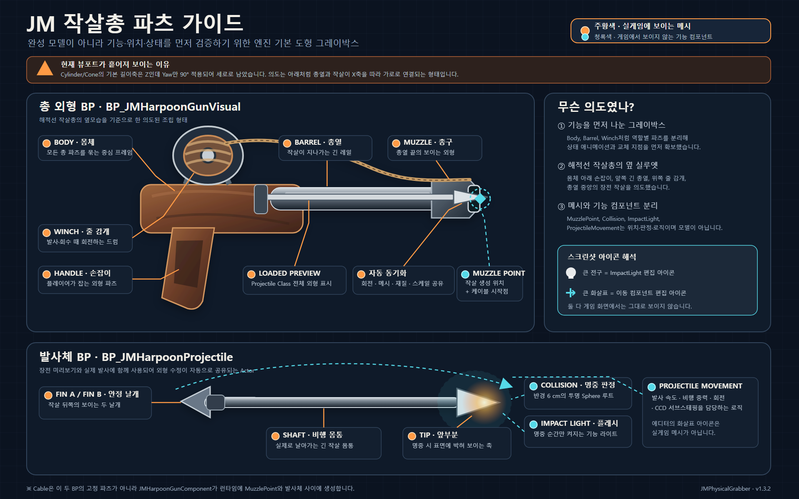
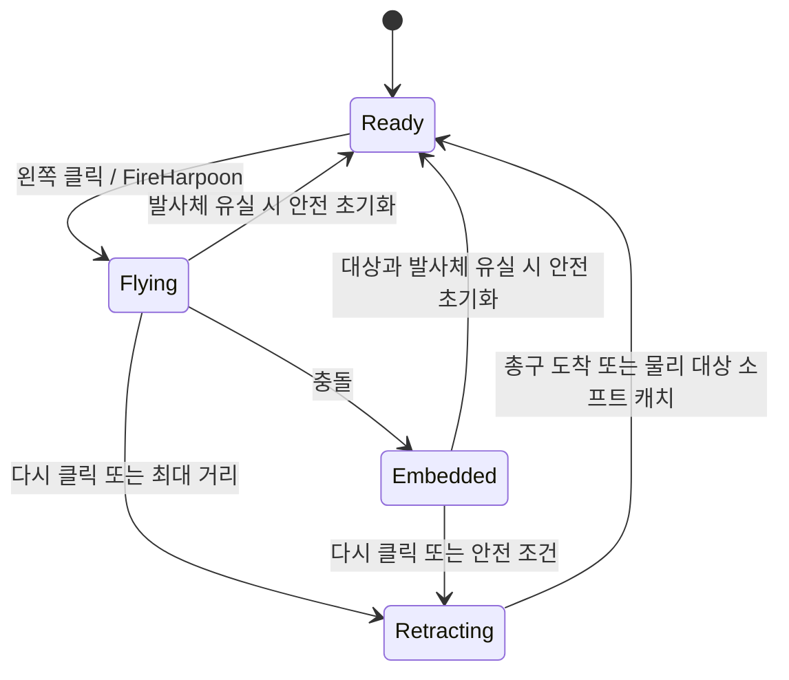

# JM 작살총 사용 및 수정 문서

이 문서는 현재 프로젝트에 적용된 `JM Harpoon Gun`의 기능, 수정 위치, 기본값, 외형 파츠, Blueprint API, 테스트 방법을 정리한다.

편집 가능한 벡터 원본: [JM_HARPOON_PARTS_POSTER_KO.svg](JM_HARPOON_PARTS_POSTER_KO.svg)

## 1. 현재 적용 상태

- 적용 캐릭터: `/Game/FirstPerson/Blueprints/BP_FirstPersonCharacter`
- 기능 컴포넌트: `JMHarpoonGun`
- 기본 입력: 마우스 왼쪽 버튼
- 총 외형 클래스: `/Game/FirstPerson/Blueprints/BP_JMHarpoonGunVisual`
- 발사체 외형 클래스: `/Game/FirstPerson/Blueprints/BP_JMHarpoonProjectile`
- 기존 근거리 `JMPhysicalGrabber` 컴포넌트는 비활성화되어 있다.

마우스 왼쪽 버튼은 상태에 따라 다음처럼 동작한다.

| 현재 상태 | 왼쪽 클릭 결과 |
|---|---|
| `Ready` | 작살 발사 |
| `Flying` | 비행 중인 작살 회수 시작 |
| `Embedded` | 박힌 작살 또는 물리 오브젝트 회수 시작 |
| `Retracting` | 추가 입력 무시 |

## 2. 기능 요약

### 발사

- 플레이어 카메라가 바라보는 지점을 기준으로 조준한다.
- 실제 작살은 총의 `MuzzlePoint`에서 생성된다.
- 빠른 발사체에서도 충돌을 놓치지 않도록 CCD와 서브스테핑을 사용한다.
- 비행 중 작살은 진행 방향을 바라보도록 자동 회전한다.
- 발사 시 총이 뒤로 밀리는 반동과 작은 카메라 피치 반동이 적용된다.
- 작살과 총구 사이에 Unreal 내장 `Cable Component` 줄이 표시된다.
- `Max Range`에 도달하면 자동으로 회수가 시작된다.

### 명중 및 박힘

- 작살의 충돌 채널에서 `Block`으로 판정되는 프리미티브에는 우선 박힌다.
- 명중한 컴포넌트와 본 이름을 저장하고, 실제 충돌 지점에 작살을 부착한다.
- 움직이는 물체나 스켈레탈 메시의 본에 맞아도 부착된 대상을 따라간다.
- 물리 시뮬레이션 중인 대상에는 명중 충격량을 가한다.
- 명중 순간 짧은 주황색 포인트 라이트가 켜진다.
- 명중 후에는 윈치 회전이 정지한다.

### 회수

- 고정 오브젝트 또는 물리 시뮬레이션을 하지 않는 오브젝트에서는 작살만 빠져나와 돌아온다.
- 물리 오브젝트에서는 박힌 지점에 힘을 가해 물체와 작살을 함께 당긴다.
- 당기는 힘은 질량에 비례해서 증가하지 않는 고정 최대 힘 방식이다. 따라서 무거운 물체일수록 가속이 느리고 회수가 어렵다.
- 물리 오브젝트가 플레이어로부터 `Physics Release Distance` 안에 들어오면 힘을 풀고 작살 회수를 완료한다.
- 가까움 판정은 박힌 점뿐 아니라 물체의 실제 충돌 표면까지의 최단거리도 사용하므로, 큰 물체가 플레이어와 겹친 채 계속 매달리지 않는다.
- 힘을 풀 때 플레이어 방향 속도를 감속해 물체가 플레이어 뒤로 넘어가는 현상을 줄인다.
- 너무 무거워 일정 시간 동안 충분히 움직이지 않은 물체에서는 작살이 분리되어 작살만 돌아온다.
- 작살만 회수할 때는 완전한 물리 시뮬레이션 대신 가벼운 절차적 중력, Sphere Sweep, 바닥 Trace를 사용한다.
- 회수 초기에는 작살이 중력을 받아 실제 바닥을 찾을 때까지 떨어진다.
- 바닥에 닿으면 작살이 눕고, 바닥의 경사와 작은 단차를 따라 플레이어 쪽으로 끌려온다.
- 바닥이 끊기면 수평 이동 속도를 유지한 채 다시 떨어지고 다음 바닥을 찾는다.
- 플레이어 근처에서는 바닥을 떠나 총구까지 짧게 들어 올려진다.
- 비행 중 바로 회수하면 기존 전진 속도를 조금 유지한 채 떨어진다.
- 아래에 바닥이 없으면 안전 시간 후 총구 호밍으로 전환되어 작살이 유실되지 않는다.
- 회수 중에는 작살이 이동 방향을 바라보며, 윈치는 발사 때와 반대 방향으로 회전한다.

### 외형 상태 처리

- `Ready`: `Projectile Class`와 동일한 `LoadedHarpoonPreview`가 표시된다.
- `Flying`: 장전 작살이 숨겨지고 발사체가 표시되며 윈치가 정방향으로 회전한다.
- `Embedded`: 윈치가 현재 각도에서 멈춘다.
- `Retracting`: 윈치가 역방향으로 회전한다.
- 회수 완료: 발사체와 줄이 사라지고 장전 작살이 다시 표시된다.

## 3. 상태 흐름

## 4. 가장 자주 수정하는 위치

### 기능과 느낌 수정

1. Content Browser에서 `/Game/FirstPerson/Blueprints/BP_FirstPersonCharacter`를 연다.
2. `Components` 패널에서 `JMHarpoonGun`을 선택한다.
3. `Details > JM > Harpoon Gun` 아래의 값을 수정한다.

발사 속도, 사거리, 당기는 힘, 바닥 회수, 마지막 들어 올림, 반동, 클래스 선택은 모두 이곳에서 수정한다.

### 총 외형 수정

1. `/Game/FirstPerson/Blueprints/BP_JMHarpoonGunVisual`을 연다.
2. `Components` 패널에서 원하는 파츠를 선택한다.
3. Viewport 또는 Details에서 `Static Mesh`, `Materials`, `Location`, `Rotation`, `Scale`을 수정한다.

총 전체의 카메라 기준 위치는 `BP_FirstPersonCharacter > JMHarpoonGun > Gun Visual Offset`에서 수정한다.

### 발사되는 작살 외형 수정

1. `/Game/FirstPerson/Blueprints/BP_JMHarpoonProjectile`을 연다.
2. `Shaft`, `Tip`, `FinA`, `FinB`를 선택한다.
3. 메시, 재질, 위치, 회전, 크기를 수정한다.

장전 상태도 `BP_JMHarpoonProjectile` 전체를 미리보기로 사용한다. 따라서 발사체의 `Shaft`, `Tip`, `FinA`, `FinB`에서 메시, 재질, 위치, 회전, 크기를 수정하면 장전 상태와 발사 상태에 동시에 반영된다. 총 Blueprint에서 장전용 파츠를 따로 맞출 필요가 없다.

## 5. JMHarpoonGun에서 수정 가능한 값

아래 값은 `BP_FirstPersonCharacter > JMHarpoonGun`에서 C++ 재빌드 없이 수정할 수 있다.

### Input

| 속성 | 기본값 | 설명 |
|---|---:|---|
| `Fire Key` | `Left Mouse Button` | 발사와 회수에 사용하는 토글 입력 키 |

컴포넌트가 직접 키 입력을 확인하므로, 같은 키를 다른 기능에서도 사용하면 두 기능이 동시에 실행될 수 있다.

### Fire

| 속성 | 기본값 | 단위 | 설명 및 조정 방향 |
|---|---:|---:|---|
| `Fire Speed` | `6500` | cm/s | 발사 속도. 높일수록 즉각적이지만 빠른 표적에서 명중 연출을 보기 어려워진다. |
| `Max Range` | `2500` | cm | 최대 비행 거리. 도달 시 자동 회수한다. 박힌 상태에서는 `1.25배` 이상 멀어지면 자동 회수한다. |
| `Embed Depth` | `8` | cm | 명중 지점에서 진행 방향으로 더 들어가는 깊이. 너무 크면 얇은 벽을 관통해 보일 수 있다. |
| `Impact Impulse` | `30000` | Unreal impulse | 물리 오브젝트에 명중할 때 주는 충격량. 높이면 가벼운 물체가 크게 튕긴다. |
| `Fire Cooldown` | `0.15` | s | 회수 완료 후 다시 발사할 수 있을 때까지의 대기 시간 |

### Recall

| 속성 | 기본값 | 단위 | 설명 및 조정 방향 |
|---|---:|---:|---|
| `Reel Speed` | `1800` | cm/s | 공중 낙하 속도의 상한과 마지막 총구 호밍의 최대 이동 속도. 바닥 끌림 속도는 별도 값으로 조정한다. |
| `Max Pull Force` | `200000` | Unreal force | 물리 오브젝트에 적용할 수 있는 최대 힘. 무거운 물체의 난이도를 결정하는 핵심 값 |
| `Pull Strength` | `3000` | spring strength | 거리 오차에 비례해 요구하는 당김 힘. 높이면 반응이 빠르고 거칠어진다. |
| `Pull Damping` | `700` | damping | 현재 속도를 억제하는 감쇠. 높이면 흔들림과 튕김이 줄지만 둔해질 수 있다. |
| `Catch Distance` | `100` | cm | 작살만 회수할 때 총구 도착으로 판정하는 거리. 케이블의 최소 길이로도 사용한다. |
| `Physics Release Distance` | `220` | cm | 물리 오브젝트를 더 이상 당기지 않고 놓는 플레이어 주변 반경 |
| `Release Braking` | `0.85` | 0~1 | 물체가 해제 반경에 도달했을 때 플레이어 방향 속도를 제거하는 비율. `0`은 감속 없음, `1`은 해당 방향 속도를 전부 제거한다. |
| `Heavy Target Timeout` | `1.5` | s | 무거운 물체가 충분히 움직이지 않았다고 판단하기까지 기다리는 시간 |
| `Minimum Recall Progress` | `100` | cm | 위 시간 동안 이 거리보다 적게 움직이면 물체를 포기하고 작살만 회수한다. |
| `Return Separation Distance` | `20` | cm | 박힌 표면과 겹친 작살을 발사 반대 방향으로 먼저 빼낸 뒤 회수를 시작하는 거리 |

물리 오브젝트를 더 쉽게 끌고 싶다면 먼저 `Max Pull Force`를 높인다. 당김 반응만 빠르게 만들고 싶다면 `Pull Strength`를 높이고, 진동하거나 플레이어를 지나치는 현상이 생기면 `Pull Damping`, `Physics Release Distance`, `Release Braking`을 조정한다.

### Recall > Arc

| 속성 | 기본값 | 단위 | 설명 및 조정 방향 |
|---|---:|---:|---|
| `Return Gravity` | `1800` | cm/s² | 작살이 바닥을 찾는 동안 계속 적용되는 절차적 중력. 높이면 더 빠르게 바닥으로 떨어진다. |
| `Return Gravity Fade Time` | `0.35` | s | 바닥 이동 또는 낙하 속도에서 마지막 총구 호밍 속도로 전환되는 보간 시간 |
| `Return Initial Drop Speed` | `280` | cm/s | 회수를 시작하는 순간 주는 초기 하강 속도 |
| `Return Forward Carry Speed` | `300` | cm/s | 비행 중 회수할 때 유지하는 전진 속도. 박힌 작살 회수에는 적용하지 않는다. |
| `Return Homing Responsiveness` | `5` | 보간 속도 | 마지막 단계에서 총구 방향으로 속도를 전환하는 민감도. 높이면 바닥을 떠난 뒤 더 빠르게 총구를 향한다. |

더 빨리 바닥에 떨어지게 하려면 `Return Initial Drop Speed`와 `Return Gravity`를 높인다. 마지막에 총구로 너무 천천히 올라오면 `Return Gravity Fade Time`을 줄이거나 `Return Homing Responsiveness`를 높인다.

### Recall > Ground

| 속성 | 기본값 | 단위 | 설명 및 조정 방향 |
|---|---:|---:|---|
| `Return Ground Drag Speed` | `1100` | cm/s | 바닥에서 작살이 끌려오는 최대 속도. 낮추면 무겁게, 높이면 빠르게 끌린다. |
| `Return Ground Drag Responsiveness` | `8` | 보간 속도 | 바닥 이동 방향과 속도가 목표를 따라가는 민감도. 낮추면 관성이 커지고 높이면 줄을 따라 즉시 방향을 바꾼다. |
| `Return Ground Height Responsiveness` | `24` | 보간 속도 | 단차와 울퉁불퉁한 바닥에서 작살 높이가 바뀌는 속도. 낮추면 부드럽지만 바닥에 잠시 겹칠 수 있다. |
| `Return Ground Normal Responsiveness` | `10` | 보간 속도 | 바닥 노멀에 맞춰 작살 자세를 바꾸는 속도. 낮추면 경계면에서 덜 튄다. |
| `Return Ground Clearance` | `7` | cm | 작살 루트를 바닥에서 띄우는 높이이며 최초 바닥 감지 Sphere 반경으로도 사용한다. |
| `Return Ground Probe Distance` | `120` | cm | 바닥을 따라가는 동안 아래쪽 바닥을 찾는 거리. 큰 하강 단차를 계속 따라가게 하려면 높인다. |
| `Return Ground Step Height` | `35` | cm | 바닥 추적 Trace의 시작 높이. 작은 계단과 올라가는 경사를 따라가는 능력에 영향을 준다. |
| `Return Ground Lift Distance` | `240` | cm | 플레이어와 이 거리 안에 들어오면 바닥 끌림을 끝내고 총구로 들어 올린다. |
| `Return Ground Search Timeout` | `1.5` | s | 바닥을 찾지 못했을 때 안전 호밍으로 전환하기까지의 공중 낙하 시간 |
| `Return Minimum Ground Normal Z` | `0.5` | 0~1 | 바닥으로 인정할 최소 노멀 Z. `0.5`는 약 60도 경사까지 허용한다. 높이면 완만한 바닥만 인정한다. |

바닥에서 더 묵직하게 끌리게 하려면 `Return Ground Drag Speed`를 낮추고 `Return Ground Drag Responsiveness`도 조금 낮춘다. 작살이 바닥에 파묻히거나 떠 보이면 `Return Ground Clearance`를 작살 메시 두께에 맞춰 조정한다.

### Presentation

| 속성 | 기본값 | 설명 |
|---|---:|---|
| `Muzzle Offset` | `(80, 18, -14)` | 비주얼 액터 또는 `MuzzlePoint`가 없을 때 사용하는 카메라 기준 예비 발사 위치 |
| `Gun Visual Offset` | `(38, 18, -20)` | 총 전체의 카메라 기준 상대 위치 |
| `Recoil Distance` | `12 cm` | 발사 시 총 외형이 뒤로 움직이는 최대 거리 |
| `Create Prototype Visuals` | `true` | 총 외형 액터 생성 여부. 꺼도 기능과 케이블은 동작한다. |
| `Visual Actor Class` | `BP_JMHarpoonGunVisual` | 생성할 총 외형 Blueprint 클래스 |

`BP_JMHarpoonGunVisual`이 정상 생성되어 있으면 발사 위치는 `Muzzle Offset`보다 외형 Blueprint의 `MuzzlePoint`를 우선 사용한다.

### Projectile

| 속성 | 현재값 | 설명 |
|---|---|---|
| `Projectile Class` | `BP_JMHarpoonProjectile` | 발사할 작살 Actor 클래스. 다른 `AJMHarpoonProjectile` 자식 Blueprint로 교체할 수 있다. |

### Debug

| 속성 | 기본값 | 설명 |
|---|---:|---|
| `Draw Debug` | `false` | 발사 시 조준선, 명중 시 구와 노멀 방향 화살표를 잠시 표시한다. |

## 6. 총 외형 Blueprint 파츠

수정 에셋: `/Game/FirstPerson/Blueprints/BP_JMHarpoonGunVisual`

| 컴포넌트 | 역할 | 수정 가능한 대표 항목 |
|---|---|---|
| `VisualRoot` | 모든 총 파츠의 기준 루트 | 자식 전체의 기준 Transform |
| `Body` | 총 몸체 | Mesh, Material, Transform |
| `Handle` | 손잡이 | Mesh, Material, Transform |
| `Barrel` | 총열 | Mesh, Material, Transform |
| `Muzzle` | 총구 외형 | Mesh, Material, Transform |
| `Winch` | 줄을 감는 회전 파츠 | Mesh, Material, Transform. 비행/회수 중 코드가 회전을 추가한다. |
| `MuzzlePoint` | 실제 발사 및 케이블 시작 위치 | Location을 외형 총구 끝으로 옮긴다. 발사 방향은 이 컴포넌트의 Rotation이 아니라 카메라 조준으로 계산한다. |
| `LoadedHarpoonPreview` | 장전 상태 미리보기 | `JMHarpoonGun > Projectile Class`의 전체 외형을 자동 표시한다. 별도 메시를 수정하지 않는다. |

주의 사항:

- `Muzzle`은 보이는 메시일 뿐이며 실제 발사 위치는 `MuzzlePoint`다.
- 총구 메시를 옮겼다면 `MuzzlePoint`도 반드시 같이 옮긴다.
- `LoadedHarpoonPreview`의 기준점은 `MuzzlePoint`다. 장전 작살 자체의 회전과 파츠 배치는 `BP_JMHarpoonProjectile`에서 수정한다.
- `Winch`의 Blueprint 기본 회전을 기준으로 런타임 회전이 더해진다.
- 총 메시들은 충돌, 내비게이션 영향, 그림자가 기본적으로 꺼져 있다.
- 총 외형은 소유 플레이어에게만 보이도록 설정된다.

## 7. 발사체 Blueprint 파츠

수정 에셋: `/Game/FirstPerson/Blueprints/BP_JMHarpoonProjectile`

| 컴포넌트 | 역할 | 현재 주요 기본값 |
|---|---|---|
| `Collision` | 루트 충돌체와 실제 명중 판정 | Sphere Radius `6 cm`, `WorldDynamic`, Camera 무시, 나머지 채널 Block, CCD 사용 |
| `Shaft` | 작살 몸통 | Engine Cylinder, 위치 `(-30,0,0)`, 회전 `(0,90,0)`, 스케일 `(0.045,0.045,0.55)` |
| `Tip` | 작살촉 | Engine Cone, 위치 `(-1,0,0)`, 회전 `(0,90,0)`, 스케일 `(0.11,0.11,0.22)` |
| `FinA` | 뒤쪽 날개 A | Engine Cube, 위치 `(-55,0,5)`, 스케일 `(0.14,0.025,0.08)` |
| `FinB` | 뒤쪽 날개 B | Engine Cube, 위치 `(-55,0,-5)`, 스케일 `(0.14,0.025,0.08)` |
| `ImpactLight` | 명중 순간 플래시 | 색상 `(1.0,0.22,0.04)`, 반경 `180`, 그림자 없음 |
| `ProjectileMovement` | 발사 비행 처리 | 중력 배율 `0.12`, 속도 방향 회전, Bounce 없음, 서브스테핑 사용 |

발사 시 `ProjectileMovement`의 `Initial Speed`와 `Max Speed`는 `JMHarpoonGun > Fire Speed` 값으로 다시 설정된다. 따라서 실제 발사 속도는 발사체 Blueprint보다 `JMHarpoonGun`에서 수정해야 한다.

`ImpactLight`의 색상과 반경은 Blueprint에서 바꿀 수 있지만, 명중 시 세기 `12000`과 지속 시간 `0.09초`는 현재 C++ 런타임 값이므로 아래 C++ 수정 위치에서 변경해야 한다.

`Collision` 반경을 지나치게 줄이면 빠른 발사체가 작은 물체를 맞히기 어려워지고, 지나치게 키우면 작살촉이 닿기 전에 박히는 것처럼 보일 수 있다.

## 8. 케이블 줄 설정

케이블은 Blueprint 에셋으로 배치된 파츠가 아니라 `JMHarpoonGunComponent`가 런타임에 생성한다. 설정은 `BP_FirstPersonCharacter > JMHarpoonGun > Presentation > Cable`에서 수정할 수 있다.

| 속성 | 현재값 | 설명 |
|---|---:|---|
| `Cable Num Segments` | `12` | 줄 시뮬레이션 세그먼트 수. 적을수록 안정적이고 각져 보일 수 있다. |
| `Cable Solver Iterations` | `8` | 줄 제약 해결 반복 횟수. 높을수록 단단하고 안정적이지만 계산량이 증가한다. |
| `CableWidth` | `1.8` | 줄 굵기 |
| `Cable Gravity Scale` | `0.25` | 줄에 적용되는 중력 비율. 낮을수록 바닥 회수 중 덜 출렁인다. |
| `Cable Substep Time` | `0.01 s` | 줄 시뮬레이션 서브스텝 간격 |
| `Cable Length Interp Speed` | `24` | 작살 거리 변화에 케이블 길이가 따라가는 보간 속도 |
| `Cable Slack Multiplier` | `1.01` | 실제 거리보다 추가할 여유 길이 비율 |
| `bEnableStiffness` | `true` | 줄 강성 사용 |
| `bEnableCollision` | `false` | 줄과 월드 충돌 비활성화 |
| `bAttachStart` | `true` | 시작점을 총구에 부착 |
| `bAttachEnd` | `true` | 끝점을 작살에 부착 |

컴포넌트 Details에서 값을 지정하면 다음 PIE 시작 시 `RegisterComponent()` 전에 적용된다. PIE 중에 `NumSegments`를 런타임으로 직접 변경하면 Cable 내부 파티클 배열 크기가 맞지 않아 Array index assertion이 발생할 수 있다.

케이블 길이는 현재 상태에 따라 자동 갱신되며, 한 프레임에 즉시 바뀌지 않고 보간되어 줄이 채찍처럼 튀는 현상을 줄인다.

## 9. Blueprint에서 사용할 수 있는 함수와 이벤트

### 호출 함수

| 함수 | 반환 | 설명 |
|---|---|---|
| `FireHarpoon()` | `bool` | `Ready`이고 쿨다운이 끝났을 때 발사한다. 성공 여부를 반환한다. |
| `RecallHarpoon()` | `bool` | `Flying` 또는 `Embedded` 상태에서 회수를 시작한다. |
| `ResetHarpoon()` | 없음 | 활성 작살을 제거하고 줄을 숨긴 뒤 즉시 `Ready`로 초기화한다. |
| `GetHarpoonState()` | 상태 Enum | 현재 `Ready`, `Flying`, `Embedded`, `Retracting` 상태를 반환한다. |
| `GetActiveHarpoon()` | Projectile Actor | 현재 발사된 작살을 반환한다. 없으면 `None`이다. |

### 이벤트 디스패처

| 이벤트 | 전달 값 | 호출 시점 |
|---|---|---|
| `On Harpoon Fired` | Projectile | 작살 생성과 발사에 성공한 직후 |
| `On Harpoon Embedded` | Projectile, Hit Result | 작살이 대상에 박힌 직후 |
| `On Harpoon Recall Started` | Projectile | 회수 상태로 전환한 직후 |
| `On Harpoon Returned` | Projectile | 작살을 파괴하고 `Ready`로 돌아가기 직전 |

이 이벤트에 사운드, 카메라 셰이크, Niagara, UI, 게임 규칙을 연결하면 C++ 핵심 로직을 수정하지 않고 타격감을 확장할 수 있다.

## 10. C++ 수정 위치

| 파일 | 담당 기능 |
|---|---|
| `Public/Components/JMHarpoonGunComponent.h` | Blueprint 노출 파라미터, 상태 Enum, 함수, 이벤트 선언 |
| `Private/Components/JMHarpoonGunComponent.cpp` | 입력, 발사, 명중 처리, 물리 당김, 바닥 회수와 마지막 총구 호밍, 케이블, 윈치/반동 상태 처리 |
| `Public/Actors/JMHarpoonProjectile.h` | 발사체 파츠 및 클래스 인터페이스 |
| `Private/Actors/JMHarpoonProjectile.cpp` | 충돌체, 메시 기본값, Projectile Movement, 박힘, 임팩트 라이트 |
| `Public/Actors/JMHarpoonGunVisualActor.h` | 총 외형 파츠 인터페이스 |
| `Private/Actors/JMHarpoonGunVisualActor.cpp` | 기본 프로토타입 메시와 Transform, 윈치 및 장전 파츠 표시 처리 |

소스 기준 루트는 `Plugins/JMPhysicalGrabber/Source/JMPhysicalGrabber`다.

현재 C++에만 고정된 주요 연출 값은 다음과 같다.

- 발사 시 카메라 피치 입력: `-0.65`
- 명중 시 카메라 피치 입력: `+0.18`
- 총 반동 복귀 보간 속도: `14`
- 윈치 회전 속도: 초당 `720도`
- 명중 플래시 시간: `0.09초`
- 명중 플래시 최대 세기: `12000`
- 비행 중 케이블 여유 길이: 실제 거리의 약 `1.015배`
- 박힘/회수 중 케이블 여유 길이: 실제 거리의 약 `1.02배`

이 값들을 자주 튜닝해야 한다면 이후 `UPROPERTY(EditAnywhere)`로 옮겨 `JMHarpoonGun` Details에 노출하는 방식이 적합하다.

## 11. 테스트 방법

### 기본 테스트

1. `/Game/FirstPerson/Lvl_FirstPerson` 또는 `BP_FirstPersonCharacter`를 사용하는 테스트 맵을 연다.
2. PIE를 실행한다.
3. 왼쪽 클릭으로 발사한다.
4. 벽에 박힌 뒤 윈치가 멈추는지 확인한다.
5. 다시 왼쪽 클릭하고, 작살이 바닥까지 떨어지는지 확인한다.
6. 작살이 바닥에 누운 상태로 경사와 작은 단차를 따라 끌려오는지 확인한다.
7. 플레이어 근처에서 바닥을 떠나 총구로 들어오는지 확인한다.
8. 회수 완료 후 장전 작살이 다시 나타나는지 확인한다.

### 물리 무게 테스트

테스트용 Static Mesh Actor를 세 개 만들고 다음을 설정한다.

- `Mobility`: `Movable`
- `Simulate Physics`: 활성화
- `Collision Preset`: `PhysicsActor`
- `Mass Override`: 예시로 `5 kg`, `75 kg`, `300 kg`

확인할 내용:

- 가벼운 물체는 빠르게 당겨지는가?
- 무거운 물체는 같은 힘에서 느리게 움직이는가?
- 물체가 약 `220 cm` 거리에서 풀리고 플레이어 뒤로 심하게 넘어가지 않는가?
- 큰 물체의 박힌 점은 멀어도 물체 표면이 플레이어와 가까워지면 즉시 힘이 풀리는가?
- 가까운 물체를 쏜 뒤 회수했을 때 대롱대롱 매달리지 않고 작살만 빠져나오는가?
- `1.5초` 동안 `100 cm`보다 적게 움직이는 대상에서는 작살만 분리되어 돌아오는가?

### 최대 거리와 안전 처리 테스트

- 아무것도 맞히지 않고 발사해 `2500 cm`에서 자동 회수되는지 확인한다.
- 비행 중 다시 클릭해 즉시 회수했을 때 전진 관성을 조금 유지하면서 바닥으로 떨어지는지 확인한다.
- 계단, 경사, 낮은 단차에서 바닥을 계속 따라오는지 확인한다.
- 낭떠러지에서 바닥이 끊기면 다시 낙하하고 다음 바닥을 찾는지 확인한다.
- 바닥이 없는 공간에서는 `1.5초` 후 안전 호밍으로 전환되는지 확인한다.
- 박힌 대상을 게임 중 제거해도 크래시 없이 회수 또는 초기화되는지 확인한다.
- `Draw Debug`를 켜 조준선과 실제 명중 지점을 비교한다.

### 타격감 확장 권장 지점

- `On Harpoon Fired`: 발사음, 총구 Niagara, 강한 짧은 카메라 셰이크
- `On Harpoon Embedded`: 재질별 충돌음, 파편 Niagara, 히트 스톱 또는 추가 카메라 셰이크
- `On Harpoon Recall Started`: 윈치 시작음과 반복음
- `On Harpoon Returned`: 금속 걸림음, 작은 총기 반동, UI 재장전 표시

## 12. 제한 사항

- 입력과 Tick은 로컬 플레이어 컨트롤러에서만 처리한다.
- 현재 버전은 서버 권위 멀티플레이 복제를 구현하지 않았다.
- 케이블은 월드 충돌을 사용하지 않으므로 벽 모서리를 감아 돌아가지 않는다.
- 회수 중인 작살은 절차적 이동이며 완전한 리지드 바디 물리를 사용하지 않는다. WorldStatic, WorldDynamic, PhysicsBody 바닥 감지와 바닥 추종만 수행하므로 벽에 걸리거나 장애물과 복잡하게 충돌하지 않는다.
- 충돌 반응이 `Overlap` 또는 `Ignore`인 표면에는 박히지 않는다.
- 총 외형 Blueprint와 발사체 Blueprint는 프로젝트 편의를 위한 오버라이드이며, 플러그인 자체는 `/Game` 에셋에 의존하지 않는다.
